# **Vokabeln**
### <u>Zellentypen</u>
* `Somazellen` = Körperzellen
* `Gameten` = Keimzellen, Geschlechtszellen

### <u>Mutationstypen</u>
1) <b>Silentm.</b> = Verän. keine Ausw.

2) <b>Punktm.</b> = nur eine Base verändert
    * Transition = Purin $\to$ Purin oder Pyrimidin $\to$ Pyrimidin

    * Transversion = Purin $\leftrightarrow$ Pyrimidin 

        * $\text{Wahrscheinlichkeit} =  \text{Transition} \gt \text{Transversion}$

            * <b>Wrm ?</b>: Weil d. Struktur nahezu identisch ist & weniger Energie aufzuwenden ist

            

3) <b>Missensem.</b> = Aminisäure verän.
4) <b>Nonsensem.</b> = Codon $\rightarrow$ Stoppcodon

5) <b>InDel M.</b> = Einf. oder Entf. v. Basen
    
    * `Frameshift` = Leseraster verschiebt sich
        * aber nur wenn $\pm$ 1 oder 2 Basen
            * <u>Grund</u>: `len(sequenz)` = 
                $24 \ mod \ 3 = 0$, weil ein Codon aus Basen-Tripletts besteht
                * $24 \pm 1 = 23 \ mod \ 3 = 1$
                * $24 \pm 2 = 22 \ mod \ 3 = 2$

### <u>Baumstammanalyse</u>
* `autosomal dominant/rezessiv` = Vererb. ü. autosomales Chromosom, merkmal dominant/rezessiv
* `X-Chromosomal dominant/rezessiv` = Vererb. ü. X-Chromosom, Merkmal dominant/rezessiv
* `Y-chromosomal` = : Verer. über Y-Chromosom, nur đ Vater
* `Mitochondriale Erbgänge` = nur đ Mutter
* `Kodominanz` = beide Allele  ausgeprägt $\to$ unabhängigen
Merkmalen
    * Bsp. Blutgruppen
* `Intermediärer Erbgang` = beide Allele sind im selben Merkmal ausgeprägt
    * Blütenfarbe bei Löwenmaul

### <u>Dominanz und Rezessivität</u>

* erklärt, warum schädl. rezessive Krankheiten häufiger auftreten als schädl. dominante Krankheiten

* `Haplosuffizient`(rezessiv) = ein Wildtyp-Allel ist ausreichend,
um den Wildtyp-Phänotyp auszuprägen $\implies$ mutiertes Allel ist rezessiv
    
* `Haploinsuffizient`(dominant) = ein Wildtyp-Allel reicht $\lnot$ aus,
um den Wildtyp-Phänotyp auszuprägen $\implies$ mutiertes Allel = dominant

* `Wildtypallel` = Genvariante (das Allel), d. in einer natürl. Population am häufigsten vorkommt & als d. funktionale Standard gilt

# **Stammbaum**
* `Gen` = Absch. d. DNA mit Info. f. d. Synthese v. Proteinen/Enzymen
* `Allel` = Genvariationen
* `Locus` = speazielle Region im Chromosom
* `homozygot` = 1 ident. Allele an einem Locus
* `heterozygot` = 2 vers. Allele an einem Locus
* `hemizygot` = Was ????

* `Phänotyp` = Ausprä. eines Gens
* `Genotyp` = Allelische Zsm.setzung eines Gens
* `homolog` = homologe Chromosomen 
    * 

* `Haploid & Diploid` 
$
\underrightarrow{\ \ \ \ \textcolor{#d6b315}{\text{Anwendung}}\ \ \ \ } \text{Anzahl d. Chromosomensätze} \begin{cases} haploid = Gameten(1n)\\ diploid = Somazellen(2n) \end{cases}
$

* Aneuploidie = Jeder Mensch hat 46 Chromosomen, wenn $\neq$ 46 = Aneuploidie

# **Was passiert wenn man sagt, dass ein Merkmal rezessiv oder dominant ist**

<blockquote style="border-left: 5px solid gray; margin: 10px; padding-left: 10px;"> Das muss ich noch machen ! Aber dafür muss ich erst einmal Mitose und Meiose lernen!!!</blockquote>

* `Gameten` (bei jedem Menschen) = $23$ Chromosomen $\begin{cases}
                                            22 = \text{Autosom}\\
                                            1 = \text{Genosom} 
                                            \end{cases}$

    * <b>Bsp.:</b> Allel f. Augenfarbe d. Mutter bei `Autosomchromosom 3` $\implies$ Beim Vater auch bei `Autosomchromosom 3`
        * D. ist dann bei jedem Menschen auf Autosomchromosom 3 !!!

# **Synthetische Lethalität**

* Lethal = tödl.
* synthetische Lethalität tritt nur ein, wenn beide Gene đ. `Inhibitoren` oder `Mutationen` ausgeschaltet wurden

## Bsp.:

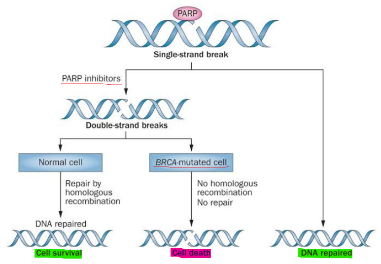

# **Stammbaumanalyse**

## <u>Monogene Vererbung</u>

1) <u>Uniformitätsregel</u>:
    * Kreuzung zw. homozygoten Individuen ($\forall$ Allele gleich), d. sich in einem Merkmal unters., führen zu einer Nachkommensgeneration mit $\equiv$ Merkmal
1) <u>Spaltungsregel</u>:
    * Wenn man d. $G_1-Generation$ mit sich selbst kreuzt, dann hat das Nachkommen eine phänotypische Vert. v. 3:1 und eine genotypische Vert. v. 1:2:1
1) <u>Unabhängigkeitsregel</u>:
    * Unterschiedl. merkmale werden unabhängig v.einander vererbt

## <u>Bsp.:</u>

* `Gen A` = Transkriptionsfaktor f. Anthocyanin = verantw. f. violette Farbe
* Punktmutation(`Transition`, $G \to A$) = Verlust d. Splicingstelle & verfrühter Stoppcodon (`Nonsense`, `Frameshift`)
    * wir haben jzt. $+ 8 B. =$ Leseraster um 2 Basen verschoben
        * Weil: $8 \mod 3 = 2$
    * Funktion $\lnot$ geg. = Blüte weiß

# **Mitose**
* in Somazellen
    * d. ist einf. nur d. $\equiv$ Klonung 
        * Wundheilung, Wachstum 

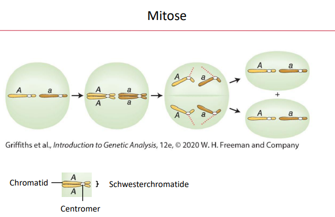

## <u>Phasen der Mitose</u>

1) <u>Prophase</u>: 
    * DNA kondensiert $\to$ Chromosomen
1) <u>Prometaphase</u>:
    * Kernkörperchen (Ort d. Ribosomen Herstellung) & Kernmembran löst sich auf
    * Entstehung des Spindelapperats an beiden Polen

     

3) <u>Metaphase</u>:
    * Spindeln des Spindelapperats haften an Centromeren
    * Chromosomen in die Äquatorialebene gezogen

    

 

4) <u>Anaphase</u>:
    * Chromosomen werden wieder in Cromatide aufgeteilt und jewils an den Pol d. Zelle gezogen (Schwestercromatide auseinandergezogen)
    * jeder Pol = **46** Ein-Chromatid-Chromosomen
1) <u>Telophase</u>:
    * Um Chromosomen bildet sich ein Zellkern
    * Chromosomen dekondensieren
    * Spindelapperat löst sich auf 

<a href="https://youtu.be/N97cgUqV0Cg" target="_blank" style="color: #2600ffff; text-decoration: underline;">Visualisierung d. Mitose</a>

# **Meiose**

* in Gameten

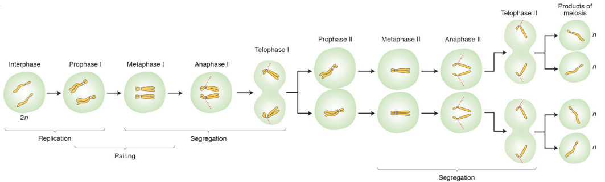

## <u>Phasen der Meiose</u>

1) <u>Prophase I</u>:

    * [Mitose: Prophase ](#prophase_mitose)
    * homologe Chromosomenpaare gruppieren sich 
        * kann zum `crossing-over` führen
            * Rekombination: Genetische Vielfalt vermehrt
            
            * Crossing Over = einzige Weg, um **gekoppelte Gene**(Gene, d. nah beieinander auf demselben Chromosom liegen) voneinander zu trennen & neu zu kombinieren.

1) <u>Metaphase I</u>:
    * [Mitose: Metaphase I](#Mitose:Metaphase_I)

1) <u>Anaphase I</u>:
    * [Mitose Anaphase](#Mitose_Anaphase)
        * hier ist d. Unters., dass d. jeweils ein ganzes Chromosom an d. jewilige Polen gezogen wird
    * **zuvällige Verteilung**: An jedem Pol *mütterl.* & *väterl.* Chromosomen

D. passiert jzt. nochmal mit den Tochterzellen
    * keine Interphase

* **Prophase II**
    * $\lnot$ Cross-Over 

### <u>Unters. zw. Mann & Frau</u>

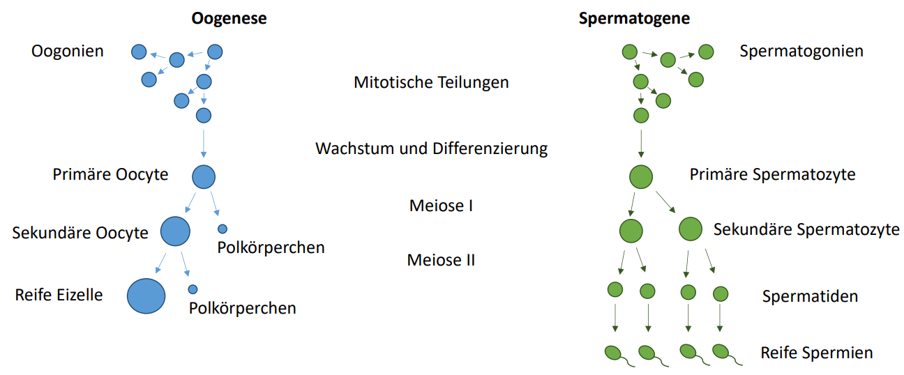

* Polkörperchen $\to$ sterben ab

## <u>Monogene Vererbung mit mehreren Allelen</u>
* <u>Bsp.</u>:
    
    

    * A & B = unterschiedl. Antigene auf Oberfläche

    * Wenn A oder B vorhanden $\xrightarrow{wird}$ augeprägt $\implies 0$ *rezessiv* 
    * AB = Kodominanz, weil beiden ausgeprägt
    * Jeder Mensch hat 2 Allele f. d. Blutgruppe
        * eins v. Mama & eins v. Papa
            * bei d. Meiose werden die einzelnen Allele aufgeteilt

                

## <u>Polygene Vererbung</u>
* vererbte Merkmale = keine klare Entweder-oder-Ausprägung $\xrightarrow{\text{stattdessen}}$ kontinuierlichen Ausprägung in d. Bevölkerung

    

* Polygenie $\leftrightarrow$ Pleiotropie
### <u>**Polygene**</u>

* mehrere Gene $\to$ ein Phänotyp
    * Beschreibt, wie viele Gene zsm.wirken, um ein einziges, oft quantitatives Merkmal (wie Körpergröße oder Hautfarbe) zu bestimmen
        * D. Gene addieren sich so zu sagen

* verantw. Gene ü. Genom verteilt + oft auf unterschiedl. Chromosomen $\xrightarrow{\text{führt zu}}$ zufälligen Kombinationen & folgt Unabhängigkeitsregel

### <u>**Pleiotopie**</u>

* Gegenteil v. Polygene
* ein Gen $\to$ mehrere Phänotypen
    * dies beschriebt, wie ein einziges Gen durch seine Wirkung aud grundlegende Prozesse des Körpers gleichzeitig mehrere, scheinbar unabhängige Merkmale oder Symptome beeinflusst.

* Ein Gen = mehrere Funktionen & beeinflusst somit mehrere Merkmale

## <u>Beispielstammbäume:</u>

* `Vererbungsart`:
    * Verhältnis zw. Männern & Frauen $\equiv \ \ \to$ <code>_autosomal_</code>
    

    * $3/5 = 60 \%$ đ.gesetzt
    * $2/5 = 40\% \  \lnot$ đ.gesetzt
    * d. Krankheit tritt in jeder Generation auf 
        = <code>_dominant_</code>
    

    * $II-10$ = Wahrscheinlichkeit bei 50% krank zu sein

* `Vererbungsart`:
    * tritt nur in 2 Gen. auf + Mutter & Vater gesund & dennoch ein krankes Kind = <code>_rezessiv_</code>
    

    * Verhältnis zw. kranken & Männern & Frauen $\equiv$
        = <code>_autosomal_</code>
    

    * $IV-4$ zu $25 \%$ krank

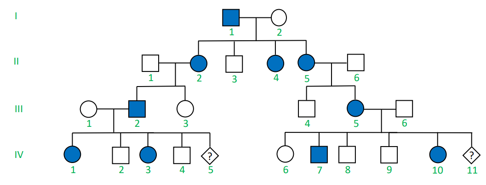

* `Vererbungsart`:
    * Tritt in jeder Gen. auf = <code>_dominant_</code>
    

    * Frauen eher betroffen als Männer
        * Vater in $I-1$ krank, aber gesunde Söhne, aber kranke Töchter. D. Mann hat 100% sein Y Chromosom an seine Söhne gegeben $=$ krankes Gen muss auf seinem X-Chromosom liegen. D. Söhne sind nur krank, wenn sie d. X-Chromosom d. Mutter bekommen, welches d. X-Chromosom 100% vererbt bekommt, weil Töchter beide X-Chromosomen v. d. Mutter als auch v. d. Vater vererbt bekommen = <code>_X-Chromosomal_</code>
    

    * $IV-5$: Söhne = $0\%$, Töchter $100\%$
    * $IV-11$ Söhne = $50\%$, Töchter $50\%$

* `Vererbungsart`:
    * tritt nicht in jeder Gen. auf = <code>_rezessiv_</code>
    

    * Frauen = Träger
    * nur Männer betroffen
        * <code>_X-Xhromosomal_</code>
    

    * $IV-4$: Söhne = $50\%$, Töchter = $50\%$
    * $III-12$: Söhne = $100\%$ gesund, Töchter = $100\%$ ein Konduktor  

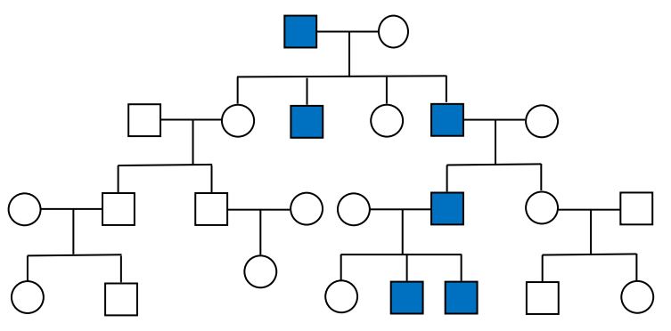

* `Vererbungsart`:
    * Nur Männer betroffen = _gonosomal_
    * tritt in jeder Generation auf = _dominant_
    * Jeder Sohn Krankheit ausgeprägt, wenn Vater auch ausgeprägt
        * gonosomal + dominant = <code>_Y-Chromosomal_</code>

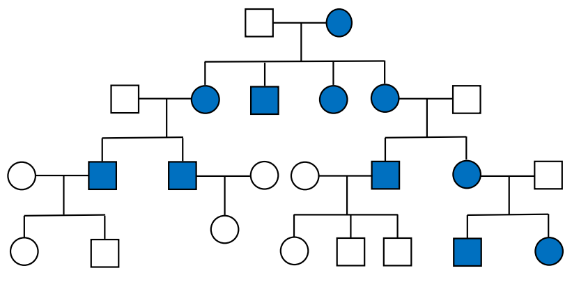

* `Vererbungsart`:
    * Alle Kinder betroffen, wenn Mutter betroffen
    * Wenn Vater betroffen, dann Kinder $\lnot$ betroffen
        * <code>_Mitochondriale Vererbung_</code>

* `Vererbungsart`:
    * ü.springt Gen. = <code>_rezessiv_</code>
    * betroffene Männer & Frauen $\equiv$
    * es muss _autosomal_ sein, weil ansonsten Familie B: $I-1,2$ $\lnot$ aufgeht
        * $a$ = krank, $A$ = gesund:
            * $II-2$ muss $X_aX_a$ haben. $I-1$ muss $X_aY$ haben & müsste krank sein(ist er aber nicht), deswegen muss es eine <code>_autosomal_</code> sein
        * a = krank, A = gesund:
            * $I-1,2: Aa \to II-2: aa$
        * seltene Erkrankung
    

* `Wahrscheinlichkeit`

    * $IV-2 \text{ ist } Aa = \text{Wahrscheinlichkeit } III-2 \text{  Aa erbt} = \frac{1}{2} \cdot \text{Wahrscheinlichkeit } IV-2 \text{  Aa vererbt} = \frac{1}{2} = \frac{1}{2} \cdot \frac{1}{2} = \frac{1}{4} = 25\%$

    * $V-1 = (\text{Wahrscheinlichkeit, d. IV-2 Aa erbt}) \cdot (\text{Wahrscheinlichkeit, d. IV-1 Aa erbt}) \cdot (\text{Wahrscheinlichkeit, d. V-1 aa erbt}) = \frac{1}{4} \cdot \frac{1}{2} \cdot \frac{1}{4} = \frac{1}{32} = \underline{3,125\%}$

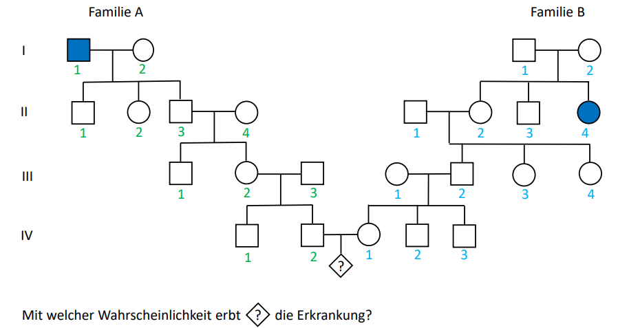

* `Vererbungsart`
    * ü.springt Generationen = <code>_rezessiv_</code>
    * Männer & Frauen gleich betroffen = <code>_autosomal_</code>
    * <code>_seltene_</code> Krankheit
    

* `Wahrscheinlichkeit`
    * Wahrscheinlichkeit, d. $\text{V-1} \ aa$ erbt = $\frac{1}{4} \cdot \frac{1}{6} \cdot \frac{1}{4} = \frac{1}{96} = \underline{1.042\%}$

* `Vererbungsart`
    * $\text{II-2} = 100\% Aa$
    * $\text{III-2} = 50\% Aa$, weil $\frac{2}{2} \cdot \frac{1}{2} = \frac{2}{4} = \underline{\frac{1}{2}}$
    

    * $\text{II-4} = 100\% Aa$
    * $\text{III-3} = 50\% Aa$, weil $\frac{2}{2} \cdot \frac{1}{2} = \frac{2}{4} = \underline{\frac{1}{2}}$
    

    * $\text{IV-1} = 25\% Aa$, weil $\frac{1}{2} \cdot \frac{1}{2} = \underline{\frac{1}{4}}$
    * $\text{IV-2} = 25\% Aa$, weil $\frac{1}{2} \cdot \frac{1}{2} = \underline{\frac{1}{4}}$
    

    * $\text{V-1} = 1,563\% aa$, weil $\frac{1}{4} \cdot \frac{1}{4} \cdot \frac{1}{4} = \underline{\frac{1}{64}}$

* `Vererbungsart`
    * tritt in jeder Generation auf, aber $\text{III-1,2}$: $\forall$ Kinder gesund
    * $\text{II-5,6}$: trotz gesunden Eltern = ein kranker Sohn
    * $\text{III-5,6}$: Trotz gesunden Eltern = 2 Kinder krank  
        * <code>_rezessiv_</code>
    * <u>Warum $\lnot$ X-chromosomal ?</u>
        * $\text{III-5} \times \text{III-6}$: Muss $X_AX_a \ \& \ X_AY$ sein = d. Tochter $\text{IV-10}$ kann eigentl. $\not$ krank sein, weil d. Vater $100\%$ d. gesunde $X_A$ Chromosom weitergeben müsste. Deswegen <code>_autosom_</code>

* `Vererbungsart`
    * Ü.springt Generationen & obwohl eltern gesund = 1 krankes Kind = <code>_rezessiv_</code>
    * Verhäktnis d. erkrankung $\equiv$ = <code>_autosomal_</code>

* `Wahrscheinlichkeit`
    * $\text{II-3} = \frac{2}{3} = 66,7\% Aa$
    * $\text{III-2} = \frac{1}{3} = 33,3\% Aa$
    * $\text{IV-2} = \frac{1}{6} = 16,7\% Aa$
    

    * $\text{II-2} = 100\% Aa$
    * $\text{III-2} = \frac{2}{3} = 66,7\% Aa$
    * $\text{IV-1} = \frac{1}{3} = 33,3\% Aa$
    

    * $\text{V-1} = \frac{1}{3} \cdot \frac{1}{6} \cdot \frac{1}{4} = 33,3\% aa$
    * $1,389\%$

### <u>Wie berechnet man d. Wahrscheinlichkeiten zsm ?</u>:
* **Produktregel (&)**:
    * wenn wir d. Wahrscheinlichkeit berechnen wollen, dass zwei oder mehr unabhängige Ereignisse nacheinander oder gleichzeitig eintreten müssen
    
* **Summenregel (&)**:

## <u>Was sind gekoppelte Gene ?</u>:
* Gene, d. auf dem ***gleichen Chromosom*** sehr ***nah beieinanander liegen*** $\to$ tendieren dazu zsm. vererbt zu werden 
    * Kann nur durch `Crossing-Over` getrennt werden 

# **Crossing-Over**
* nur so können sich homologe Chromosomen zusammenfinden & sich richtig aufteilen
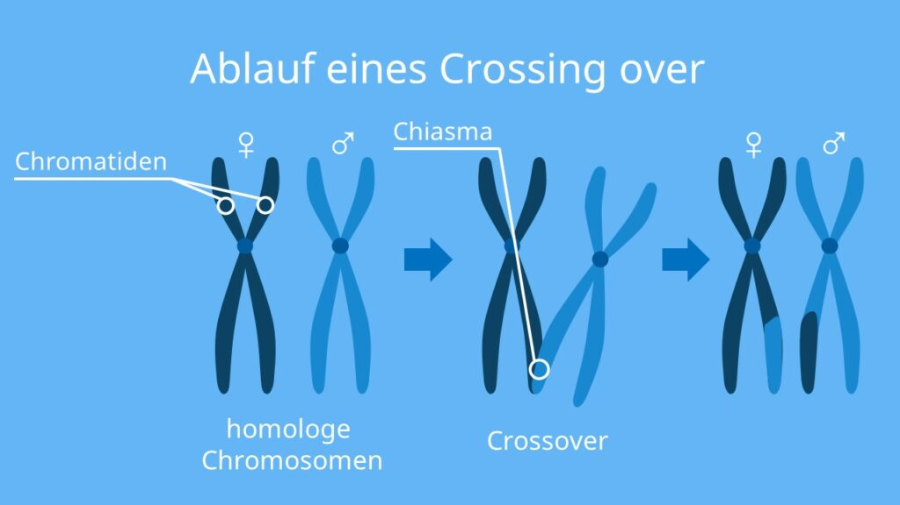
* ***Chiasmas*** = Überkreuzungsstelle
    * physische Verbindung, die das homologe Paar zsm.hält $\to$ entscheidend f. korrekte Paarung d. Chromosomen in Metaphase I  & Anaphase I richtig voneinander trennen.
* **Rekombination**: Chromosomen pro Meiose, ca. *2-3 crossing over*
    * $\lnot$ gleichmäßig $\to$ finden in Hotspots statt (1-2 **kb** (Kilobasen) $\leftrightarrow$ 1000-2000 Basenpaare)

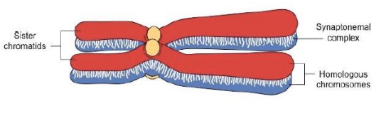 

* **Sister chromatids** $\to$ Schwesterchromatiden
* **Homologous chromosomes** $\to$ Homologe Chromosomen
* **Synaptonemal complex** $\to$ Synaptonemaler Komplex (Struktur, die die homologen Chromosomen zusammenhält)

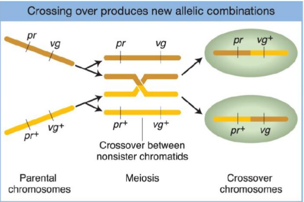

## <u>Wie kommt es zu einem so präzisen Austausch v. doppelsträngiger DNA?</u>

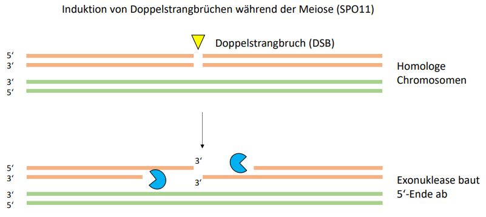

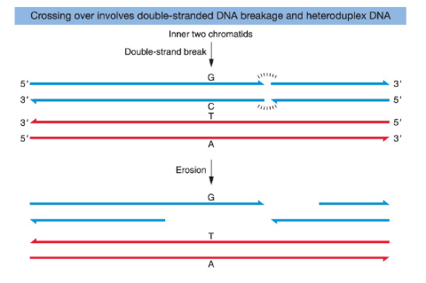

## <u>Rekombination bei X und Y</u>
* ***heterogametischen Geschlecht*** (also Männer) tritt Crossing Over zw. *X- & Y-Chromosom*
    * Dise Regionen nennt man: ***pseudoautosomalen Regionen***. Diese simf *homolog* & enthalten d. *gleichen Gene*
        * Verhalten wie autosomale Erbgänge 

## <u>Wie berechnet man d.Wahrscheinlichkeit, dass ein Crossing-Over stattfindet ?</u>:

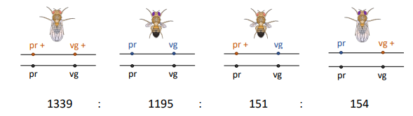 
$\left(\frac{(151 + 154)}{1339+1195+151+154}\right) \cdot 100 = 10.7432\% \to 10.7432cM \ [centiMorgan]$

## <u>Aufgabe: Verteilungswahrscheinlichkeit</u>:

[Lösung](#Verteilungswahrscheinlichkeit)

# **Parthenogenese**
* ***asexuelle Reproduktion***: eingeschlechtlichen Fortpflanzung
    * N.kommen immer identisch zur Mutter
        * __Vorteile__: keine Partnersuche
        * __Nachteile__: $\forall$ gleich anfällig f. sich ändernde Umweltbedingungen

* wird $2 \times$ geteilt $\to \left( \frac{1}{2}\right)^2 = \underline{\frac{1}{4}}$ 

# **1) DNA-Klonierung (Restriktion, Ligation, Transformation)**

## <u>Restriktion</u>
* Restriktionsenzyme $\underrightarrow{\ \ \ \ \textcolor{#d6b315}{\text{schneiden}}\ \ \ \ }$ hochmolekulare DNA $\to$ def. Bruchstücke mit vorhersagbaren Enden (Bsp.: **sticky ends**)

## <u>Ligation</u>
* T4-DNA-Ligase  $\underrightarrow{\ \ \ \ \textcolor{#d6b315}{\text{verknüpft}}\ \ \ \ }$ Phosphodiesterbindung im DNA-Rückgrat
    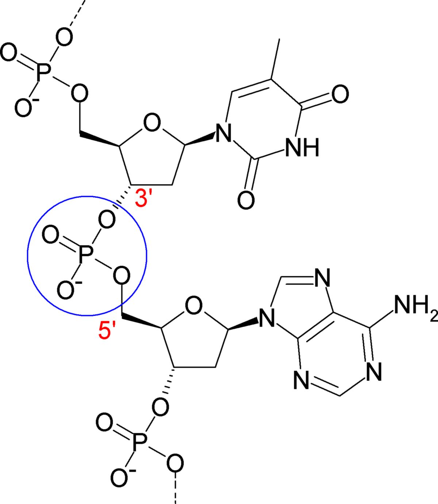
    * <b><u>gewünscht für Klonierung</u></b>
        * Vektor $\underrightarrow{\ \ \ \ \textcolor{#d6b315}{\text{verbindet}}\ \ \ \ }$ Insert
    * <b><u>ungewünscht für Klonierung</u></b>
        * *Selbstligation* des Vektors
            * Insert $\underrightarrow{\ \ \ \ \lnot \textcolor{#d6b315}{\text{eingeschlußt}}\ \ \ \ }$ Sticky ends des Vektors verbinden sich (ohne Insert)

## <u>Transformation</u>
* rekombinierte DNA $\underrightarrow{\ \ \ \ \textcolor{#d6b315}{\text{einfügen}}\ \ \ \ }$ kompetente Wirtszelle
* d. e-coli Bakterien nehmen $\lnot$ einfach DNA aus Umgebung auf
    * muss künstl. erzwungen werden $\implies$ $CaCl_{2}$ & den Hitzeschock bei $42°C$

# <b>2) Plasmide als Vektoren (Def. & pUC18/19)</b>
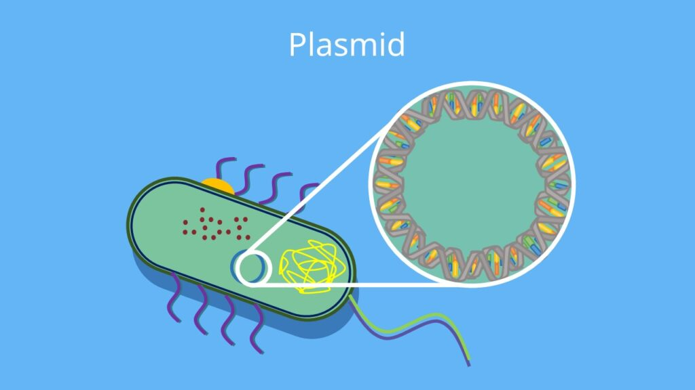

## <u>Der pUC19-Vektor (Key Features):</u>
* <b>Mutierter ColE1-Origin</b> $\underrightarrow{\ \ \ \ \textcolor{#d6b315}{\text{ermöglicht}}\ \ \ \ }$ „relaxierte“ Replikationskontrolle mit hohen Kopienzahlen (300–500 pro Zelle)
* <b>Selektionsmarker ($Amp^{R}$)</b>:
    * Gen f. <b>$\beta$-Lactamase</b> $\underrightarrow{\ \ \ \ \textcolor{#d6b315}{\text{verleiht resistenz geg.}}\ \ \ \ } $Ampicillin
        * <b>Nur transformierte Zellen überleben auf Amp-Platten.</b>
* <b>Multiple Cloning Site (MCS):</b>
    * d. Stelle wo d. *Inserts* eingefügt werden
    * Bereich mit vielen singulären Schnittstellen f. Restriktionsenzyme.
* <b>Sicherheit</b>:
    *  pUC-Vektoren = $\lnot$ konjugativ $\underrightarrow{\ \ \ \ \textcolor{#d6b315}{\text{weil}}\ \ \ \ }$ Gene f.  Gentransfer entf.

# <b>3) Funktionsprinzip des lac-Operons & Blau-Weiß-Selektion</b>
* Erfolgskontrolle

* <u>$\alpha$-Komplementation</u>
    * <b><u>Problem</u></b>:
        * vollständige $lacZ_Gen =$ zu groß $\underrightarrow{\ \ \ \ \textcolor{#d6b315}{\text{f.}}\ \ \ \ }$ kleine + effiziente Vektoren
    * <b><u>Lösung</u></b>:
        * Vector $\underrightarrow{\ \ \ \ \textcolor{#d6b315}{\text{trägt nur}}\ \ \ \ }$ $lacZ'- \text{Fragment }(\alpha-\text{Peptid})$
            * Wirtsstamm  (E. coli RRI) $\underrightarrow{\ \ \ \ \textcolor{#d6b315}{\text{trägt}}\ \ \ \ }$ Rest des Gens im Genom $\underrightarrow{\ \ \ \ \textcolor{#d6b315}{\text{jedoch fehlt}}\ \ \ \ }$ Aminosäuren 11–41 ($\Omega$-Peptid)
    * Nur wenn <b>beide Fragmente</b> zsm.kommen, entsteht eine funktionelle $\beta$-Galactosidase17.

## <b>Selektion im Experiment</b>:
1) <b><u>Iduktion</u></b>:
    * <b>IPTG</b> $\underrightarrow{\ \ \ \ \textcolor{#d6b315}{\text{dient als}}\ \ \ \ }$ Induktor
        * bindet $\underrightarrow{\ \ \ \ \textcolor{#d6b315}{\text{an}}\ \ \ \ }$ Repressor $\underrightarrow{\ \ \ \ \textcolor{#d6b315}{\text{gibt frei}}\ \ \ \ }$ Operator $\underrightarrow{\ \ \ \ \textcolor{#d6b315}{\text{starten}}\ \ \ \ }$ Transkription
2) <b><u>Farbnachweis</u></b>:
    * <b>X-Gal</b> $\underrightarrow{\ \ \ \ \textcolor{#d6b315}{\text{gegegespaltet v.}}\ \ \ \ }$ $\beta$-Galactosidase $\underrightarrow{\ \ \ \ \textcolor{#d6b315}{\text{Enstehung}}\ \ \ \ }$ blauer Farbstoff
3) <b><u>Auswertung</u></b>:
    * <u>blaue Kolonie</u>:
        * $LacZ' \to$ intakt, kein Insert vorh. (Selbstligation des Vektors)
    * <u>weiße</u>:
        * Fremd-DNA in d. MCS inseriert $\to$ Insertionsinaktivierung des $lacZ'$-Gens $\underrightarrow{\ \ \ \ \textcolor{#d6b315}{\text{keine}}\ \ \ \ }$ $\beta$-Galactosidase

<link rel="stylesheet" href="https://cdn.jsdelivr.net/npm/katex@0.16.9/dist/katex.min.css">

