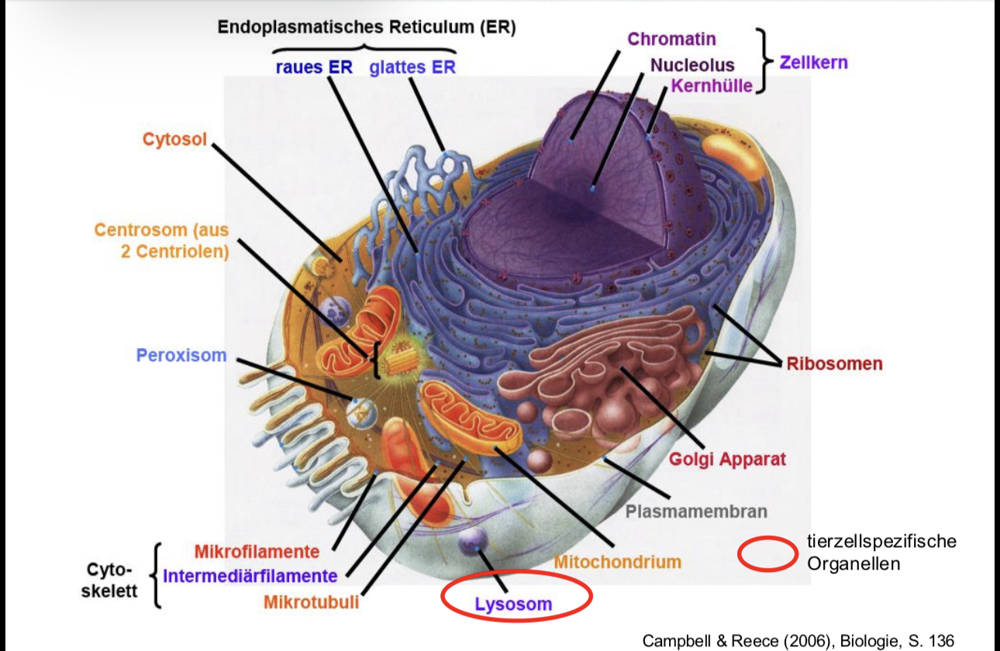
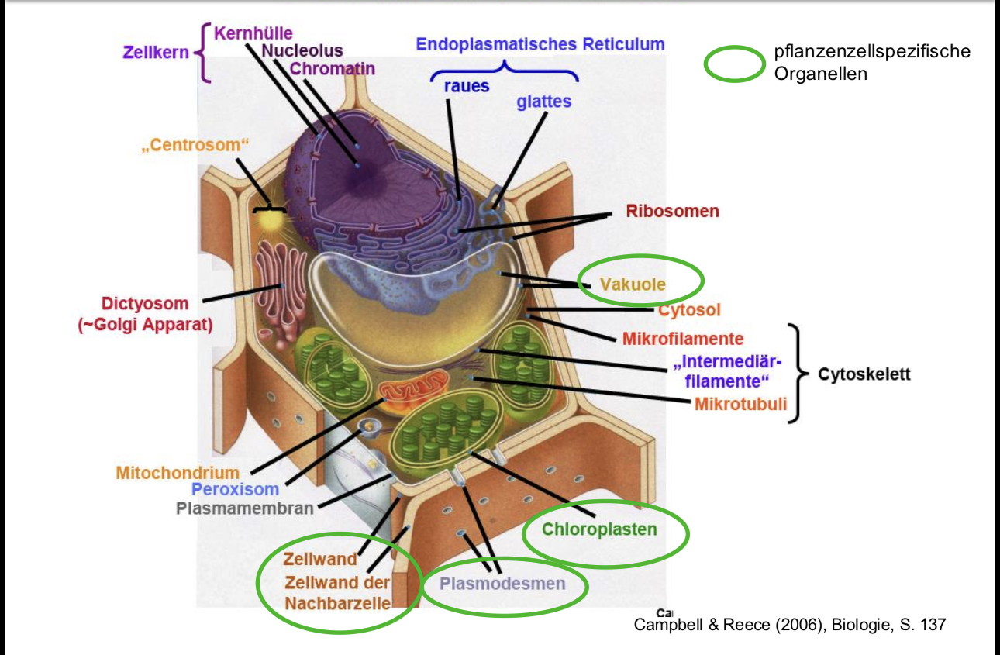
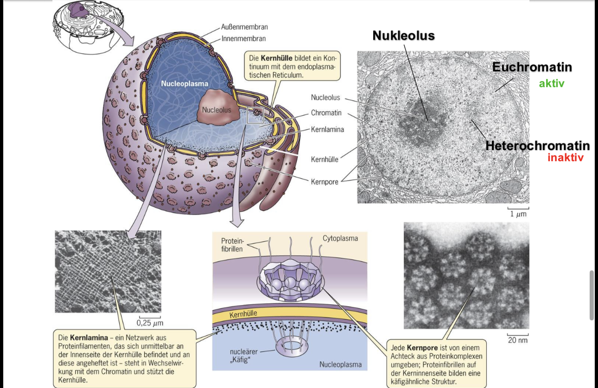
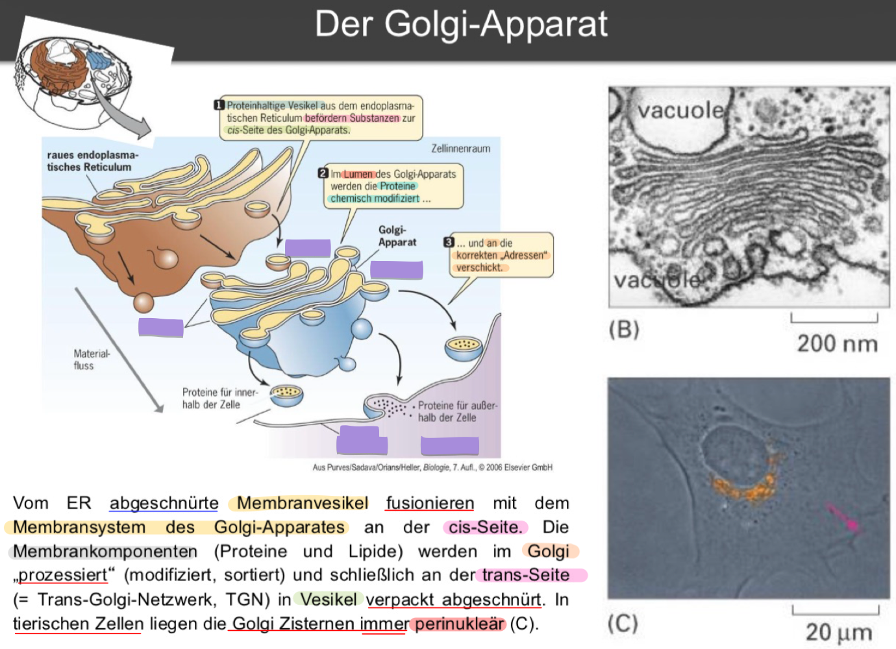
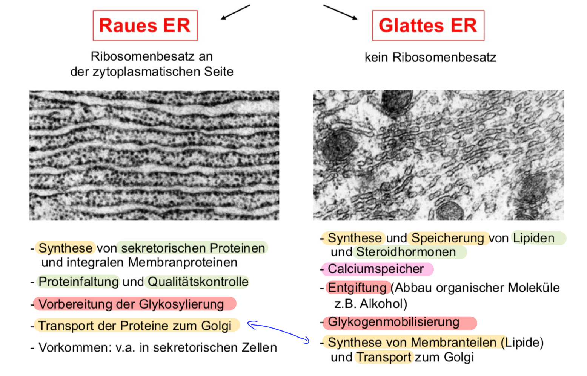
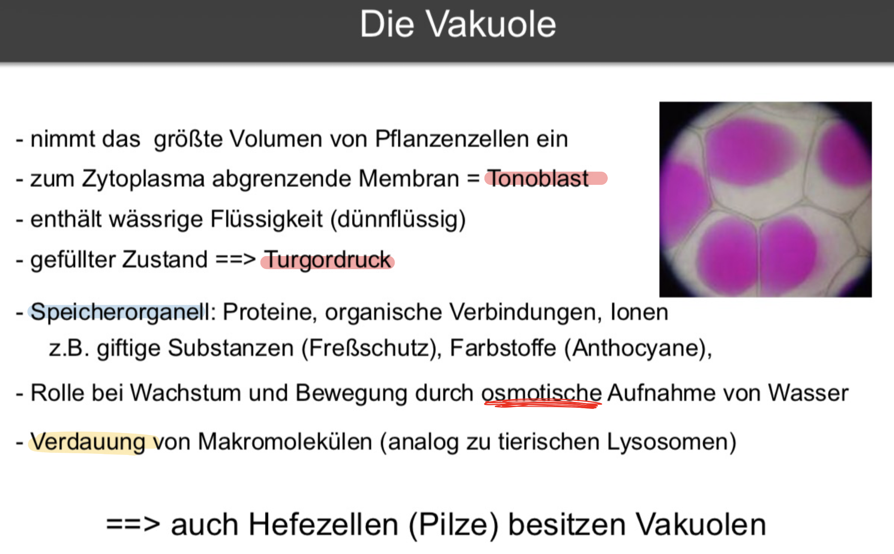
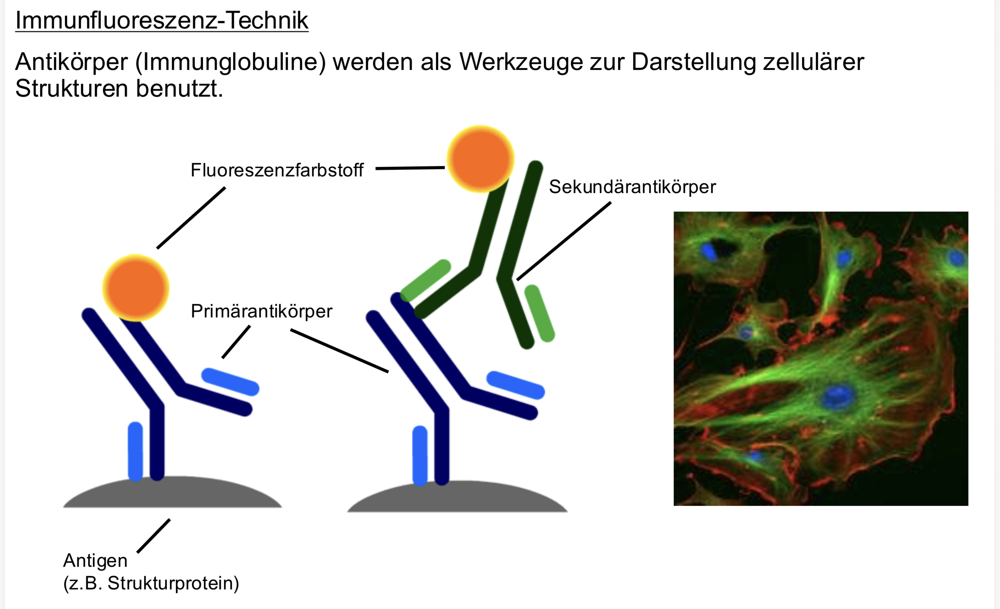
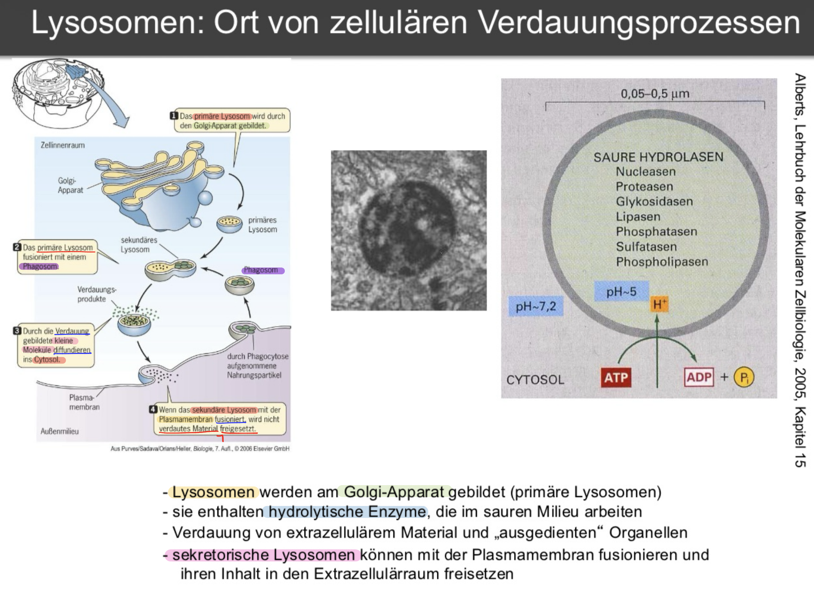

<!-- Style:  -->

<!-- Tabelle -->

<!-- Der richtige Lerninhalt -->
<table>
  <tr>
    <th></th>
    <th>Eukaryoten</th>
    <th>Prokaryoten</th>
  </tr>
  <tr>
    <td><b>len(Okazaki Fragment)</b></td>
    <td>100 bis 200 Nt</td>
    <td>1000 bis 2000 Nt</td>
  </tr>
  <tr>
    <td><b>len(Primer)</b></td>
    <td>8 bis 11 Nt</td>
    <td>11 bis 12 Nt</td>
  </tr>
  <tr>
    <td><b>Replikationsgeschwindigkeit</b></td>
    <td>2500 Nt/min.</td>
    <td>50.000 Nt/min.</td>
  </tr>
  <tr>
    <td><b>Anzahl pro Replikon</b></td>
    <td>25.000(Maus)</td>
    <td>1</td>
  </tr>
  <tr>
    <td><b>len(Replikons)</b></td>
    <td>150 kb(Maus)</td>
    <td>4.700 (E.Coli.)</td>
  </tr>
</table>

# **DNA POL bei Eukaryoten**

# **Eukaryotische Replikationsgabel**

* Helikase = Reißverschluss öffner
* RPA
(Replication Protein A) = d. sind d. einzelstrangbindenden Proteine (**ssb-Protein** (Single-Strand Binding Protein)), d. d. Replikationsgabel aufhalten
* Pol $\epsilon$: $\underrightarrow{\ \ \ \ \textcolor{#d6b315}{\text{synthetisiert}}\ \ \ \ }$ Leitstrang
* Pol $\delta$: $\underrightarrow{\ \ \ \ \textcolor{#d6b315}{\text{synthetisiert}}\ \ \ \ }$ Folgestrang
* PCNA(Proliferating Cell Nuclear Antigen) $\underrightarrow{\ \ \ \ \textcolor{#d6b315}{\text{gibt Polymeasen}}\ \ \ \ }$ halt
* POL $\alpha$-Primase $\underrightarrow{\ \ \ \ \textcolor{#d6b315}{\text{setzt}}\ \ \ \ }$ Primer
* FEN1 (Flap Endonuclease) $\underrightarrow{\ \ \ \ \textcolor{#d6b315}{\text{schneidet}}\ \ \ \ }$ Primer am Ende weg
* DNA-Ligase $\underrightarrow{\ \ \ \ \textcolor{#d6b315}{\text{versiegelt}}\ \ \ \ }$ DNA-Strang

# **Wann weiß d. Zelle, dass d. Replikation zu Ende ist? (Termination)**

* Wenn 2 Teams aufeinanderstoßen
* Vorteil $\to$ kein besonderen Signale notw.

# **Was sind Histonen-Oktamere ?**

* D. ist das fertige Produkt aus einzelnen Histonen 
* besteht aus $\underrightarrow{\ \ \ \ \textcolor{#d6b315}{\text{jeweils einer Kopie}}\ \ \ \ }$ v. 4 Proterinen
    * $H2A$, $H2B$, $H3$ und $H4$.

# **Was kann geschehen, wenn d. nicht so läuft wie geplant ?**

1) <u>Progerie</u>
    * <u>Was macht es ?</u>
        * Kinder $\underrightarrow{\ \ \ \ \textcolor{#d6b315}{\text{altern}}\ \ \ \ }$ schneller
    * <u>Grund ?</u>
        * Helikase-Defekt
    
2) <u>Ophtalmoplegia</u>
    * <u>Was macht es ?</u>
        * Augenmuskelatur $\implies$ gelähmt
    * <u>Grund ?</u>
        * DNA Pol $\gamma$-Defekt

3) <u>**Was genau wird mit Krebs assoziiert ?**</u>
    * DNA Pol $\gamma$ mut.
    * erhöhte Expression v. DNA $\beta$

# **Wrm. werden Telomere immer kürzer ?**

* Primerentf.  $\underrightarrow{\ \ \ \ \textcolor{#d6b315}{\text{verkürzt}}\ \ \ \ }$ Chromosomen $\underrightarrow{\ \ \ \ \textcolor{#d6b315}{\text{pro}}\ \ \ \ }$ Replikation

# **Wie verhindert d. Zelle dieses Problem ?**

* an den Enden $\underrightarrow{\ \ \ \ \textcolor{#d6b315}{\text{hinzugef.}}\ \ \ \ }$ Telomere $\underrightarrow{\ \ \ \ \textcolor{#d6b315}{\text{durch}}\ \ \ \ }$ Telomerasen $\underrightarrow{\ \ \ \ \textcolor{#d6b315}{\text{Grund}}\ \ \ \ }$ Verlustvermeidung

* Telomere $\underrightarrow{\ \ \ \ \textcolor{#d6b315}{\text{bestehen}}\ \ \ \ }$ simplen, tandem-repetitiven Seq.
    * Bsp. bei Mensch: $\color{red}(TTAGGG)_{n = ca. 2000}$

# **Telomerase**

## **<u>Das End-Replikationsproblem</u>**
<u>Was ist das grundlegende Problem bei der Replikation linearer Chromosomen?</u>

* lineare Chromosomen $\underrightarrow{\ \ \ \ \textcolor{#7abd2d}{\text{Problem}}\ \ \ \ }$ Primerentf. am Folgestrang $\underrightarrow{\ \ \ \ \textcolor{#7abd2d}{\text{Folge}}\ \ \ \ }$ Chromosomen verkürzen sich bei jeder Replikation

## <u>**Was ist d. Lösung ?**</u>

* Chromosomenenden $\underrightarrow{\ \ \ \ \textcolor{#7abd2d}{\text{besitzen}}\ \ \ \ }$ Telomere (z.B. $TTAGGG_n$) $\underrightarrow{\ \ \ \ \textcolor{#7abd2d}{\text{verlängert durch}}\ \ \ \ }$ Telomerase $\underrightarrow{\ \ \ \ \textcolor{#7abd2d}{\text{Ergebnis}}\ \ \ \ }$ Kompensation des DNA-Verlusts

## <u>**Was ist die Telomerase & wie funktioniert sie biochemisch?**</u>

* Telomerase $\underrightarrow{\ \ \ \ \textcolor{#7abd2d}{\text{ist ein}}\ \ \ \ }$  Ribonukleoprotein $\underrightarrow{\ \ \ \ \textcolor{#7abd2d}{\text{besteht aus}}\ \ \ \ }$  Protein ($\colorbox{red}{TERT}$) + RNA-Anteil ($\colorbox{red}{TERC}$)
* Enzym-Klasse $\underrightarrow{\ \ \ \ \textcolor{#7abd2d}{\text{wirkt als}}\ \ \ \ }$  **Reverse Transkriptase** $\underrightarrow{\ \ \ \ \textcolor{#7abd2d}{\text{nutzt}}\ \ \ \ }$  eigene RNA ($TERC$) als Matrize f. DNA-Synthese
* Arbeitsweise: Telomerase $\underrightarrow{\ \ \ \ \textcolor{#7abd2d}{\text{verlängert aktiv}}\ \ \ \ }$  den 3'-Überhang (Matrizenstrang) $\underrightarrow{\ \ \ \ \textcolor{#7abd2d}{\text{danach}}\ \ \ \ }$  Primase & DNA-Polymerase füllen den Folgestrang auf

## <u>**Wie schützt die Zelle ihre offenen DNA-Enden vor dem Abbau oder falscher Reparatur?**</u>

* Telomer-DNA $\underrightarrow{\ \ \ \ \textcolor{#7abd2d}{\text{bildet}}\ \ \ \ }$  `T-Loop` (Schleife) $\underrightarrow{\ \ \ \ \textcolor{#7abd2d}{\text{Funktion}}\ \ \ \ }$  versteckt das offene Ende & reguliert Telomerase-Aktivität
* `SHELTERIN-Komplex` (z.B. $TRF1/TRF2$) $\underrightarrow{\ \ \ \ \textcolor{#7abd2d}{\text{bindet an}}\ \ \ \ }$  `T-Loop` $\underrightarrow{\ \ \ \ \textcolor{#7abd2d}{\text{Funktion}}\ \ \ \ }$  versiegelt das Ende & schützt vor unbeabsichtigter DNA-Reparatur

## <u>**Wie erkennen Telomerase-Enzyme, wo sie arbeiten müssen?**</u>

* Telomere $\underrightarrow{\ \ \ \ \textcolor{#7abd2d}{\text{prod.}}\ \ \ \ }$  **long non-coding RNA** ($TERRA$)
* verkürzte Telomere $\underrightarrow{\ \ \ \ \textcolor{#7abd2d}{\text{nutzen}}\ \ \ \ }$  $TERRA$ $\underrightarrow{\ \ \ \ \textcolor{#7abd2d}{\text{lockt an}}\ \ \ \ }$  `Telomerase` $\underrightarrow{\ \ \ \ \textcolor{#7abd2d}{\text{verhindert}}\ \ \ \ }$  vorzeitige Seneszenz

## <u>**Warum altern unsere Zellen?**</u>
* `Somazellen` $\underrightarrow{\ \ \ \ \textcolor{#7abd2d}{\text{schalten ab}}\ \ \ \ }$  `Telomerase` (n. d. Geburt) $\underrightarrow{\ \ \ \ \textcolor{#7abd2d}{\text{Folge}}\ \ \ \ }$  Telomere *verkürzen* sich stetig
* Kritische Verkürzung $\underrightarrow{\ \ \ \ \textcolor{#7abd2d}{\text{führt zu}}\ \ \ \ }$  Teilungsstopp (<b>Hayflick-Limit</b>, ca. 100 Mitosen) $\underrightarrow{\ \ \ \ \textcolor{#7abd2d}{\text{Ergebnis}}\ \ \ \ }$  Zelluläre Seneszenz

## <u>**Welche Zellen altern nicht und warum?**</u>

* Keimzellen & Krebszellen $\underrightarrow{\ \ \ \ \textcolor{#7abd2d}{\text{besitzen}}\ \ \ \ }$  aktive Telomerase $\underrightarrow{\ \ \ \ \textcolor{#7abd2d}{\text{Folge}}\ \ \ \ }$  unbegrenzte Zellteilung (unlimited proliferation)
* Somazellen $\underrightarrow{\ \ \ \ \textcolor{#7abd2d}{\text{Telomere abgestellt}}\ \ \ \ }$  ist eine evolutionäre Strategie $\underrightarrow{\ \ \ \ \textcolor{#7abd2d}{\text{Zweck}}\ \ \ \ }$  Tumorunterdrückung (da 85% aller Tumore Telomerase+ sind)
 

# **DNA-Amplifikation**

## <u>**Wie und warum kommt es zur gezielten DNA-Amplifikation in Eukaryoten?**</u>

* Physiologisch $\underrightarrow{\ \ \ \ \textcolor{#7abd2d}{\text{nutzt}}\ \ \ \ }$ selektive Über-Replikation definierter Genom-Abschnitte $\underrightarrow{\ \ \ \ \textcolor{#7abd2d}{\text{Zweck}}\ \ \ \ }$ Erhöhung der Gendosis für starke Proteinproduktion (z.B. rRNA-Gene in Amphibien-Oocyten)
* Pathologisch $\underrightarrow{\ \ \ \ \textcolor{#7abd2d}{\text{passiert bei}}\ \ \ \ }$Mutationsereignissen in Krebszellen $\underrightarrow{\ \ \ \ \textcolor{#7abd2d}{\text{Folge}}\ \ \ \ }$ Amplifikation von Onkogenen (sichtbar als HSR oder "Double Minutes")

## <u>**Was sind Onkogene?**</u>
* natürl. Gene, d wachstumsfördernd sind
    * geben Zelle d. Signal zur Teilung

## <u>**Wie stoppen Medikamente wie Acyclovir oder AZT die Virusvermehrung?**</u>

* Medikament $\underrightarrow{\ \ \ \ \textcolor{#7abd2d}{\text{besteht aus}}\ \ \ \ }$ `Nukleotidanaloga` (synthetische Arzneistoffe, d. natürl. Bausteinen von DNA/RNA ähneln, aber modifiziert sind) $\underrightarrow{\ \ \ \ \textcolor{#7abd2d}{\text{eingebaut durch}}\ \ \ \ }$ virale Polymerasen / Reverse Transkriptase (z.B. $AZT$ bei $HIV$) $\underrightarrow{\ \ \ \ \textcolor{#7abd2d}{\text{Folge}}\ \ \ \ }$ Kettenabbruch bei viraler Replikation

## <u>**Wie wird der Übergang zwischen den verschiedenen Zellzyklus-Phasen gesteuert?**</u>

* Zellzyklus $\underrightarrow{\ \ \ \ \textcolor{#7abd2d}{\text{kontrolle durch}}\ \ \ \ }$ `CDK-Cyclin-Komplexe`
* Komplex-Aufbau $\underrightarrow{\ \ \ \ \textcolor{#7abd2d}{\text{besteht aus}}\ \ \ \ }$ `Cyclin` (regulatorisches Protein) + $CDK$ (cyclinabhängige Kinase)
* Mechanismus $\underrightarrow{\ \ \ \ \textcolor{#7abd2d}{\text{aktiver Komplex}}\ \ \ \ }$ phosphoryliert Zielproteine $\underrightarrow{\ \ \ \ \textcolor{#7abd2d}{\text{Ergebnis}}\ \ \ \ }$ Auslösung des nächsten Zellzyklus-Schritts (z.B. Eintritt in die S-Phase)

## <u>**Wie verhindert der "Wächter des Genoms" (p53) die Replikation von defekter DNA?**</u>

* DNA-Schaden $\underrightarrow{\ \ \ \ \textcolor{#7abd2d}{\text{führt zur}}\ \ \ \ }$ Aktivierung von **p53** $\underrightarrow{\ \ \ \ \textcolor{#7abd2d}{\text{aktives p35}}\ \ \ \ }$ bindet an Regulationsbereich des **p21-Gens** $\underrightarrow{\ \ \ \ \textcolor{#7abd2d}{\text{Zelle prod.}}\ \ \ \ }$ **p21** (ein Cdk-Inhibitorprotein) $\underrightarrow{\ \ \ \ \textcolor{#7abd2d}{\text{p21 blockiert}}\ \ \ \ }$ den `Cyclin-Cdk-Komplex` der S-Phase $\underrightarrow{\ \ \ \ \textcolor{#7abd2d}{\text{Ergebnis}}\ \ \ \ }$ Eintritt in S-Phase wird verhindert

* Kinasen aktiviert & Inhibitoren blockieren

