<style>
  img {
  width: 200px;
  height: auto;
  }

  code {
    background: #eaeaeaff 2px;
    color: #7dc761ff
  }

  body {
    background: #ffffffff;
    color: #000000ff;
    font-size: 20px;
  }

  h1 {
    font-weight: bold;
    text-decoration: underline;
  }

  h2 {
    font-weight: bold;
    text-decoration: underline;
  }

  h3 {
    font-weight: bold;
    text-decoration: underline;
  }
  
  /* Zielvorgabe für alle Blockquotes */
  blockquote {
    border-left: 5px solid #7cb459ff; /* Ein farbiger Strich links */
    padding-left: 20px;             /* Abstand zum Text */
    background-color: #edfbeaff;      /* Ein leichter Hintergrund */
    margin-left: 10px;              /* Die eigentliche Einrückung */
    color: #333;                    /* Textfarbe */
  }

  /* Optional: Wenn du das Aussehen der Liste im Blockquote verändern willst */
  blockquote ul {
    list-style-type: square;
  }


  /* Standard-Design für den Button */
  .toggle-btn {
    cursor: pointer;
    padding: 10px;
    border: 1px solid #ccc;
    background-color: #f0f0f0;
    transition: background 0.3s;
    display: inline-block;
    width: 100%;
  }

  /* Rote Farbe, wenn die Klasse "marked" gesetzt ist */
  .toggle-btn.marked {
    background-color: #ffcccc; /* Hellrot */
    border-color: #ff0000;
  }

</style>


<h1>Viren & Phagen</h1>

<details>
 <summary><b><u>Wrm. stellen <code>Viren</code> & <code>Phagen</code> eine Grenzform des Lebens dar ?</u></b></summary>

* sind eigentl. nur eine Kapsel mit `Nukleinsäurenstrang`$^!$(R- oder DNA) $\underrightarrow{\ \ \ \ \textcolor{#c72483}{\text{nicht ü.lebensfähig ohne}}\ \ \ \ }$ <code style="color:red">Wirtszelle</code>$^!$
</details>


<details>
  <summary><b><u>Was ist d. Unterschied zw. einem <code>Virus</code> & einer <code>Phage</code></u></b></summary>

  * <code>Phage</code> $\underrightarrow{\ \ \ \ \textcolor{#c72483}{\text{spezialisiert auf}}\ \ \ \ }$ Bakterien
</details>

<details>
  <summary><b><u>Nach welches Prinzip sind <code>Viren</code> & <code>Phagen</code> aufgebaut ?</u></b></summary>

  * N. dem <code style="color:red">Baukastenprinzip</code>
</details>


<details>
  <summary><b><u>Welche Virenarten gibt es ?</u></b></summary>

  * TMV: 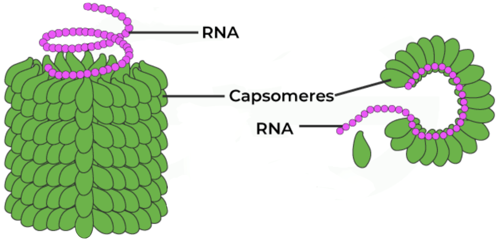
  * Adenovirus: 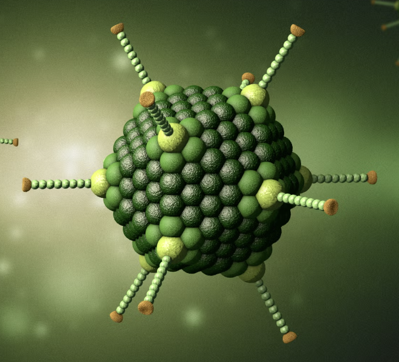
  * HIV: 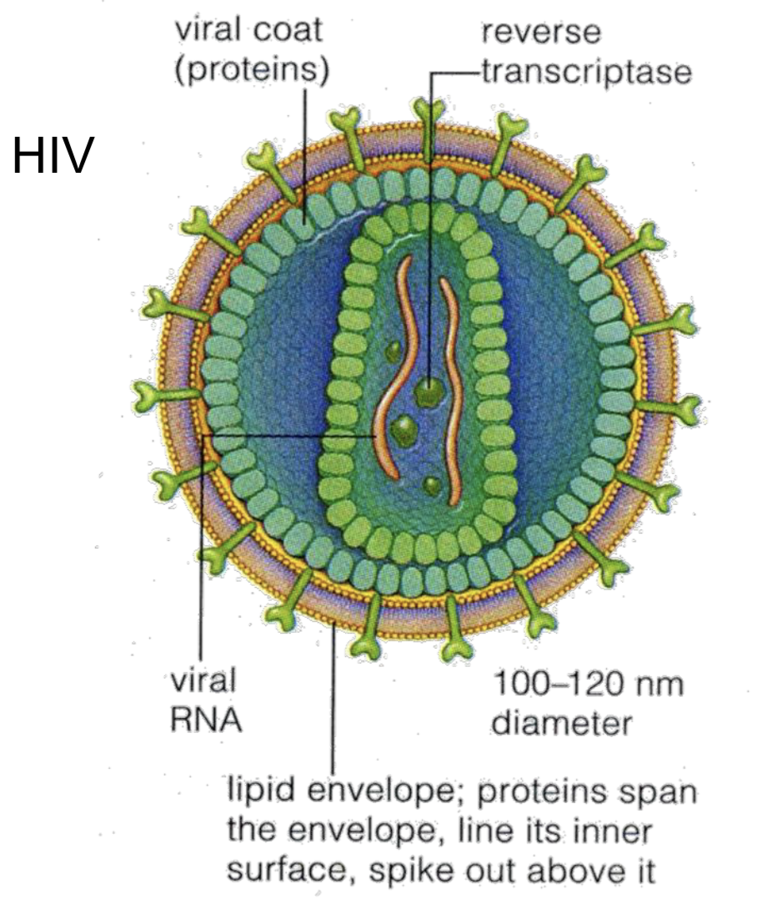
  * T-Phage: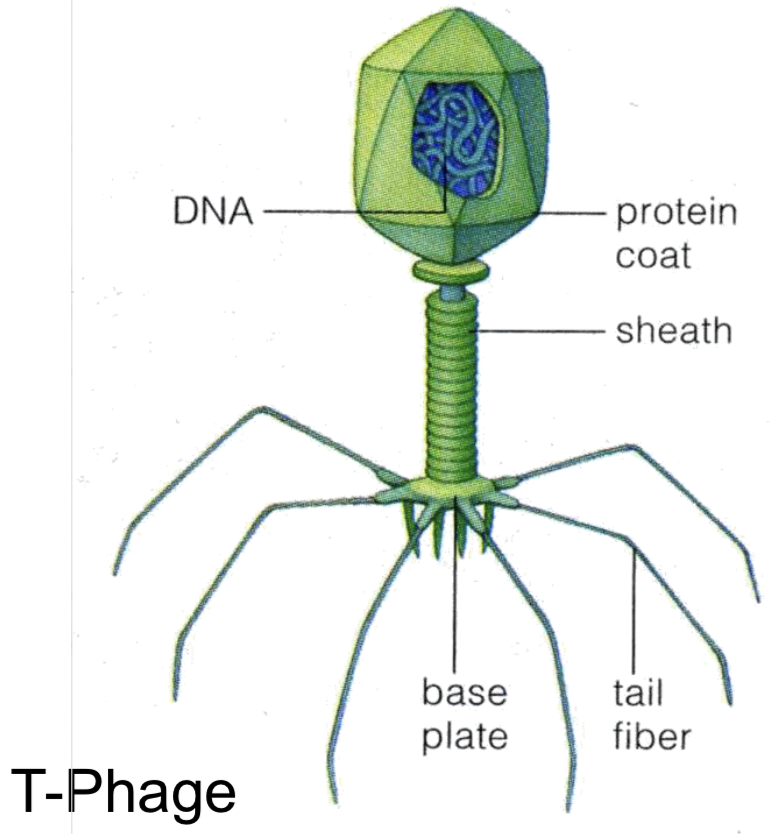
</details>

<div>
  <details>
    <summary><b><u>Was sind die beiden Virenstrukturen</u></b></summary>

  > 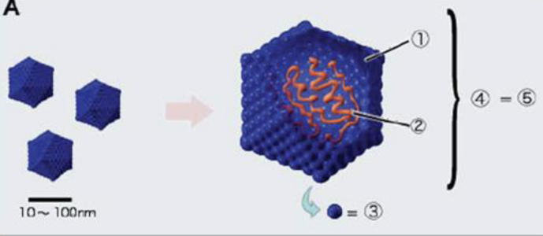
  >
  > <details>
  >   <summary>Lösung</summary>
  >   <ol>
  >     <li>Kapsid (Ikosaeder)</li>
  >     <li>Nukleinsäure</li>
  >     <li>Kapsomer</li>
  >     <li>Nukleokapsid</li>
  >     <li>Virion</li>
  >   </ol>
  > </details>
  >
  > 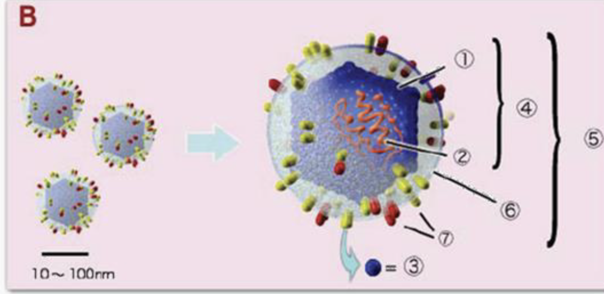
  >
  > <details>
  >   <summary>Lösung</summary>
  >   <ol>
  >     <li>Kapsid</li>
  >     <li>Nukleinsäure</li>
  >     <li>Kapsomer</li>
  >     <li>Nukleokapsid</li>
  >     <li>Virion</li>
  >     <li>Hülle (Envelope)</li>
  >     <li>Spikes (Glykoproteine)</li>
  >   </ol>
  > </details>
  </details>
</div>


<details>
 <summary><b><u>Was sind d. Vermehrungszyklen von Bakteriophagen</u></b></summary>

  1) <u>Lytic Cycle (Zerstörerisch)$^!$</u>
     * Step 1: Virus $\to$ <span style="color: #69dbceff;">dockt an</span> $\to$ Bakterium $\to$ <span style="color: #69dbceff;">injeziert</span> $\to$ DNA
     * Step 2: Bakterien-DNA $=$ zerstört $^!$ $\implies$ Bakterium muss `Virus-DNA` produzieren
     * Step 3: Bakterium $\to$ baut $\to$ neue Viren zsm.
     * Step 4: Zelle platzt (<b><span style="color: #8e50d0ff;">Lysis</span></b> $^!$) 
      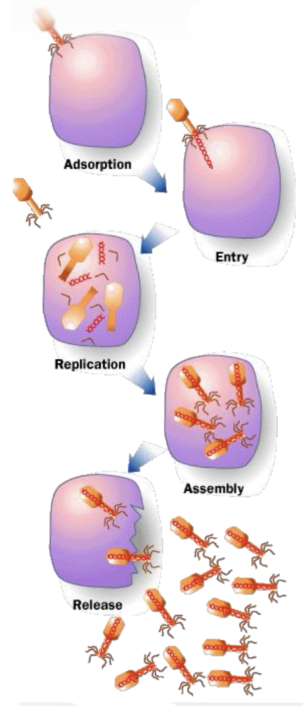

  1) <u>Lysogenic Cycle (Schläferich)</u>
      * Step 1: Virus $\to$ <span style="color: #69dbceff;">dockt an</span> $\to$ Bakterium $\to$ <span style="color: #69dbceff;">injeziert</span> $\to$ DNA
      * STep 2:  Virus-DNA wird eingebaut in Erbgut des Bakteriums (<b><span style="color: #8e50d0ff;">Prophage</span></b>) $\leftarrow$ <span style="color: #d51010ff;">OHNE SCHADEN</span>
  
  * es ist mögl. d. ein Virus v. <code>Lysogenic Cycle</code> $\to$  <code>Lytic Cycle</code>
</details>

<details>
  <summary><b><u>Welche 2 Vermehrungsarten gibt es ?</u></b></summary>

  1) <code>Burst</code>:
  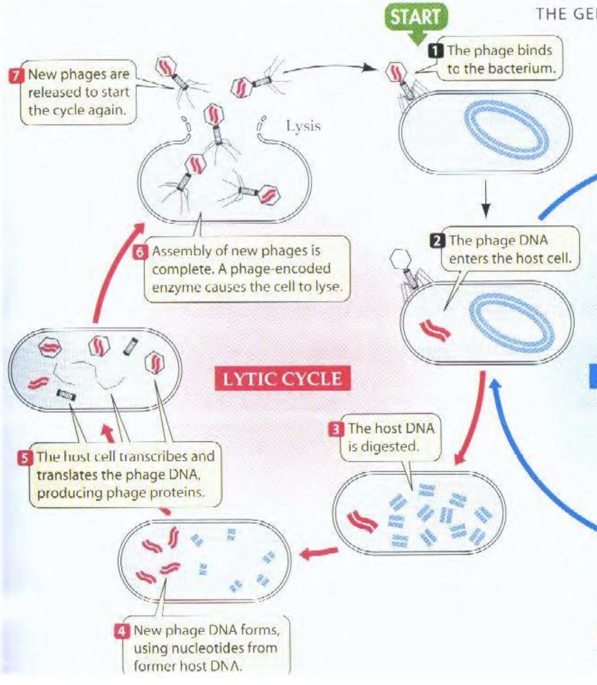

  1) <code>Budding</code>: 
  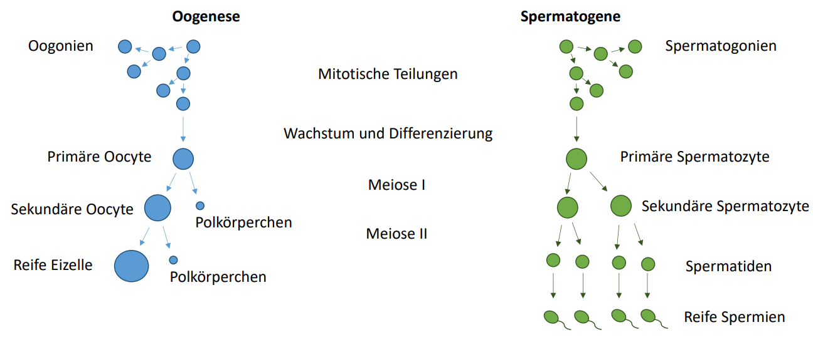

     * Vgl.: Versikel, Lysosomen

</details>

<details>
 <summary><b><u>Was sind d. 3 Domänen des Lebens ?</u></b></summary>

  1) <code>Procaryoten</code>: $\begin{cases}
      \text{Archaea}\\
      \text{Bakteria}
    \end{cases}$
  1) <code>Eucaryoten</code>: Ein - oder Mehrzellig
  * Bsp.: Algen, Flechten, Pilze

  > * Archaea: Brücke zw. Euk. & Prok.
  > * Vorkommen = extremen Lebensräume $\begin{cases} \text{extrem thermophil} \\ \text{extrem halophil(Salzkonzentration)} \end{cases}$
  
</details>

<details>
 <summary><b><u>Was ist d. Hauptunterschied zw. <code>Eukaryoten</code> & <code>Prokaryoten</code> ?</u></b></summary>

  * Zellkern Zellkern $ \begin{cases} \text{Eukaryoten = Zellkern} \\ \text{Prokaryoten = kein Zellkern} \end{cases} $

</details>


<h1>Wasser, Kohlenhydrate & Fette</h1>

<h2>Kovalente Bindung</h2>

<details>
 <summary><b><u>Was ist eine <code>kovalente</code> & eine <code>nicht kovalente Bindung</code></u></b></summary>

  * <code>Kovalente Bindung</code>
    * Atombindungen
    * <code style="color: #d91c55ff">Valenzelektronen</code> = geteilt
      * d. am schwächsten gebundenen Elektronen in d. äußersten Schale eines Atoms
  * <code>Nicht kovalente Bindung</code>
    * Zwischenmolekulare Kräfte
</details>


<details>
 <summary><b><u>Wie nennt man d. am schwächsten gebundenen Elektronen in d. äußeren Schale eines Atoms ? </u></b></summary>

  * <code>Valenzelektronen</code>
  
</details>

<details>
 <summary><b><u>Wodurch ist d. Elektronenverteilung abhängig ? </u></b></summary>

  * <code>Elektronegativität</code>
  
</details>

<h2>Geometrie</h2>

<details>
 <summary class="toggle-btn" id="q1" onclick="toggleMark(this)"><b><u>Was ist die Voraussetzung dafür, dass ein Kohlenstoffatom als "asymmetrisch" bezeichnet wird?</u></b></summary>
  
  * Es muss __Bindungen__ zu <span style="color: red">vier völlig unterschiedl. <code style="color: red">Atomen</code> oder <code style="color: red">Atomgruppen</code> besitzen</span>.
</details>


<details>
 <summary><b><u>Was entsteht automa., wenn ein Molekül ein asymmetrisches C-Atom besitzt?</u></b></summary>

  * Es entstehen <code>Stereoisomere</code>(auch ___optische Isomere___ genannt).
    * <span style="font-size: 12px">chemische Verbindungen, d. zwar d. gleiche Summenformel & Verknüpfung d. Atome (Konstitution) besitzen, sich jedoch in d. räuml. Anordnung d. Atome im dreidimensionalen Raum unters.. Man nennt sie daher auch <code>Raumisomere</code></span>

    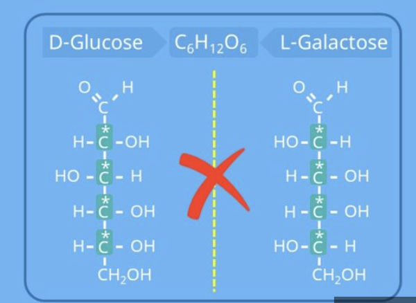
</details>


<details>
 <summary><b><u>Was bedeutet der Begriff <code>Chiralität</code> (Händigkeit) anschaul. ?</u></b></summary>

  * Dass sich d. Molekül & sein Spiegelbild durch reine Drehung $\lnot$ zur Deckung bringen lassen (genau wie eine linke & rechte Hand).
</details>

<details>
 <summary><b><u>Welche biologische Relevanz haben chirale C-Atome ?</u></b></summary>

  * Biologisch wichtige Moleküle besitzen fast immer __mindestens ein__ <code>chirales C-Atom</code>, $\underrightarrow{\ \ \ \ \textcolor{#c72483}{\text{Grund}}\ \ \ \ }$ dreidimensionale Form $\underrightarrow{\ \ \ \ \textcolor{#c72483}{\text{entscheidet}}\ \ \ \ }$ wie sie im Körper wirken
</details>

<details>
 <summary><b><u>Welche zwei großen Stoffgruppen sind typische Beispiele für Moleküle mit chiralen Zentren?</u></b></summary>

  * <code>Aminosäure</code>
    * Bausteine d. Proteine
  * <code>Kohlenhydrate</code>
</details>

<details>
 <summary><b><u>Welche Aminosäure bildet eine wichtige Ausnahme & ist nicht chiral? Warum?</u></b></summary>

  * ```text
        COOH
          |
    H₂N — C — H   <-- Das zentrale C hat zwei H-Atome, 
          |           ist also NICHT asymmetrisch!
          H
    ```
  * zentrale C-Atom ist an zwei identische Wasserstoffatome ($H$) gebunden $\implies$ keine $4$ unterschiedl. Partner
</details>

<h2>Nicht kovalente Bindung</h2>

<details>
 <summary><b><u>Welche nicht kovalente Bindungen gibt es ?</u></b></summary>

  * Ionen-Bindung
  * Wasserstoffbrückenbindung
</details>

<h2>Inonen</h2>

<details>
 <summary><b><u>Wie entsteht eine Ionenbindung? (z. B. bei Kochsalz)</u></b></summary>

  * Durch die vollständige Übertragung v. Elektronen. 
  * Ein Atom (`Natrium`) $\underrightarrow{\ \ \ \ \textcolor{#c72483}{\text{gibt ab}}\ \ \ \ }$ Elektron $\underrightarrow{\ \ \ \ \textcolor{#c72483}{\text{wird zum}}\ \ \ \ }$ __positiven Kation__ ($Na^+$), d. andere (`Chlor`) nimmt es auf $\underrightarrow{\ \ \ \ \textcolor{#c72483}{\text{wird zum}}\ \ \ \ }$ __negativen Anion__ ($Cl^-$). <span style="color: red">Die entgegengesetzten Ladungen ziehen sich elektrostatisch an</span>.
</details>

<details>
 <summary><b><u>In welcher Struktur liegen die Ionen im festen Zustand vor?</u></b></summary>

  * bilden ein festes, regelmäßiges Kristallgitter (Ionengitter)
</details>

<details>
 <summary><b><u>Welche Voraussetzung muss erfüllt sein, damit sich ein Salzkristall in Wasser auflöst?</u></b></summary>

  * $\text{Hydratationsenergie} > \text{Gitterenergie}$
</details>

<details>
 <summary><b><u>Was versteht man unter der "Gitterenergie" ?</u></b></summary>

  * Energie, d. Ionen im festen Kristalgitter zsm.hält $\underrightarrow{\ \ \ \ \textcolor{#c72483}{\text{Überwindung}}\ \ \ \ }$ Zerstörung des Kristalgitters
</details>

<details>
 <summary><b><u>Was versteht man unter der "Hydratationsenergie" ?</u></b></summary>

  * Energie, d. freigesetzt wird, wenn sich Wassermoleküle an d. freigewordenen Ionen anlagern.
</details>

<details>
 <summary><b><u>Was versteht man unter der "Hydratationsenergie" ?</u></b></summary>

  * Eine Schicht aus Wassermolekülen, d. sich beim Lösen um d. einzelnen Ionen herum anordnet.
  * Dabei zeigt d. positive Pol des Wassers ($H$) zum negativen Chloridion ($Cl^-$) & d. negative Pol ($O$) zum positiven Natriumion ($Na^+$).
</details>


<h2>Wasserstoffbrückenbindung</h2>

<details>
 <summary><b><u>Welcher Prozess beschreibt den ersten Schritt beim Lösen eines Salzes (aus energetischer Sicht) ?</u></b></summary>

  * D. __Aufbrechen des Ionengitters__. Die Ionen müssen aus ihrem festen Verband gelöst werden (dafür wird Gitterenergie verbraucht).
</details>

<details>
 <summary><b><u>Was ist die Gitterenergie ($U_L$)?</u></b></summary>

  * feste Kristallgitter $\underrightarrow{\ \ \ \ \textcolor{#c72483}{\text{GItterenergie}}\ \ \ \ }$ gasförmige Ionen
  * __immer positiv__ (`endotherm`).
</details>

<details>
 <summary><b><u>Was ist die Gitterenergie ($U_L$)?</u></b></summary>

  * feste Kristallgitter $\underrightarrow{\ \ \ \ \textcolor{#c72483}{\text{GItterenergie}}\ \ \ \ }$ gasförmige Ionen
  * __immer positiv__ (`endotherm`).
</details>

<details>
 <summary><b><u>
Welcher Prozess beschreibt den zweiten Schritt beim Lösen ?</u></b></summary>

  * `Hydratation`: Ionen $\underrightarrow{\ \ \ \ \textcolor{#c72483}{\text{umgeben}}\ \ \ \ }$ Wassermoleküle $\underrightarrow{\ \ \ \ \textcolor{#c72483}{\text{Entstehung}}\ \ \ \ }$ Hydrathülle $\underrightarrow{\ \ \ \ \textcolor{#c72483}{\text{wird frei}}\ \ \ \ }$ Hydratationsenergie
</details>

<details>
 <summary><b><u>Was bestimmt, ob sich ein Salz löst oder nicht ?</u></b></summary>

  * Die `Lösungsenthalpie` ($\Delta H_{sol}$): $Gitterenergie + Hydratationsenergie$
</details>

<details>
 <summary><b><u>Wie lautet die Faustformel für die Lösungsenthalpie?</u></b></summary>

  * $\Delta H_{sol} = U_L + \Delta H_{hyd}$
</details>

<details>
 <summary><b><u>Was passiert energetisch, wenn sich ein Salz löst (exotherm vs. endotherm)?</u></b></summary>

  1) `Exotherm`: Es wird mehr Energie bei der Hydratation frei, als für das Gitter benötigt wurde ($\Delta H_{sol} < 0$) $\implies$ Glas wird warm.
  1) `Endotherm`: Es wird mehr Energie benötigt, um das Gitter zu knacken, als bei d. Hydratation frei wird ($\Delta H_{sol} > 0$) $\implies$ Glas kühlt ab.
</details>

<h2>Aggerarzustände</h2>

<details>
 <summary><b><u>Wie verhalten sich Wassermoleküle im festen Zustand (Eis)?</u></b></summary>

  * Wassermoleküle $\underrightarrow{\ \ \ \ \textcolor{#c72483}{\text{durch}}\ \ \ \ }$ Wasserstoffbrückenbindungen $\underrightarrow{\ \ \ \ \textcolor{#c72483}{\text{gehalten}}\ \ \ \ }$ festen Zustand
</details>

<details>
 <summary><b><u>Was passiert mit den Wasserstoffbrücken im flüssigen Zustand?</u></b></summary>

  * Wassermoleküle bewegen sich $\underrightarrow{\ \ \ \ \textcolor{#c72483}{\text{ständig}}\ \ \ \ }$ brechen Wasserstoffbrücken & bilden sich neu.
</details>

<details>
 <summary><b><u>Wie ist die Struktur im gasförmigen Zustand?</u></b></summary>

  * Keine Wasserstoffbrückenbindung
</details>

<h2>Wasser</h2>

<details>
 <summary><b><u>Was ist d. Kohäsion ?</u></b></summary>

  * Zsm.halt innerhalb eines Stoffes
</details>

<details>
 <summary><b><u>Was ist d. Adhäsion ?</u></b></summary>

  * Anhaftung an fremden Oberflächen
</details>

<details>
 <summary><b><u>Was ist die Folge von Kohäsion und Adhäsion bei Wasser?</u></b></summary>

  * `Organismen` sind auf die __Kohäsion__ & __Adhäsion__ v. Wassermolekülen angew.
</details>

<details>
 <summary><b><u>Wo zeigt sich d. Oberflächenspannung in der Natur ?</u></b></summary>

  * Bsp.: Bei d. Fortbewegung v. Insekten auf d. Wasseroberfläche.
</details>

<details>
 <summary><b><u>Welche Funktion haben Kohäsion und Adhäsion bei Pflanzen ?</u></b></summary>

  * Sie ermöglichen den Wassertransport innerhalb d. Pflanze.
  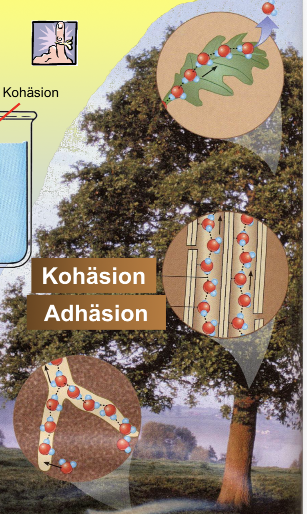
</details>

<h2>Makromoleküle</h2>

<details>
 <summary><b><u>Was sind d. 4 Klassen der Makromoleküle ?</u></b></summary>

  * Proteine(Polypaptide)
  * Nukleinsäuren
  * Kohlenhydrate
  * Lipide

  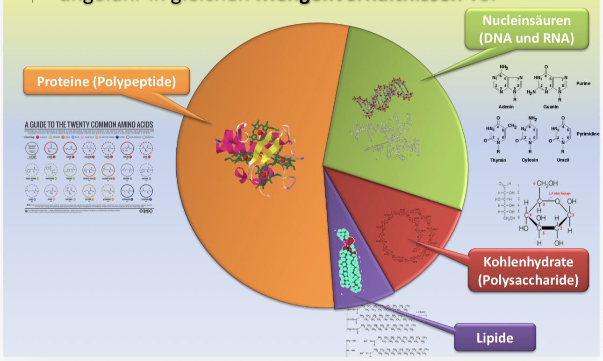
</details>

<details>
 <summary><b><u>Monomere -> Polymere</u></b></summary>

  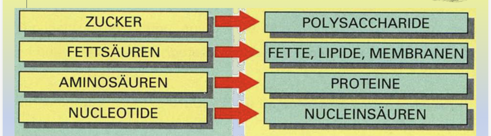
</details>

<details>
 <summary><b><u>Wie lautet d. Chemische Bezichnung v. Kohlenhydraten ?</u></b></summary>

  $(CH_20)_n$
</details>

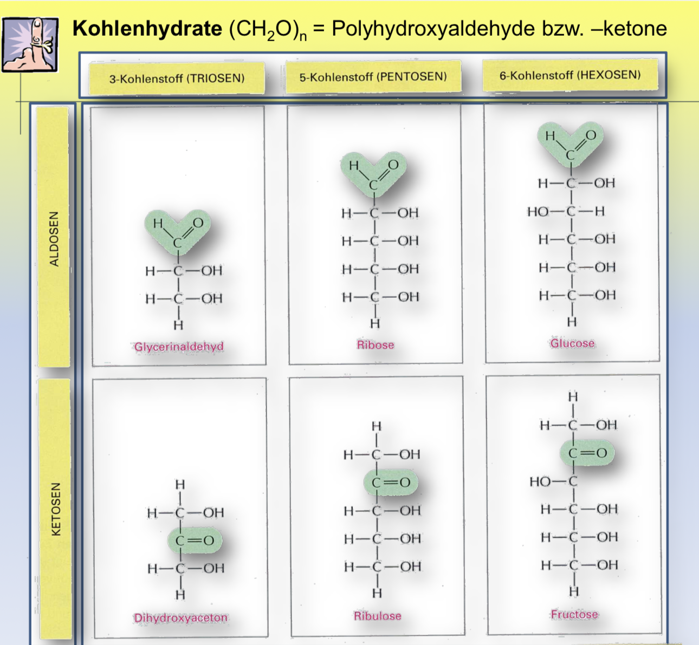

<details>
 <summary><b><u>Was ist ein `Stereoisomer` ?</u></b></summary>

  * gleiche Formel, andere Struktur
</details>

<details>
 <summary><b><u><code>Stereoisomer</code>: Wie nennt man d. komplette Spieglung ?</u></b></summary>

  * `Enantiomer`
</details>

<details>
 <summary><b><u><code>Stereoisomer</code>: Einzelne Spieglung ?</u></b></summary>

  * `Diastereomere`
</details>

<details>
 <summary><b><u><code>Stereoisomer</code>: Diastereomere mit vielen Stereozentren ?</u></b></summary>

  * `Epimere`
</details>

<details>
 <summary><b><u><code>Stereoisomer</code>: Unters. mit 1. C-Atom ?</u></b></summary>

  * `Anomere`
</details>

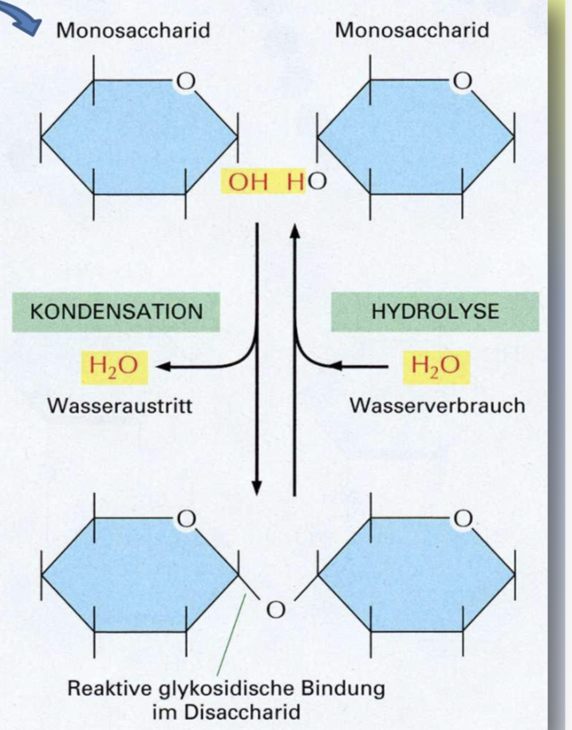
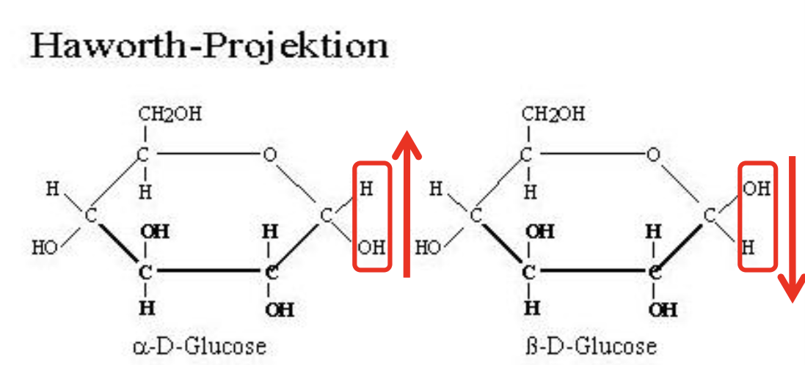

<details>
 <summary><b><u>Was sind Zuckerderivate ?</u></b></summary>

  * Moleküle d. aus einem Monosachharid besteht ?
</details>

<details>
 <summary><b><u>Nenne d. 3 Zuckerderivate ?</u></b></summary>

  * <code style="color: #2b42a6ff">N-Acetylglucosamin</code>
  * <code style="color: #ca77c2ff">Glucoseamin</code>
  * <code style="color: #5eb796ff">Glucosesäure</code>

  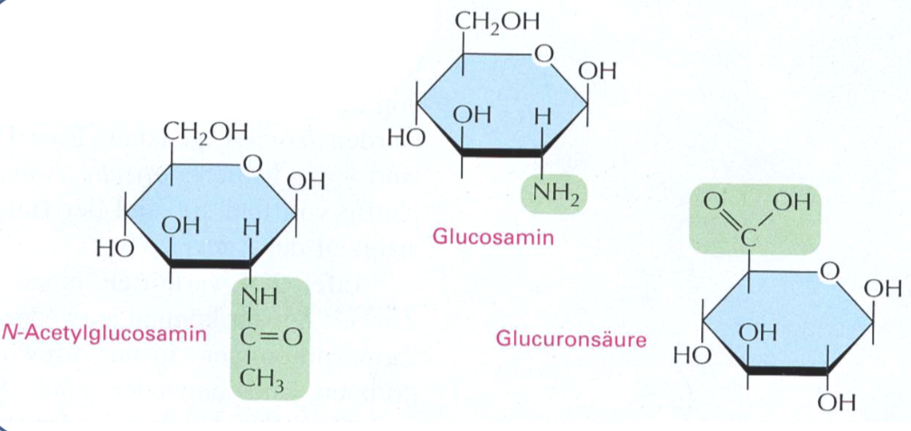
</details>

<h2>Apolare Moleküle</h2>

<details>
 <summary><b><u>Was sind <code>Apolare Moleküle</code> ?</u></b></summary>

  * Keine Ionen
  * keine permanenter Dipol
  * Keine Hydrathülle
    * Wasser<b>un</b>löslich
  
  * d. Lösung, um Störfaktor des Wassers zu minimieren
</details>

<details>
 <summary><b><u>Was ist der Hydrophobe Effekt ?</u></b></summary>

  * Wasser \to will sich bewegen
  * apolarer "Dreck" zwingt Wasser starr zu sein $\implies$ energetisch ungünstig + Entropie verringert
</details>

<details>
 <summary><b><u>Was beschreibt d. 2. hauptsatz in d. Thermodynamik ?</u></b></summary>

  * Endotropie im geschlossen Raum $\underrightarrow{\ \ \ \ \textcolor{#c72483}{\text{darf v. allein nicht}}\ \ \ \ }$  sinken
</details>

<details>
 <summary><b><u>Was ist die Endotropie?</u></b></summary>

  * d. Unordnung

  * nehmen wir mal an, dass ich ein Zimmer betrete \implies wird autom. unordentl.
    * je höher d. Endotropie, desto unordentl. ist d. Zimmer
  * wenn ich d. Endotopie verringern möchte muss ich __Energie aufwenden__
</details>

<h2>Van-der-Waals-Kräfte</h2>

<details>
 <summary><b><u>Was ist Van-der-Waals-Kräfte</u></b></summary>

  * Elektronen bewegen sich ständig \to manchmal ungleich verteilt \implies temporärer Dipol \to benachbartes Molekül auch kurzfristig polarisiert \implies kurzlebige Anziehungskraft zw. Molekülen

  * Analogie. Klebstoff v. Molekülen, d. normalerweise nicht zsm.gehören
</details>


<h2>Peptide</h2>

<details>
 <summary><b><u>Was ist d. Unterschied zw. einer Mizelle, einem Liposom und einer Lamelle ?</u></b></summary>

  
</details>

<h2>Membran</h2>

<details>
 <summary><b><u>Wie nennt man den Durchlässigkeitsgrad einer Membran ?</u></b></summary>

  * Permeabilität

  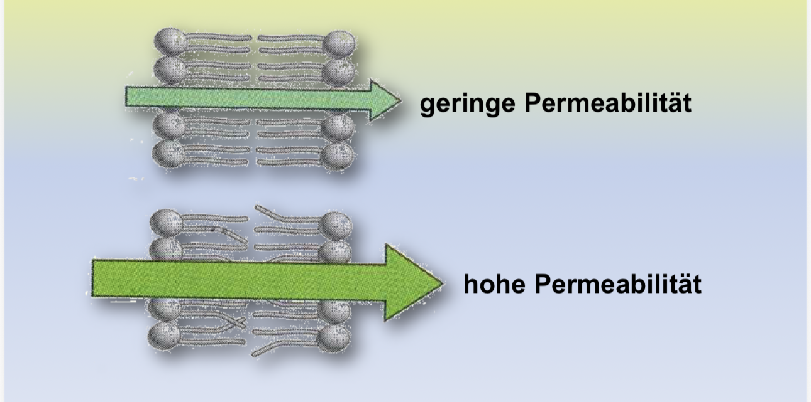
</details>

<h3>Osmose</h3>

* Wasserbewegung

<h3>Diffusion</h3>

* Gasbewegung


<script>
  // Funktion zum Speichern des Status
  function toggleMark(el) {
    el.classList.toggle('marked');
    const isMarked = el.classList.contains('marked');
    // Speichert den Status (true/false) unter der ID des Elements
    localStorage.setItem(el.id, isMarked);
  }

  // Beim Laden der Seite den gespeicherten Status wiederherstellen
  document.querySelectorAll('.toggle-btn').forEach(btn => {
    if (localStorage.getItem(btn.id) === 'true') {
      btn.classList.add('marked');
    }
  });


  window.MathJax = {
    tex: {
      inlineMath: [['$', '$'], ['\\(', '\\)']]
    }
  };
</script>
<script type="text/javascript" async
  src="https://cdn.jsdelivr.net/npm/mathjax@3/es5/tex-mml-chtml.js">
</script>
