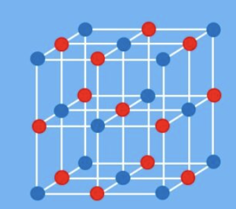
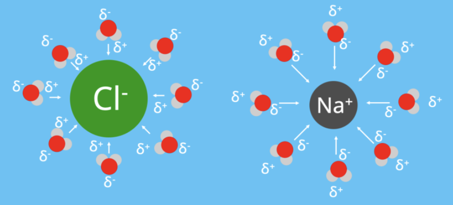
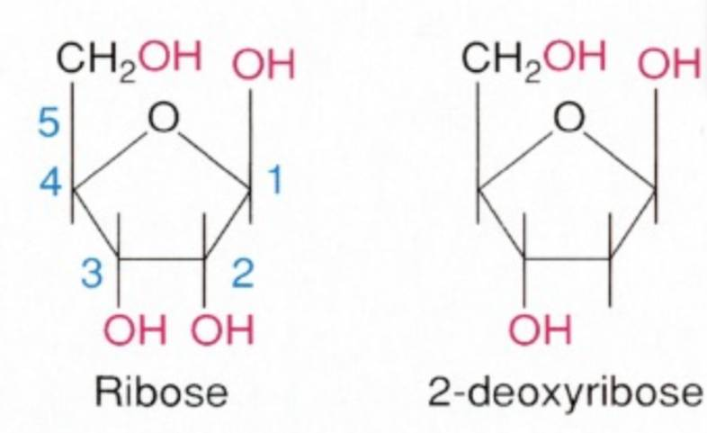
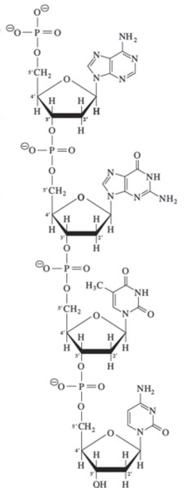
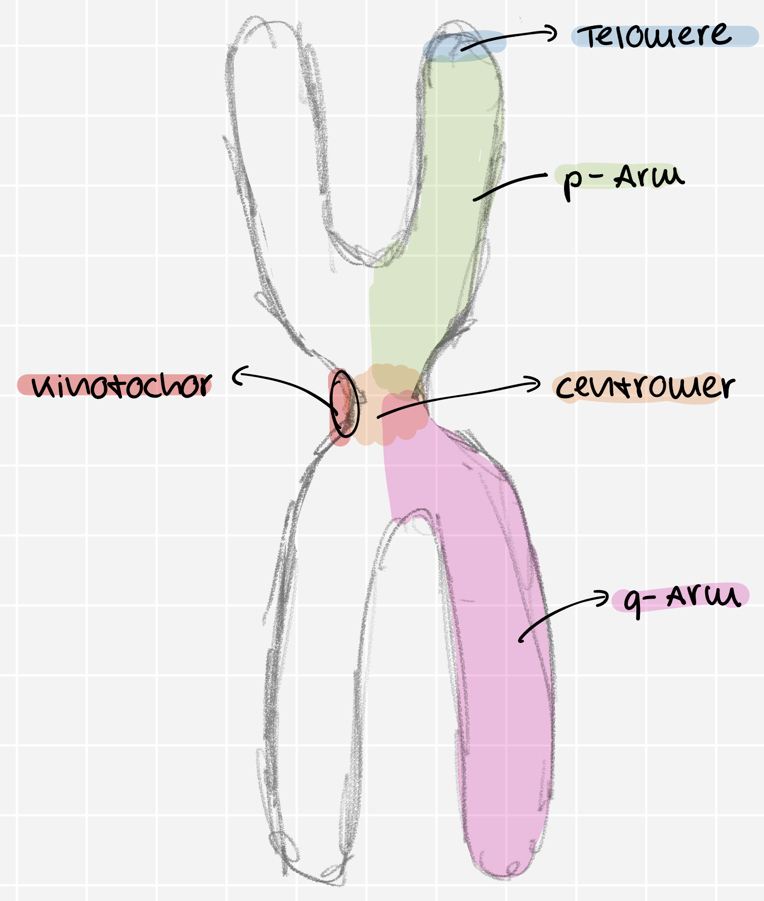
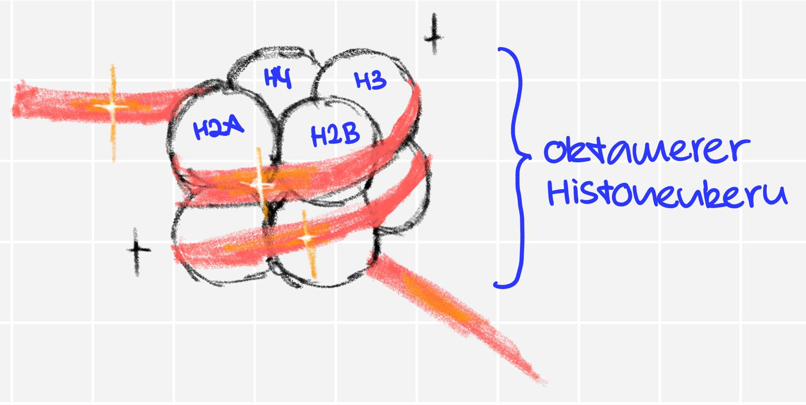
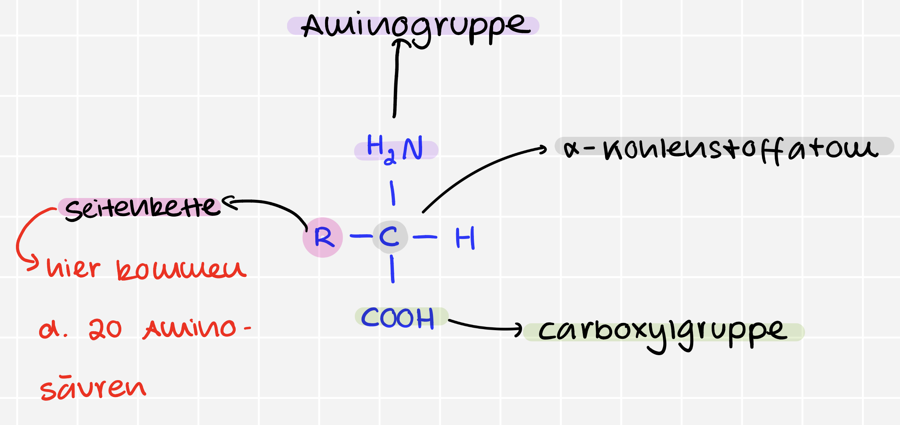
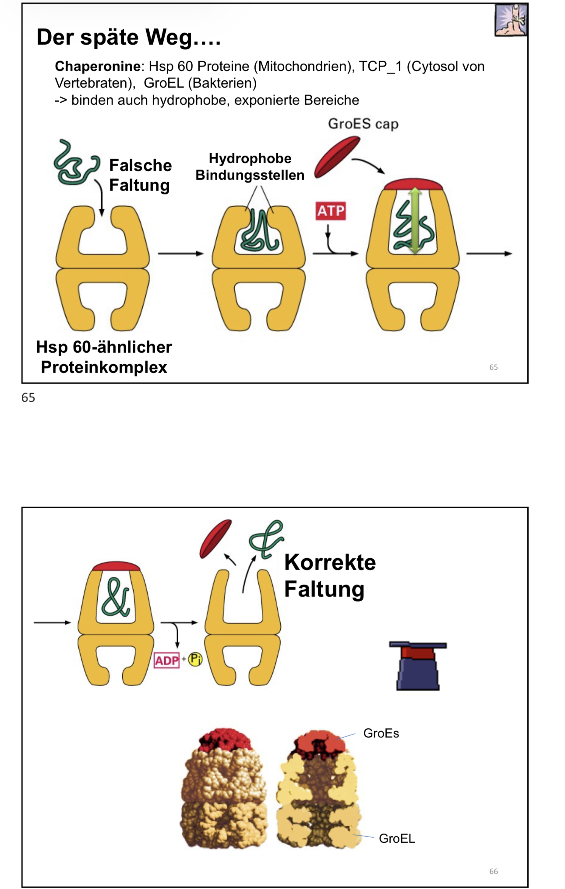
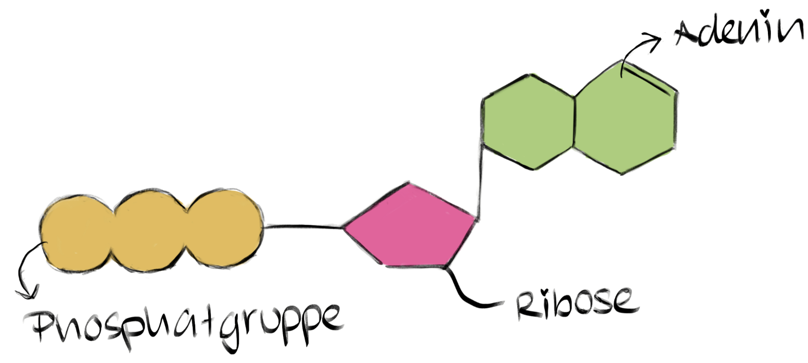
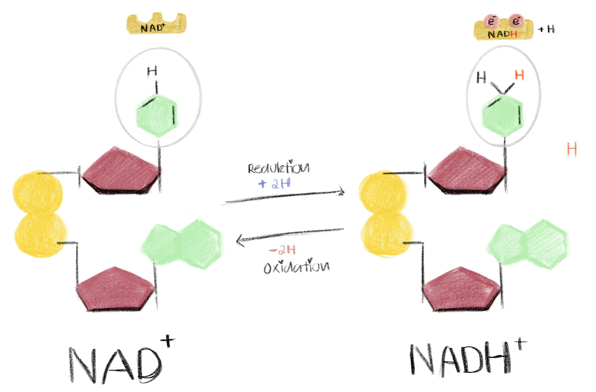

<style>
  details {
    margin-bottom: 0.2em  ;
    border: lightgrey 1px solid;
    padding: 3px
}
  img {
  width: 300px;
  height: auto;
  }

  code {
    background: #eaeaeaff 2px;
    color: #7dc761ff;
    padding: 2px 5px 2px 5px;
    border-radius: 6px
  }

  body {
    background: #ffffffff;
    color: #000000ff;
    font-size: 20px;
  }

  h1 {
    font-weight: bold;
    text-decoration: underline;
  }

  h2 {
    font-weight: bold;
    text-decoration: underline;
  }

  h3 {
    font-weight: bold;
    text-decoration: underline;
  }
  
  /* Zielvorgabe für alle Blockquotes */
  blockquote {
    border-left: 5px solid #7cb459ff; /* Ein farbiger Strich links */
    padding-left: 20px;             /* Abstand zum Text */
    background-color: #edfbeaff;      /* Ein leichter Hintergrund */
    margin-left: 10px;              /* Die eigentliche Einrückung */
    color: #333;                    /* Textfarbe */
  }

  /* Optional: Wenn du das Aussehen der Liste im Blockquote verändern willst */
  blockquote ul {
    list-style-type: square;
  }

  li {
    margin-bottom: 10px;
  }
</style>


<h1>Viren & Phagen</h1>

<details>
 <summary><b><u>Wrm. stellen <code>Viren</code> & <code>Phagen</code> eine Grenzform des Lebens dar ?</u></b></summary>

* sind eigentl. nur eine Kapsel mit `Nukleinsäurenstrang`$^!$(R- oder DNA) $\underrightarrow{\ \ \ \ \textcolor{#c72483}{\text{nicht ü.lebensfähig ohne}}\ \ \ \ }$ <code style="color:red">Wirtszelle</code>$^!$
</details>


<details>
  <summary><b><u>Was ist d. Unterschied zw. einem <code>Virus</code> & einer <code>Phage</code></u></b></summary>

  * <code>Phage</code> $\underrightarrow{\ \ \ \ \textcolor{#c72483}{\text{spezialisiert auf}}\ \ \ \ }$ Bakterien
</details>

<details>
  <summary><b><u>Nach welches Prinzip sind <code>Viren</code> & <code>Phagen</code> aufgebaut ?</u></b></summary>

  * N. dem <code style="color:red">Baukastenprinzip</code>
</details>


<details>
  <summary><b><u>Welche Virenarten gibt es ?</u></b></summary>

  * TMV: 
  * Adenovirus: 
  * HIV: 
  * T-Phage:
</details>

<div>
  <details>
    <summary><b><u>Was sind die beiden Virenstrukturen</u></b></summary>

  > 
  >
  > <details>
  >   <summary>Lösung</summary>
  >   <ol>
  >     <li>Kapsid (Ikosaeder)</li>
  >     <li>Nukleinsäure</li>
  >     <li>Kapsomer</li>
  >     <li>Nukleokapsid</li>
  >     <li>Virion</li>
  >   </ol>
  > </details>
  >
  > 
  >
  > <details>
  >   <summary>Lösung</summary>
  >   <ol>
  >     <li>Kapsid</li>
  >     <li>Nukleinsäure</li>
  >     <li>Kapsomer</li>
  >     <li>Nukleokapsid</li>
  >     <li>Virion</li>
  >     <li>Hülle (Envelope)</li>
  >     <li>Spikes (Glykoproteine)</li>
  >   </ol>
  > </details>
  </details>
</div>


<details>
 <summary><b><u>Was sind d. Vermehrungszyklen von Bakteriophagen</u></b></summary>

  1) <u>Lytic Cycle (Zerstörerisch)$^!$</u>
     * Step 1: Virus $\to$ <span style="color: #69dbceff;">dockt an</span> $\to$ Bakterium $\to$ <span style="color: #69dbceff;">injeziert</span> $\to$ DNA
     * Step 2: Bakterien-DNA $=$ zerstört $^!$ $\implies$ Bakterium muss `Virus-DNA` produzieren
     * Step 3: Bakterium $\to$ baut $\to$ neue Viren zsm.
     * Step 4: Zelle platzt (<b><span style="color: #8e50d0ff;">Lysis</span></b> $^!$) 
      

  1) <u>Lysogenic Cycle (Schläferich)</u>
      * Step 1: Virus $\to$ <span style="color: #69dbceff;">dockt an</span> $\to$ Bakterium $\to$ <span style="color: #69dbceff;">injeziert</span> $\to$ DNA
      * STep 2:  Virus-DNA wird eingebaut in Erbgut des Bakteriums (<b><span style="color: #8e50d0ff;">Prophage</span></b>) $\leftarrow$ <span style="color: #d51010ff;">OHNE SCHADEN</span>
  
  * es ist mögl. d. ein Virus v. <code>Lysogenic Cycle</code> $\to$  <code>Lytic Cycle</code>
</details>

<details>
  <summary><b><u>Welche 2 Vermehrungsarten gibt es ?</u></b></summary>

  1) <code>Burst</code>:
  

  1) <code>Budding</code>: 
  

     * Vgl.: Versikel, Lysosomen

</details>

<details>
 <summary><b><u>Was sind d. 3 Domänen des Lebens ?</u></b></summary>

  1) <code>Procaryoten</code>: $\begin{cases}
      \text{Archaea}\\
      \text{Bakteria}
    \end{cases}$
  1) <code>Eucaryoten</code>: Ein - oder Mehrzellig
  * Bsp.: Algen, Flechten, Pilze

  > * Archaea: Brücke zw. Euk. & Prok.
  > * Vorkommen = extremen Lebensräume $\begin{cases} \text{extrem thermophil} \\ \text{extrem halophil(Salzkonzentration)} \end{cases}$
  
</details>

<details>
 <summary><b><u>Was ist d. Hauptunterschied zw. <code>Eukaryoten</code> & <code>Prokaryoten</code> ?</u></b></summary>

  * Zellkern Zellkern $ \begin{cases} \text{Eukaryoten = Zellkern} \\ \text{Prokaryoten = kein Zellkern} \end{cases} $

</details>


<h1>Wasser, Kohlenhydrate & Fette</h1>

<h2>Kovalente Bindung</h2>

<details>
 <summary><b><u>Was ist eine <code>kovalente</code> & eine <code>nicht kovalente Bindung</code></u></b></summary>

  * <code>Kovalente Bindung</code>
    * Atombindungen
    * <code style="color: #d91c55ff">Valenzelektronen</code> = geteilt
      * d. am schwächsten gebundenen Elektronen in d. äußersten Schale eines Atoms
  * <code>Nicht kovalente Bindung</code>
    * Zwischenmolekulare Kräfte
</details>


<details>
 <summary><b><u>Wie nennt man d. am schwächsten gebundenen Elektronen in d. äußeren Schale eines Atoms ? </u></b></summary>

  * <code>Valenzelektronen</code>
  
</details>

<details>
 <summary><b><u>Wodurch ist d. Elektronenverteilung abhängig ? </u></b></summary>

  * <code>Elektronegativität</code>
  
</details>

<h2>Geometrie</h2>

<details>
 <summary><b><u>Was ist ein assymetrisches C-Atom, Wie nennt man das Molekül & welche Eigenschaft hat dieses ?</u></b></summary>
  
  * Die <code>Chiralität</code>, oft als <code>Händigkeit</code> bezeichnet, beschreibt das Prinzip, dass ein <code>Molekül</code> und sein <code>Spiegelbild</code> sich nicht durch einfache Drehung zur Deckung bringen lassen. 
  Die Voraussetzung hierfür ist ein <code>asymmetrisches C-Atom</code>, das an vier völlig verschiedene <code>Atomgruppen</code> gebunden ist. Diese räumliche Anordnung führt zu <code>Stereoisomeren</code>, die sich in ihrer <code>biologischen Funktion</code> unterscheiden können. 
  Da biologische Systeme nach dem <code>Schlüssel-Schloss-Prinzip</code> arbeiten, erkennt die Zelle spezifische <code>chirale Formen</code>, während ihr Spiegelbild oft nicht „andocken“ kann.

  

  > <details>
  >   <summary><b><u>Wie lautet d. Hierarchie der Stereoisomere & was bedeuten diese?</u></b></summary>
  >   
  >    * `Stereoisomere` = Ü.begriff
  >       * `Diastereomere` = Sammelbegriff f. „teilweise verschieden“
  >          * `Epimere` = „sehr eng verwandt“ (nur ein einziger Punkt ist anders).
  >          * `Anomere` = „Ring-Spezialisten“ (nur die Position am Ring-C-Atom ist anders)
  >       * `Enantiomere` = „kompletten Gegenteile“ (alle Zentren gespiegelt)
  >  </details>
</details>


<details>
 <summary><b><u>Welche biologische Relevanz haben chirale C-Atome ?</u></b></summary>

  * <u>__Molekül-Vielfalt__</u>: chirales Zentrum $\underrightarrow{\ \ \ \ \textcolor{#c72483}{\text{verdoppelt}}\ \ \ \ }$ Anzahl verfügbarer räuml. Formen
  * <u>__Biol. Aufgabe__</u>: Spiegelbilder $\underrightarrow{\ \ \ \ \textcolor{#c72483}{\text{völlig andere}}\ \ \ \ }$ Funktionen $\underrightarrow{\ \ \ \ \textcolor{#c72483}{\text{Grund}}\ \ \ \ }$ `Schlüssel-Schloss-Prinzip`
</details>

<details>
 <summary><b><u>Welche zwei großen Stoffgruppen sind typische Beispiele für Moleküle mit chiralen Zentren?</u></b></summary>

  * <code>Aminosäure</code>
    * Bausteine d. Proteine
  * <code>Kohlenhydrate</code>
</details>

<details>
 <summary><b><u>Welche Aminosäure bildet eine wichtige Ausnahme & ist nicht chiral? Warum?</u></b></summary>

  * `Glycin`
  * ```text
        COOH
          |
    H₂N — C — H   <-- Das zentrale C hat zwei H-Atome, 
          |           ist also NICHT asymmetrisch!
          H
    ```
  * zentrale C-Atom ist an zwei identische Wasserstoffatome ($H$) gebunden $\implies$ keine $4$ unterschiedl. Partner
</details>

<h2>Nicht kovalente Bindung</h2>

<details>
 <summary><b><u>Welche nicht kovalente Bindungen gibt es ?</u></b></summary>

  * Ionen-Bindung
  * Wasserstoffbrückenbindung
  * Van-der-Waals-Kräfte
</details>

<h2>Inonen</h2>

<details>
 <summary><b><u>Wie entsteht eine Ionenbindung? (z. B. bei Kochsalz)</u></b></summary>

  * Durch die vollständige Übertragung v. Elektronen. 
  * Ein Atom (`Natrium`) $\underrightarrow{\ \ \ \ \textcolor{#c72483}{\text{gibt ab}}\ \ \ \ }$ Elektron $\underrightarrow{\ \ \ \ \textcolor{#c72483}{\text{wird zum}}\ \ \ \ }$ __positiven Kation__ ($Na^+$), d. andere (`Chlor`) nimmt es auf $\underrightarrow{\ \ \ \ \textcolor{#c72483}{\text{wird zum}}\ \ \ \ }$ __negativen Anion__ ($Cl^-$). <span style="color: red">Die entgegengesetzten Ladungen ziehen sich elektrostatisch an</span>.
</details>

<details>
 <summary><b><u>In welcher Struktur liegen die Ionen im festen Zustand vor?</u></b></summary>

  * bilden ein festes, regelmäßiges `Kristallgitter` (Ionengitter)

  
</details>

<details>
 <summary><b><u>Welche Voraussetzung muss erfüllt sein, damit sich ein Salzkristall in Wasser auflöst?</u></b></summary>

  * $\text{Hydratationsenergie} > \text{Gitterenergie}$
</details>

<details>
 <summary><b><u>Was versteht man unter der "Gitterenergie" ?</u></b></summary>

  * Energie, d. Ionen im festen Kristalgitter zsm.hält $\underrightarrow{\ \ \ \ \textcolor{#c72483}{\text{Überwindung}}\ \ \ \ }$ Zerstörung des Kristalgitters
</details>

<details>
 <summary><b><u>Was versteht man unter der "Hydratationsenergie" ?</u></b></summary>

  * Energie, d. freigesetzt wird, wenn sich Wassermoleküle an d. freigewordenen Ionen anlagern.
</details>

<details>
 <summary><b><u>Was versteht man unter einer "Hydrathülle" ?</u></b></summary>

  * Eine Schicht aus Wassermolekülen, d. sich beim Lösen um d. einzelnen Ionen herum anordnet.
  * Dabei zeigt d. positive Pol des Wassers ($H$) zum negativen Chloridion ($Cl^-$) & d. negative Pol ($O$) zum positiven Natriumion ($Na^+$).

  
</details>


<h2>Wasserstoffbrückenbindung</h2>

<details>
 <summary><b><u>Welcher Prozess beschreibt den ersten Schritt beim Lösen eines Salzes (aus energetischer Sicht) ?</u></b></summary>

  * D. __Aufbrechen des Ionengitters__. Die Ionen müssen aus ihrem festen Verband gelöst werden (dafür wird Gitterenergie verbraucht).
</details>

<details>
 <summary><b><u>Was ist die Gitterenergie ($U_L$)?</u></b></summary>

  * feste Kristallgitter $\underrightarrow{\ \ \ \ \textcolor{#c72483}{\text{GItterenergie}}\ \ \ \ }$ gasförmige Ionen
  * __immer positiv__ (`endotherm`).
</details>

<details>
 <summary><b><u>Was ist die Gitterenergie ($U_L$)?</u></b></summary>

  * feste Kristallgitter $\underrightarrow{\ \ \ \ \textcolor{#c72483}{\text{GItterenergie}}\ \ \ \ }$ gasförmige Ionen
  * __immer positiv__ (`endotherm`).
</details>

<details>
 <summary><b><u>
Welcher Prozess beschreibt den zweiten Schritt beim Lösen ?</u></b></summary>

  * `Hydratation`: Ionen $\underrightarrow{\ \ \ \ \textcolor{#c72483}{\text{umgeben}}\ \ \ \ }$ Wassermoleküle $\underrightarrow{\ \ \ \ \textcolor{#c72483}{\text{Entstehung}}\ \ \ \ }$ Hydrathülle $\underrightarrow{\ \ \ \ \textcolor{#c72483}{\text{wird frei}}\ \ \ \ }$ Hydratationsenergie
</details>

<details>
 <summary><b><u>Was bestimmt, ob sich ein Salz löst oder nicht ?</u></b></summary>

  * Die `Lösungsenthalpie` ($\Delta H_{sol}$): $Gitterenergie + Hydratationsenergie$
</details>

<details>
 <summary><b><u>Wie lautet die Faustformel für die Lösungsenthalpie?</u></b></summary>

  * $\Delta H_{sol} = U_L + \Delta H_{hyd}$
</details>

<details>
 <summary><b><u>Was passiert energetisch, wenn sich ein Salz löst (exotherm vs. endotherm)?</u></b></summary>

  1) `Exotherm`: Es wird mehr Energie bei der Hydratation frei, als für das Gitter benötigt wurde ($\Delta H_{sol} < 0$) $\implies$ Glas wird warm.
  1) `Endotherm`: Es wird mehr Energie benötigt, um das Gitter zu knacken, als bei d. Hydratation frei wird ($\Delta H_{sol} > 0$) $\implies$ Glas kühlt ab.
</details>

<h2>Aggerarzustände</h2>

<details>
 <summary><b><u>Wie verhalten sich Wassermoleküle im festen Zustand (Eis)?</u></b></summary>

  * Wassermoleküle $\underrightarrow{\ \ \ \ \textcolor{#c72483}{\text{durch}}\ \ \ \ }$ Wasserstoffbrückenbindungen $\underrightarrow{\ \ \ \ \textcolor{#c72483}{\text{gehalten}}\ \ \ \ }$ festen Zustand
</details>

<details>
 <summary><b><u>Was passiert mit den Wasserstoffbrücken im flüssigen Zustand?</u></b></summary>

  * Wassermoleküle bewegen sich $\underrightarrow{\ \ \ \ \textcolor{#c72483}{\text{ständig}}\ \ \ \ }$ brechen Wasserstoffbrücken & bilden sich neu.
</details>

<details>
 <summary><b><u>Wie ist die Struktur im gasförmigen Zustand?</u></b></summary>

  * Keine Wasserstoffbrückenbindung
</details>

<h2>Wasser</h2>

<details>
 <summary><b><u>Was ist d. Kohäsion ?</u></b></summary>

  * Zsm.halt innerhalb eines Stoffes
</details>

<details>
 <summary><b><u>Was ist d. Adhäsion ?</u></b></summary>

  * Anhaftung an fremden Oberflächen
</details>

<details>
 <summary><b><u>Was ist die Folge von Kohäsion und Adhäsion bei Wasser?</u></b></summary>

  * Wasser kann in `engen Röhren` <span style="color: red;">aufsteigen<span> $\implies$ wichtig f. Pflanzen/Bäume
  * `Wasseroberflächenspannung` $\underrightarrow{\ \ \ \ \textcolor{#c72483}{\text{ermögl. Insekten}}\ \ \ \ }$ Auf Wasser zu laufen
  * natürl. `Klebestoff` $\underrightarrow{\ \ \ \ \textcolor{#c72483}{\text{zsm.kleben v. Stoffen}}\ \ \ \ }$ wichtig f. <span style="color: red;">Stofftransport in biologischen Systemen <span>
</details>


<details>
 <summary><b><u>Welche Funktion haben Kohäsion und Adhäsion bei Pflanzen ?</u></b></summary>

  * Sie ermöglichen den Wassertransport innerhalb d. Pflanze.
  
</details>

<h2>Makromoleküle</h2>

<details>
 <summary><b><u>Was sind d. 4 Klassen der Makromoleküle ?</u></b></summary>

  * Proteine(Polypaptide) <span style="color:red">60%</span>
  * Nukleinsäuren <span style="color:red">20</span>
  * Kohlenhydrate <span style="color:red">10</span>
  * Lipide <span style="color:red">10</span>

  
</details>

<details>
 <summary><b><u>Monomere -> Polymere</u></b></summary>

  
</details>

<details>
 <summary><b><u>Wie lautet d. Chemische Bezichnung v. Kohlenhydraten ?</u></b></summary>

  $(CH_20)_n$
  * wenn $n = 3$: $C_{1 \times 3}H_{2 \times 3}O_{1 \times 3} = C_3H_6O_3$
</details>


<details>
 <summary><b><u>Was sind Zuckerderivate ?</u></b></summary>

  * chem. Verbindungen, d. v. einf. Zuckern (Monosacchariden) abstammen
    * Also, quazi <code style="color: #7dc761ff">modifizierte Zuckermoleküle</code>
</details>

<details>
 <summary><b><u>Nenne d. 3 Zuckerderivate ?</u></b></summary>

  * <code style="color: #2b42a6ff">N-Acetylglucosamin</code>
  * <code style="color: #ca77c2ff">Glucosamin</code>
  * <code style="color: #5eb796ff">Glucosesäure</code>

  
</details>

<h2>Apolare Moleküle</h2>

<details>
 <summary><b><u>Was ist die Endotropie?</u></b></summary>

  * d. Unordnung

  * nehmen wir mal an, dass ich ein Zimmer betrete $\implies$ wird autom. unordentl.
    * je höher d. Endotropie, desto unordentl. ist d. Zimmer
  * wenn ich d. Endotopie verringern möchte muss ich __Energie aufwenden__
</details>

<details>
 <summary><b><u>Was sind <code>Apolare/Unpolare Moleküle</code> ?</u></b></summary>

  * Keine Ionen
  * keine permanenter Dipol
  * Keine Hydrathülle
    * Wasser<b>un</b>löslich
  
  * __Störfaktor__ des Wassers: Wasser ist ein __polares Lösungsmittel__ aus starken __Wasserstoffbrückenbindungen__.
    * Wenn nun ein <code style="color: #a0bb74ff">unpolares Molekül</code> in d. Wasser gelangt $\implies$ keine Bindung mit <code style="color: #749dbbff">Wassermolekülen</code>
      * D. <code style="color: #a0bb74ff">unpolares Molekül</code> verdrängt d. <code style="color: #749dbbff">Wassermolekülen</code> $\to$ zwingt sie in eine __käfigartige Struktur__, um drumherum zu bauen $\leftarrow$ Wasser möchte aber flexibel sein
        * Bewegung d. <code style="color: #749dbbff">Wassermolekülen</code> in diesem Käfig = stark eingeschränkt. <span style="color: red">D. System verliert an __Entropie__<span> $\implies$ energetisch & thermodynamisch ungünstig
</details>

<details>
 <summary><b><u>Was ist der Hydrophobe Effekt ?</u></b></summary>

  * Wasser $\to$ will sich bewegen
  * apolarer "Dreck" zwingt Wasser starr zu sein $\implies$ energetisch ungünstig + Entropie verringert
  * ohne ihn könnten Zellen keine `Kompartimente` bilden! 
</details>

<details>
 <summary><b><u>Was beschreibt d. 2. hauptsatz in d. Thermodynamik ?</u></b></summary>

  * Endotropie im geschlossen Raum $\underrightarrow{\ \ \ \ \textcolor{#c72483}{\text{darf v. allein nicht}}\ \ \ \ }$  sinken
</details>


<h2>Van-der-Waals-Kräfte</h2>

<details>
 <summary><b><u>Was ist Van-der-Waals-Kräfte</u></b></summary>

  * Elektronen bewegen sich ständig $\to$ manchmal ungleich verteilt $\implies$ temporärer Dipol $\to$ benachbartes Molekül auch kurzfristig polarisiert $\implies$ kurzlebige Anziehungskraft zw. Molekülen

  * Analogie. Klebstoff v. Molekülen, d. normalerweise nicht zsm.gehören
</details>


<h2>Peptide</h2>

<details>
 <summary><b><u>Was ist d. Unterschied zw. einer Mizelle, einem Liposom und einer Lamelle ?</u></b></summary>

  
</details>

<h2>Membran</h2>

<details>
 <summary><b><u>Wie nennt man den Durchlässigkeitsgrad einer Membran ?</u></b></summary>

  * Permeabilität

  
</details>

<h3>Osmose</h3>

* Wasserbewegung

<h3>Diffusion</h3>

* Gasbewegung

<h1>Nukleinsäuren & Proteine</h1>

<details>
<summary>Was sind die Bestandteile der Bkterien und deren prozentuale Anteil ?</summary>

* `70%`= Wasser
* `30%` = Trockenmasse
  * Makromoleküle(`26%`)
    * Proteine = `15%`
    * Nukleinäuren = `7%`
    * Phospholipide = `2%`
    * Polysaccharide = `2%`
  * Kleine Moleküle (`4%`)
    * <span style="color: ">dazu gehören auch Ionen<span>
</details>

<details>
<summary>Was ist bei der replikation v. Eukaryoten & Prokaryoten anders?</summary>

<u>__Prokaryoten__</u>
* `Transkription` & `Translation`räuml. $\lnot$ getrennt
  * beides kann __gleichzeitig__ statt finden

<u>__Eukaryoten__</u>
* Transkription $\to$ Zellkern
* Translation $\to$ Cytoplasma
</details>

<details>
<summary>Wie nennt man die Eigenschaft d. prokaryotischen & d. eukaryotischen RNA ?</summary>

<u>__Eukaryoten__</u>
* `mono-cistronische RNA`

<u>__Prokaryoten__</u>
* `poly-cistronische RNA`
</details>

<h2>Hershey & Chase</h2>

<details>
<summary><u><b>Was ist das Experiment? </b></u></summary>

* `T-Phagen` werden radioaktiv makiert
  * __Proteinhplle__: $^{35}S$
  * __DNA-Kern__: $^{32}P$

* Phagen $\underrightarrow{\ \ \ \ \textcolor{#83b7ea}{\text{infizieren}}\ \ \ \ }$ Bakterien
* leere Virushüllen $\underrightarrow{\ \ \ \ \textcolor{#83b7ea}{\text{getrennt}}\ \ \ \ }$ v. Bakterien

__<u>Ergebnis</u>__:
* radioaktive Proteinhülle $\underrightarrow{\ \ \ \ \textcolor{#83b7ea}{\text{bleiben}}\ \ \ \ }$ __außerhalb__
* radiaktive DNA $\underrightarrow{\ \ \ \ \textcolor{red}{\text{im Inneren}}\ \ \ \ }$   Bakterien
</details>

<h2>DNA</h2>

<details>
<summary><u><b>Wie sind die beiden Pentosen ?</b></u></summary>


</details>

<details>
<summary><u><b>Was ist das 5` & das 3-Ende ?</b></u></summary>

* `5-Ende`: Phosphatgruppe
* `3-Ende`: Hydroxgruppe


</details>

<details>
<summary><u><b>Wie viele Wasserstoffbrückenbindungen haben A-T und C-G ?</b></u></summary>

* `A-T`: 2
* `G-C`: 3
</details>

<details>
<summary><u><b>Wie lautet der Aufbau eines Chromosoms ?</b></u></summary>


</details>

<details>
<summary><u><b>Wie ist eine Histone aufgebaut ?</b></u></summary>


</details>

<details>
<summary><u><b>Wie wird d. DNA aufeglockert und wie wird es verfestigt ?</b></u></summary>

<u>__Lockerung__</u>

* (De-)Acetylierung 

<u>__Verfestigung__</u>

* (De-)Methylierung
</details>

<details>
<summary><u><b>Wie wird die DNA repliziert ?</b></u></summary>

* semikonservativ
</details>

<details>
<summary><u><b>Wie lautet die allgemeine Form einer Aminosäure ?</b></u></summary>


</details>

<details>
<summary><u><b>Was sind die Schritte der Ribosomen ?</b></u></summary>

1) Initiation
2) Elogation
3) Termination
</details>

<details>
<summary><u><b>Was bestimmt den Zielort eines Proteins ?</b></u></summary>

* seine __spezifische__ `Signalsequenz` (Aminosäure-Abfolge)
</details>

<details>
<summary><u><b>Wo bleiben Proteine ohne Signal ?</b></u></summary>

* im `Cytosol`
</details>

<details>
<summary><u><b>Was passiert bei einer Signalsequenz für das ER ?</b></u></summary>

* Protein $\underrightarrow{\ \ \ \ \textcolor{#83b7ea}{\text{geschleucht}}\ \ \ \ }$ ER $\underrightarrow{\ \ \ \ \textcolor{#83b7ea}{\text{wandert zum}}\ \ \ \ }$ `Golgi-Komplex` $\to$ Membran $\underrightarrow{\ \ \ \ \textcolor{#83b7ea}{\text{anhand von}}\ \ \ \ }$ Lysosomen oder n. außerhalb d. Zelle (`Sekretion`).
</details>

<details>
<summary><u><b>Wie gelangen Proteine in Organellen wie Mitochondrien ?</b></u></summary>

Durch __spezifische Import-Signale__, d. d. Protein direkt zum entsprechenden Organell leiten
</details>

<details>
<summary><u><b>Was sind die posttranslationalen Modifikationen ?</b></u></summary>

* <u>__Proteolyse__</u>
  * Enzym $\underrightarrow{\ \ \ \ \textcolor{#83b7ea}{\text{schneidet ab}}\ \ \ \ }$ Teile d. Kette $\underrightarrow{\ \ \ \ \textcolor{#83b7ea}{\text{jzt. mögl.}}\ \ \ \ }$ Protein kann sich in seine __aktive 3D-Form__ falten
* <u>__Glykosylierung__</u>
  * Zuckerketten angehängt
    * Wichtig f. Erkennung & Transport

* <u>__Phsophorylierung__</u>
  * Phosphatgruppen angehängt
    * Denaturierung $\underrightarrow{\ \ \ \ \textcolor{#83b7ea}{\text{Protein}}\ \ \ \ }$ aktiver oder deaktiviert
</details>

<details>
<summary><u><b>Was ist der Chaperonin-Zyklus ?</b></u></summary>

* d. Rettung falsch gefalteten proteine
</details>

<details>
<summary><u><b>Was sind die Schritte des Chaperonin-Zyklus ?</b></u></summary>

1) __Erkennung__
  * `Chaperonin-Komplex` $\underrightarrow{\ \ \ \ \textcolor{#83b7ea}{\text{erkennt}}\ \ \ \ }$ falsch gefaltetes Protein $\underrightarrow{\ \ \ \ \textcolor{#83b7ea}{\text{an}}\ \ \ \ }$  __hydrophoben__, __herausragenden__ 
2) __Einschließung__ Bereichen
  * Protein  $\underrightarrow{\ \ \ \ \textcolor{#83b7ea}{\text{aufgenommen}}\ \ \ \ }$ hohe Kammer des Proteinkomplexes
    * Kammer = hydrophil $\implies$ geschützter Raum
3) __Versiegeln__
  * `GroES-Deckel` $\underrightarrow{\ \ \ \ \textcolor{#83b7ea}{\text{schließt ab}}\ \ \ \ }$ Kammer + __ATP-Verbrauch__
4) __Faltung__ 
  * Im Inneren d. geschlossenen Kammer kann sich d. Protein ungestört v. anderen zellulären Komponenten korrekt falten.
5) __Freisetzung__ 
  * N. d. Spaltung v. ATP (zu ADP) öffnet sich d. Deckel & d. nun korrekt gefaltete Protein wird freigesetzt.


</details>

<h1>Energie & Enzyme</h1>

<h2>Urey-Miller-Experiment</h2>

<details>
<summary><u><b>Was hat es bewiesen ?</b></u></summary>

* Durch Zufuhr v. `Energie`(Blitze) sind aus einfachen, unlebenden Stoffen `Aminosäuren` entstanden
</details>

<h2>ATP</h2>

<details>
<summary><u><b>Wie ist ATP aufgebaut?</b></u></summary>


</details>

<details>
<summary><u><b>Was ist eine Redoxreaktion ?</b></u></summary>

* hierbei handelt es sich um einen __Elektronentransfer__
* `Molekül` gibt __Elektronen__ ab, welches v. anderen aufgenommen wird
  * finden immer __gleichzeitig__ statt
</details>

<details>
<summary><u><b>Wie nennt man d. Abgabe und die Aufnahme eines Elektrons ?</b></u></summary>

* Abgabe = Oxidation
* Aufnahme = Reduktion
</details>

<details>
<summary><u><b>Warum sind sie im Stoffwechsel so wichtig ?</b></u></summary>

* sie nutzen kleine <code style="color: #a274bbff">Redox-Schritte</code>, um <span style="color: red">__Energie__ zu ü.tragen</span> anstatt `Energie` direkt aus `Zucker` zu __verbrennen__
</details> 




<script>
  window.MathJax = {
    tex: {
      inlineMath: [['$', '$'], ['\\(', '\\)']]
    }
  };
</script>
<script type="text/javascript" async
  src="https://cdn.jsdelivr.net/npm/mathjax@3/es5/tex-mml-chtml.js">
</script>
