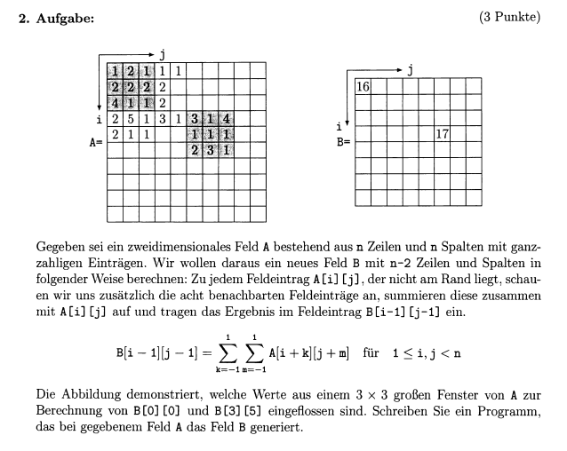

<style>
  /* 1. Ebene: Punkt */
  ul { list-style-type: disc; } 

  /* 2. Ebene: Pfeil rechts */
  ul ul { list-style-type: "→ "; }

  /* 3. Ebene: Pfeil rechts (identisch zur 2. Ebene) */
  ul ul ul { list-style-type: "→ "; }
</style>

<style>
  img {
    width: 1000px;  /* Hier deine gewünschte Breite eintragen */
    height: auto;  /* Behält das Seitenverhältnis bei, damit nichts verzerrt wird */
    display: block;
    margin: 10px 0; /* Sorgt für etwas Abstand nach oben und unten */
  }
</style>

# **Inhaltsverzeichnis**
1) [Kommandozeilenargumente](#Kommandozeilenargumente)
1) [infinet values for max & min](#infinet_values_for_max_&_min)


# **Tipps f. d. Klausur**:
* wenn ich weiß, wie oft etw. passieren muss = <span style="background-color: #bddb85; color: #607a30; padding: 0px 5px; border-radius: 2px;">for-Schleife</span>
* wenn ich $\lnot$ weiß, wie oft etw. passieren muss = <span style="background-color: #85c7db; color: #2a6e83; padding: 0px 5px; border-radius: 2px;">while-Schleife</span>
* man könnte solch eine Tabelle machen, damit es nicht so kompliziert wird
    <table border="1" style="border-collapse: collapse; width: 100%; font-family: sans-serif;">
    <thead>
        <tr style="background-color: #f2f2f2;">
        <th style="padding: 10px;">Schritt (i)</th>
        <th style="padding: 10px;">Key (Element rechts)</th>
        <th style="padding: 10px;">Liste vor dem Verschieben</th>
        <th style="padding: 10px;">Vergleich im sortierten Teil</th>
        <th style="padding: 10px;">Aktion / Ergebnis</th>
        </tr>
    </thead>
    <tbody>
        <tr>
        <td style="padding: 10px; text-align: center;">1</td>
        <td style="padding: 10px; text-align: center;"><b>1</b></td>
        <td style="padding: 10px;">[ 9 | <b>1</b>, 2, 7, 3 ]</td>
        <td style="padding: 10px;">9 > 1 ? Ja.</td>
        <td style="padding: 10px;">9 schiebt nach rechts, 1 wird vorne eingesetzt: <b>[ 1, 9 | 2, 7, 3 ]</b></td>
        </tr>
        <tr>
        <td style="padding: 10px; text-align: center;">2</td>
        <td style="padding: 10px; text-align: center;"><b>2</b></td>
        <td style="padding: 10px;">[ 1, 9 | <b>2</b>, 7, 3 ]</td>
        <td style="padding: 10px;">9 > 2 ? Ja.<br>1 > 2 ? Nein.</td>
        <td style="padding: 10px;">9 schiebt nach rechts, 2 stoppt hinter der 1: <b>[ 1, 2, 9 | 7, 3 ]</b></td>
        </tr>
        <tr>
        <td style="padding: 10px; text-align: center;">3</td>
        <td style="padding: 10px; text-align: center;"><b>7</b></td>
        <td style="padding: 10px;">[ 1, 2, 9 | <b>7</b>, 3 ]</td>
        <td style="padding: 10px;">9 > 7 ? Ja.<br>2 > 7 ? Nein.</td>
        <td style="padding: 10px;">9 schiebt nach rechts, 7 stoppt hinter der 2: <b>[ 1, 2, 7, 9 | 3 ]</b></td>
        </tr>
    </tbody>
    </table>


<a id="Kommandozeilenargumente"></a>

# **Kommandozeilenargumente**
* `import sys` $\leftarrow$ immer !!!
## <u>Wie ü.gibt man Argumente ?</u>
`<var> = sys.[i]`


```python
import sys

if len(sys.argv) < 3: #guckt, ob ich mind. 3 Elemente habe (Dateiname, liter, distanz)
    print('Bitte geben Sie Liter und die Distanz an!.')
    sys.exit() #beendet d. Programm sofort
    
liter = float(sys.argv[1])
distanz = float(sys.argv[2])

verbrauch = (liter *100)/distanz

print(round(verbrauch,2))
```
```python
# Terminal
python3 verbracuh.py 45.5 600

# Output
7.58
```

<a id="infinet_values_for_max_&_min"></a>

# **infinet values for max & min**
* <span style="background-color: #d1d1d1; color: #575757; padding: 0px 5px; border-radius: 2px;font-family:'Courier New">float('-inf')</span>
    * f. max
* <span style="background-color: #d1d1d1; color: #575757; padding: 0px 5px; border-radius: 2px;font-family:'Courier New">float('inf')</span>
    * f. min


# **"Call by Value" vs. "Call by Reference"**

* <u>Call by Value (Werte-Kopie)</u>:
    *  Wie ein Foto v. einem Blatt Papier
        * Wenn ich auf dem Foto herummale, bleibt das Original-Blatt sauber.
        ```python 
        int, float, str, bool
        ```

* <u>Call by Reference (Adress-Verweis)</u>:
    * Wie  Google-Doc-Link.
        * Wenn ich ü. den Link etw. im Dokument lösche, dann ist es $\forall$ anderen, d. den Link haben, auch weg.
        ```python 
        list, dict, set
        ```


# **String**
<span style="color: #fc0303ff;">**Man kann ein Text nicht ändern !!!**</span>
```python
text = "Was machen Sachen"

text[2] = i

#Augabe: Error
```
* `.upper()` $\to$ *copy*

* `.lower()` $\to$ *copy*

* `.strip()`: *str* $\to$ *str*
    * Entf. Leerzeichen v. Anfang & Ende

* `.split(<elem>)`: *str* $\to$ *list*

* `.replace(<alt>,<neu>)`: *str* $\to$ *str*

```python
import string

<var> = string.ascii_lowercase  #abcdefghijklmnopqrstuvwxyz

<var> = string.ascii_uppercase #ABCDEFGHIJKLMNOPQRSTUVWXYZ

<var> = string.ascii_letter #abcdefghijklmnopqrstuvwxyzABCDEFGHIJKLMNOPQRSTUVWXYZ

<var> = string.digits #0123456789

<var> = string.hexdigits #0123456789abcdefABCDEF

<var> = string.whitespace #
```

## **Arbeiten mir Pfad**

```python
import os
```
<span style="background-color: #d2b537ff; color: #605214ff; padding: 0px 5px; border-radius: 2px;">dir = directory (Verzeichnis)</span>

* `<var> = os.getcwd()` $\to$ *str*
    * aktuelles Arbeitsverzeichnis

* `<var> = os.chdir(<pfad>)`
    * wechselt Arbeitsverzeichnis

* `<var> = os.listdir(<pfad>)` $\to *list*

* `<var> = os.isfile(<pfad>)`
    * Ist ü.gebene Pfad eine Datei ?

* `<var> = os.isdir(<pfad>)`
    * Ist ü.gebene Pfad ein Ordner ?

* `<var> = os.path.exists(<pfad>)`
    * exististert Ordner oder Datei ?

### <u>Erzeugen löschen & umbenennen</u>:

* `os.mkdir(<pfad>/<Ordner_name>)`
    * erzeugt einen Ordner am Pfad
    * `os.mkdir('/Volumes/Efes USB/Uni/Semester 6/EiP/Übung für mich selbst/Hallo')`
        * pfad: /Volumes/Efes USB/Uni/Semester 6/EiP/Übung für mich selbst
        * ordner: /Hallo

* `os.makedirs('/Volumes/Efes USB/Uni/Semester 6/EiP/Übung für mich selbst/Hallo/Was/Geht')`
    * es wird eine Kette an Ordner erstellt
    * 

* `os.rmdir(<pfad>)`
    * Ordner löschen

* `os.remove(<pfad>)`
    * Datei löschen

* `os.replace(<alt_name>, <neu_name>)`
    * Name ändern


# **Listen**
* mit Input Liste generieren lassen
    ```python
    such_input = input("Zahlen für Suchmuster (getrennt durch Leerzeichen, z.B. '1 3 1'): ")
    
    mein_muster = [int(x) for x in such_input.split()]
    ```

## <u>Werkzeuge</u>:

* `<liste>.clear()`:
    * in-place
* `<list>.count(<elem>)`:
    * zählen des Elem.
* `<list1>.extend(<liste2>)`:
    * in-place
    * Die Liste wird ausgepackt & hinzugefügt ?

* `<list>.index(<elem>, start, end)`:
    * gibt Index v. Objekt

* `<list>.insert(<elem>)`:
    * in-place

* `<list>.reverse()`:
    * in-place
    * `<list>[::-1]` = Kopie
* `<list>.sort()`:
    * <span style="color: rgb(255, 0, 0);">in-place</span> Sortierung
    * sorted(<list>) = Kopie

* `.pop(<index>)`:
    * dann wird das Element an dieser stelle gelöscht

* `.remove()`:
    * wenn das erste Element, der dem Element in `.remove(<elem>)` entspricht, wird entf.

* `.copy()`:
    * <span style="color: #fc0303ff;">**wichtig !!!!**</span>
        * man kopirt nur d. ***oberste Ebene***

    
    ```python
    liste_a = [10, 20, 30]
    liste_b = liste_a

    liste_b[0] = 2
    ```
    ```python
    #Ausgabe:
    Originale Listen:
    ---------------------------------
    Lista A:  [10, 20, 30]
    Liste B: [10, 20, 30]

    V1 Listen:
    ---------------------------------
    Liste_a: [2, 20, 30]
    Liste_b: [2, 20, 30]
    ID von A: 1834691293696
    ID von B: 1834691293696
    True
    ```
    * <u>**Anw. des ersten .copy()**:</u>
    ```python
    liste_a = [10, 20, 30]
    liste_b = liste_a.copy()

    liste_b[0] = 2
    ```
    ```python
    Originale Listen:
    Lista A:  [10, 20, 30]
    Liste B: [10, 20, 30]

    V1 Listen:
    Liste_a: [10, 20, 30]
    Liste_b: [2, 20, 30]
    ID von A: 2152350446080
    ID von B: 2152352749696

    False
    ```
    * <u>**echte unabhängige copy ?**</u>
    ```python
    import copy

    liste_a = [10, 20, 30]
    liste_b = copy.deepcopy(liste_a)

    liste_b[0] = 2
    ```
    ```python
    #Ausgabe:
    Originale Listen:
    Lista A:  [[1], [3, 8, 8], [9, 6], 7]
    Liste B: [[1], [3, 8, 8], [9, 6], 7]

    V1 Listen:
    ID "OG-Conteiner": 1667841546688
    ID "Copy-Conteiner": 1667839716544

    False
    ```

## <u>Wann .append und wann += ?</u>:

* `.append()`:
    * Wenn ich ein Objekt mit den Klammern hinzufügen möchte
        * Bsp.: Ich lege d. gesamte tüte mit den Elementen in den Wagen
    * wenn ich nur den Inhalt hinzufügen möchte
        * Bsp.: Ich lege nur d. Ware in den Wagen & schmeiße die leere Tüte weg
```python
haupt_liste = [1, 2]
zusatz = [3, 4]

# Szenario A: append (Das Objekt als Ganzes)
liste_a = [1, 2]
liste_a.append(zusatz)
print(liste_a)
# Ergebnis: [1, 2, [3, 4]]  <-- Liste in der Liste

# Szenario B: += (Nur der Inhalt)
liste_b = [1, 2]
liste_b += zusatz
print(liste_b)
# Ergebnis: [1, 2, 3, 4]    <-- Alles auf einer Ebene
```

## <u>Wie werden mehrdimensionale Listen sortiert ?</u>

* Es wird anhand des ersten Elements sortiert
    ```python
    [11, 7, 9, 8]
    [16, 2, 8, 16]
    [4, 5, 12, 20]
    [10, 17, 2, 12]
    ---------------------------------------------------------------
    [4, 5, 12, 20] 4
    [10, 17, 2, 12] 10
    [11, 7, 9, 8] 11
    [16, 2, 8, 16] 16

    #größere Liste
    [16, 0, 19, 7, 3, 18, 2]
    [8, 15, 9, 1, 0, 4, 7]
    [3, 14, 10, 19, 20, 20, 5]
    [11, 1, 17, 11, 1, 7, 8]
    [2, 17, 12, 17, 12, 20, 3]
    [2, 16, 16, 18, 7, 4, 0]
    [14, 12, 1, 6, 13, 8, 20]
    ---------------------------------------------------------------
    [2, 16, 16, 18, 7, 4, 0] 2
    [2, 17, 12, 17, 12, 20, 3] 2
    [3, 14, 10, 19, 20, 20, 5] 3
    [8, 15, 9, 1, 0, 4, 7] 8
    [11, 1, 17, 11, 1, 7, 8] 11
    [14, 12, 1, 6, 13, 8, 20] 14
    [16, 0, 19, 7, 3, 18, 2] 16
    ```
## <u>Wie verändert sich meine Liste, wenn ich mit nested-for_schleifen arbeite ?</u>
* Genau die Stelle d. ich verändern möchte, muss ich mit einem Index machen:
    ```Python
    lst = [[
        [[], [], [], []], 
        [[], [], [], []], 
        [[], [], [], []], 
        [[], [], [], []]
    ], 
    [   [[], [], [], []], 
        [[], [], [], []], 
        [[], [], [], []], 
        [[], [], [], []]
    ], 
    [
        [[], [], [], []], 
        [[], [], [], []], 
        [[], [], [], []], 
        [[], [], [], []]
    ]]

    #Ich möchte d. 4. Ebene ändern = 4. Ebene = Index

    for i in lst: #lst = 1.Ebene, i = 2.Ebene
        for j in i: # 3.Ebene
            for k in range(len(j)): #4.Ebene
                j[k] = 2 
    ```

## <u>Wie kann ich autom. ein Spielbrett durch gehen & Werte eins. ?</u>
* <span style="color: #fc0303;">Def. eine Var. relation aufschrieben, wenn mehrere Var. f. d. Gleiche stehen:
    * y = Zeile = m
    * x = Spalte = n</span>
* <u>Wir müssen d. Spielfeld erst einmal bauen</u>:
    ```python
    n = 5
    m = 5

    spielfeld = [[[]for _ in range(n)]for _ in range(m)]
    
    #spielfeld = [
    # [[], [], [], [], []], 
    # [[], [], [], [], []], 
    # [[], [], [], [], []], 
    # [[], [], [], [], []], 
    # [[], [], [], [], []]
    # ]
    ```
* <u>Zufälliges Verteilen v. Bomben</u>:
    ```python
    möglichekeiten = ['', '*']

    for zeile in spielfeld:
        for spalte in range(len(zeile)):
            ausgw_elem = r.choices(möglichekeiten, weights=[60,40], k=1)
            zeile[spalte] = ausgw_elem[0]
    
    #spielfeld = [
    #   ['*', '', '', '*', '*'],
    #   ['*', '', '*', '*', ''], 
    #   ['*', '', '', '', ''], 
    #   ['*', '', '', '*', '*'], 
    #   ['', '*', '*', '*', '']
    # ]
    ```
* <u>Wir zählen d. Nachbarn</u>
    ```python
    max_n = n-1
    max_m = m-1

    for zeile in range(m):
        for spalte in range(n):
                    
            #Ist d. Feld ü.haupt eine Bombe ? Dann brauchen wir d. Gucken d. N.barn nicht
            if spielfeld[zeile][spalte] == '*':
                continue

            bomben_count = 0

            #gucken d. Umgebung:
            for y in range(-1,2):
                for x in range(-1,2):

                    #Sicherstellen, dass wir nicht auf d. [-1] Element zugreifen:
                    y_now = zeile + y
                    x_now = spalte + x
                    
                    
                    #Wenn nein, dann gucken, ob es p.haupt in meinem aufgespannten Brett ist
                    if 0 <= y_now <= max_m and 0 <= x_now <= max_n: #wenn ja, dann zählen wir d. Umgebung
                        if spielfeld[y_now][x_now] == '*':
                            bomben_count += 1
            spielfeld[zeile][spalte] = bomben_count
    ```


# **Dictionaries**

## <u>Wie sortieren ?</u>:
* `sorted_indices = sorted(häufigkeiten.keys())`
    ```python
    my_dict = {'a': 2, 'c': 1, 'b': 4, 'd': 3}
    sortierte_liste_tupel = sorted(my_dict.keys()) # Ausgabe: {'a': 1, 'b': 2, 'c': 3, 'd': 4}
    ```

## <u>Wie Elemente hinzufügen</u>:
* `dic.upadte()`

```python
dic = {}
n = 7
k = 3

dic.update({(n,k) : 45})
print(dic)
```


<hr>

# **Mit Text arbeiten**

<span style="color: #fc0303ff;">Man muss es sich so vorstellen, dass `.readlines()` unsere Augen sind & wir jede Zeile lesen ! Das heißt, wenn ich etw. hinzufüge, dass ich dann mit den Augen unter d. letzen Zeile bin. Wenn jmd. jzt. fragen würde, was da steht, dann würde ich "nichts" sagen, weil da nichts geschrieben steht. Damit ich lesen kann, muss ich wieder mit den Augen zur ersten Zeile, welches hier mit `.seek({`<a title="D. Stelle, das ich vorlesen möchte ">index</a>`})` geschieht. ES IST GANZ WICHTIG ZU WISSEN, DASS `.split()`, `.strip()`, usw. EINEN STRING ZURÜCK GEBEN !!!</span>

Also wenn ich in der Klausur eine Aufgabe bekommen sollte, welches mit einer Datei ist, dann muss ich als ersten gucken, ob ich den gesamten Inhalt als Ganzes brauche, oder ob ich es auch zeilenweise angucken kann. 

Wenn ich eine „Textanalyse“ machen muss, also den gesamten Text vor mir gedruckt haben möchte, damit ich da zum Bsp Wörter oder Buchstaben „korrigieren“ möchte, dann benutze ich readlines(). Im Computer ist d. gedruckte Blatt dann eine Liste mit den einzelnen Elementen als String mit \n & \t. 

Wenn ich aber zeilenweise abschreiben möchte, v. einem Buch in meinen Heft, dann muss ich <code style="background-color: #a2ced4ff; font-family:'Courier New'; color: #000000ff">.readline()</code> verwenden. Wichtig hierbei ist, dass <code style="background-color: #ca7f7fff; font-family:'Courier New'; color: #000000ff">mein Auge immer einen Zeile weiter geht !</code> + ich muss dem Computer sagen, dass es etwas <code style="background-color: #ca7f7fff; font-family:'Courier New'; color: #000000ff">n Mal</code> machen soll, weil er dann etwas z.B. nur 1 mal macht

## <u>Allgemein</u>:
* `r` = read
* `w` = write
* `a` = append

* **Wie kombinieren?**
    * bestehende Datei ändern möchte $\to$ `'r+'`
    * neue Datei erstellen & konrollieren möchte $\to$ `'w+'`
    * an bestehende Datei etw. anhängen möchte $\to$ `'a+'`

## <u>Wie Datei öffnen ?</u>:
```python
with open("Probe.txt", 'r') as data:
    print(data)
```
* somit benötige ich kein `var = close()` am Ende

### ***.readlines()***:
```python
with open("Probe.txt", 'r') as data:
    f_inhalt = data.readlines()
    print(f_inhalt)
```
* das nimmt den Inhalt und packt es in eine Liste, wobei jedes Element des Textest ein Element in der gesamten readline Liste ist 


* somit wird mir eine Liste aus den Elementen ausgegeben
* [Textdatei](#Probe.txt)
```python
    # Ausgabe
    ['1) Papa \n', '2) Mama \n', '3) Efe \n', '4) Sude \n', '5) Simge \n', '6) Pepee \n', '7) Mayla ']
```

### ***.readline()***
.readline() ist so, als ob wir ein Buch haben und ein Heft. Unser Auge guckt im Buch n. d. ersten Zeile und wir schreiben d.as in unser Heft ab. Autom., wenn wir ins Buch gucken, beginnen wir mit d. 2. Zeile & d. schreiben wir ebenso in ins Heft. usw. 
Da wir dem Computer alles definieren müssen, müssen wir sagen wie viele solcher Prozesse wir durchmachen möchten, welches hier = 66 mal ist. D.h., dass wir 66 $\times$ d. Buch lesen & abschreiben
* *Übungsblatt 6, Nr.4*

* hierbei wird nur eine Zeile gelesen
```python
with open("Probe.txt", 'r') as data:
    f_inhalt = data.readline()
    print(f_inhalt)
```
```python
# Augabe
1) Papa 

```
* wenn ich aber `print(f_inhalt, end=' ')` mache, dann wird es ohne den Absatz ausgegeben
```python
# Augabe
1) Papa 
```
## <u>Wie đ Zeilen iterieren ?</u>:
* <span style="background-color: #b66464ff; color: white; padding: 0px 5px; border-radius: 2px;">đ d. Iterieren, wird ein Memory-Problem umgangen !</span
```python
with open("Probe.txt", 'r') as data:
    for line in data:
        print(line, end='')
```
```python
#Ausgabe
1) Papa 
2) Mama 
3) Efe 
4) Sude 
5) Simge 
6) Pepee 
```

## <u>Wie Inhalt zu d. Datei hinzufügen ?</u>:
* [Text2](#Probe.txt2)

```python
with open("Probe.txt", 'a+') as data:

    mayla = '\n7) Mayla' 
    
    # 1. Schreiben/Anhängen
    data.write(mayla)
    
    # 2. Zeiger zurücksetzen auf den Anfang (Index 0)
    data.seek(0)
    
    # 3. Lesen der gesamten Datei ab Index 0
    inhalt = data.read()
    
    # 4. Ausgabe des gelesenen Inhalts
    print(inhalt)
```

```python
# Veränderte Textdatei:
1) Papa 
2) Mama 
3) Efe 
4) Sude 
5) Simge 
6) Pepee 
7) Mayla
```

* Wie kann man denn direkt einen kompletten langen Text hinzufügen ?
```python
with open("Probe.txt", 'a+') as data:

    #String schrieben
    mayla = str(input(f"Was soll hinzugefügt werden: ")) 
    
    #String zur Datei hinzufügen
    data.write('\n' + mayla)

    #Position in der Datei wieder auf die erste zeile setzen
    data.seek(0)
    
    lines = data.readlines()

    for line in lines:
        print(line, end="")
```
```python
# Augabe
1) Papa 
2) Mama 
3) Efe 
4) Sude 
5) Simge 
6) Pepee
7) Mayla
```
* `w+`
    ```python
    with open("Probe.txt", 'w+') as data:

        #String schrieben
        mayla = str(input(f"Was soll hinzugefügt werden: ")) 
        
        #String zur Datei hinzufügen
        data.write(mayla)

        #Position in der Datei wieder auf die erste zeile setzen
        data.seek(0)
        
        lines = data.readlines()

        for line in lines:
            print(line, end="")
    ```
    ```python
    # Ausgabe
    Hallo was geht ?
    # man sieht alos, dass d. gesamte Inhalt gelöscht wurde
    ```

## <u>Wie kann man denn gezielt leere Zeilen entfernen ?</u>:
```python
with open("Probe.txt", 'a+') as data:

    data.seek(0)
    
    lines = data.readlines()

    for line in lines:
        if line.strip() == '':
            continue
            
        print(line, end="")
```
* <span style="color: #fc0303ff;">Somit sagen wir also, wenn wir an eine leere Zeile stoßen, dann einfach ignorieren & mit d. nächsten Zeile weiter machen zu lesen ?</span>
```python
# Text davor

1) Papa 
2) Mama 
3) Efe 
4) Sude 
5) Simge 
6) Pepee 
7) Mayla 

# Text danach:
1) Papa 
2) Mama
3) Efe
4) Sude
5) Simge
6) Pepee
7) Mayla
```

## <u>
Wie kann ich denn machen, dass ich jede dritte Zeile oder 4. Zeile lesen möchte ?</u>:
* `%`


## <u>Wie kann man einfach eine neue Datei erstellen ?</u>:
```python

```

## <u>Wie kontrollieren, ob ene Datei bereits existiert ?</u>:
```python
import os

os.path.exists(<pfad>) -> bool
```


## <u>Was ist ein optionaler Parameter ?</u>:
* ein optinaler Parameter ist ein Parameter, dass immer autom, f, eine var, gegesetzt wird, falls hier ichts eingesetzt wird
```python
def begruessung(name="Mensch"):
    print("Hallo " + name)

begruessung()       
begruessung("Lisa")  
```
```python
#output
"Hallo Mensch"
"Hallo Lisa"
```


## <u>Wie kann man einzelne Zeichen zählen ?</u>:
* wir verw. .count()
```python
def letterCount(text, zeichen=string.ascii_letters):
    count_collection = []

    for letter in zeichen:
        count = text.count(letter)
        count_collection.append(count)

    return count_collection

text = str(input('String: ')) #"Was machen Sachen ?"
zeichen = str(input('Zeichen: ')) #'ach'

print(letterCount(text, zeichen))
```
```python
#Output
[3, 2, 2]
```
* $3 \times a,\  2 \times c,\  2\times h$


# **Rekursion**

So kann mich sich die Rekursion auch vorstellen.

Bsp.: Fibonacci-Zahlen

Wenn du wissen willst, was der Wert von $F(5)$ ist, gehst du zu Person 5. Da diese d. Antwort $\lnot$ auswendig weiß, ruft sie sofort bei ihren Kollegen in Büro 4 und Büro 3 an und bittet sie um Hilfe. D. Problem bei d. normalen Rekursion ist, dass diese Kollegen wiederum ihre Nachbarn anrufen müssen, was zu unzähligen Telefonaten führt, bei denen dieselben Fragen immer & immer wieder gestellt werden.

Hier kommt unsere Schachtel 📦 ins Spiel, d. im Flur $\forall$ erreichbar steht: das Memo-Dictionary. Bevor eine Person zum Hörer greift, schaut sie erst in diese Schachtel. Liegt dort schon ein Zettel mit dem Ergebnis f. ihr Büro, nimmt sie den Wert einfach heraus & gibt ihn sofort an den Fragesteller weiter. Ist d. Schachtel leer, müssen die Kollegen angerufen werden. Die Einzigen, d. niemals telefonieren müssen, sind d. Personen in Büro 0 und Büro 1. Sie kennen ihre Werte (0 und 1) sofort, legen sie als Erste in d. Schachtel und starten damit d. Kettenreaktion. Sobald eine Person d. Antw. ihrer beiden Kollegen erhalten hat, addiert sie diese, schreibt das neue Ergebnis auf einen Zettel für die Schachtel und liefert die Antwort ab. So wird jede Zahl im Gebäude nur ein einziges Mal wirklich berechnet. ✨


```python
def querSumme(n:str, result:int)->int:
    if len(n) == 0:
        return result
    else:
        b = int(n[0])
        result += b
        return querSumme(n[1:],result)


n = str(input("n: "))
n_lst = []
for i in n:
    n_lst.append(i)
result = 0
print(querSumme(n_lst,result))
```
oder
```python
def quersumme(n: int) -> int:
    if n < 10:
        return n
    
    return (n % 10) + quersumme(n // 10)
```


# **Dreiecke** 

## <u>1) Fläche deines Dreiecks begrenzen</u>:
* <span style="color: #707070ff;">Präsenzblatt</span>

* <a href="https://youtu.be/ROrIMOsDMtw" target="_blank" style="color: #e4c516; text-decoration: underline;">Was wir berechnen</a>

* Also $len(Höhe_{absolut})$ & je n. dem wo wir uns in dem absoluten intervall befinden, wird d. Breite demetsprechend berechnet.
* $H_{absolut} \in [1,4]$
    * wobei $H_{relativ} \in [0,3]$, weil Länge = $4-1 = 3$ (Gesamtlänge)


* Also, wir haben jzt. d. Basis $B$, aber weil wir aber d. Hälfte d. Basis benötigen = $\frac{B}{2}$

* d. absolute Höhe $H_{abs}$ & autom. auch $H_{rel}$


* Die $Gesamthöhe \in [2.5, 5.5]$ & $H_{relativ}$ bewegt sich im Bereich $5.5 - 2.5 = 3 \implies H_{relativ} \in [0,3]$

    1) random Höhe wählen
    1) $H_{rel}$ bestimmen
    1) ${B}$ bestimmen
    1) x koordinaten Wählen:  $r.choice[x_{mid} - w, x_{mid} + w]$.

* Rampe $B = 2$ & $H_{abs} = 1 \to$ Verhätnis zwischen Höhe zur Länge $= \frac{Höhe}{Länge}$
    * $100$ Menschen ingesamt
    * $34$ = krank
    * $34/100 = 0.34 = 34\ \%$
    * Das Verhältnis zw. den Menschen & den Kranken beträgt $34\ \%$

        * wir wollen wissen, wie das Verhältnis zwischen d. Breite & der relativen Höhe ist $= \frac{\frac{B}{2}}{H} = \frac{B}{2H}$


# <b>Tests</b>
## <u>Allgemein</u>:

1) Anweisungsü.deckung: $C_0$
1) Zweigsü.deckung: $C_1$
1) Pfadü.deckung: $C_2a, C_2b, C_2c$
1) Bedingungsü.deckung: $C_3a, C_3b, C_3c$

### <u>Was ist Anweisungsü.deckung: $C_0$</u>:


```python
def vokal_counter(wort:str)-> tuple:
    gesamtzahl = 0
    vokale = 0

    while len(wort) > 0:
        gesamtzahl += 1

        if wort[0] in "aeiou":
            vokale += 1

        wort = wort[1:]

    return gesamtzahl, vokale     


wort = str(input("Wort: ")).lower().replace(" ","")
print(wort)
print(vokal_counter(wort))
```

### <u>Was ist Zweigü.deckung: $C_1$</u>:


```python
def c1_test()->bool:
    return vokal_counter('ab') == (2,1) 
```

### <u>Was ist Pfadü.deckung: $C_2a$</u>:


# **Sortieralgorithmen**

## <u>**Lösung**</u>:
```python
def insertion_sort(lst: list[int])-> list[int]:
    if len(lst) <= 1:
        return lst
    else:
        for i in range(1,len(lst)):
            j = i-1

            key = lst[i]
            while j >= 0 and lst[j] > key:
                lst[j+1] = lst[j]
                j -=1
                
            lst[j+1] = key
            
    return lst


lst = [8, 4, 3, 9, 7, 1, 4, 2, 4, 7]
print(lst)
print(insertion_sort(lst))
```
* <u>**Wrm. eine for Schleife ?**</u>
    1) Muster erkennen:
        * es gibt immer einen Trenner `|`
        * links v. Trenner $\underrightarrow{\ \ \ \ \textcolor{#d6b315}{\text{im jeden Schritt}}\ \ \ \ }$ länger
            * Wir brauchen eine Schleife, d. den Trenner v. vorne bis hinten schiebt.


# **random**

## <u>Wie kann ich `r.choice()` verw. und denen eine Wahrscheinlichkeit geben ?</u>
* `r.choices(<lst>, <wahrscheinlichkeit 1>, <wahrscheinlichkeit 2>, ...) -> list`

    * <u>Beispiel 1:</u>
    ```python
    seq = [[1, 3, 5]]
    wahrscheinlichkeit = r.choices(seq,weights = [20, 60, 20], k = 1)

    # Jedem Element wird automatisch d. Wahrscheinlichkeit ü.geb., welches d. gleiche Index hat:
    1 = 20%
    3 = 60%
    5 = 20% 
    ```
    k = die Anzahl der Drehung
    * Wenn k = 3 $to$ 3 $\times$ gedreht
        * ***Bsp***: [['*', '', '*']]
    * Wenn k = 1 $to$ 1 $\times$ gedreht
        * ***Bsp***:['*']


<hr>


# **Storage**

<a id="Probe.txt"></a>

```python
#Probe.txt
1) Papa 
2) Mama 
3) Efe 
4) Sude 
5) Simge 
6) Pepee 
7) Mayla 
```


<a id="Probe.txt2"></a>

```python
#Probe.txt
1) Papa 
2) Mama 
3) Efe 
4) Sude 
5) Simge 
6) Pepee 
```


# **random Aufgaben**
```python
#wir müssen uns von innen nach außen arbeiten
def mehrdim_liste_sortieren(lst:list[int]) -> list[int]:
    for zeile in lst:
        for n in range(len(zeile)-1):
            min_elem = min(zeile[n:])
            min_elem_index = zeile.index(min_elem,n)
            zeile[n],zeile[min_elem_index] = zeile[min_elem_index], zeile[n]

    for i in range(len(lst)-1):
        min_zeile = min(lst[i:])
        index_min_zeile = lst.index(min_zeile,i)
        lst[i], lst[index_min_zeile] = lst[index_min_zeile],lst[i]

    
    return lst


lst_größe = int(input("Listengröße: "))
lst = [[r.randint(0,20) for _ in range(lst_größe)]for _ in range(lst_größe)]
print(lst)

#erstellen einer identischen, unabhängigen copy d. unarbeiteten Liste
lst1 = copy.deepcopy(lst)

#Ausführen meiner Liste
i_sorted_lst = mehrdim_liste_sortieren(lst)
print(f'Mein Ergebnis: {i_sorted_lst}')

#test

for zeile in lst1:
    zeile.sort()

lst1.sort()
print(f'Wie es sein sollte: {lst1}')

if lst1 == i_sorted_lst:
    print(True)
else:
    print(False)
```

<hr>


* <u>**Def. d. Laufzeit**</u>
1) Algorithmus $\underrightarrow{\ \ \ \ \textcolor{#d6b315}{\text{besteht}}\ \ \ \ }$ eine Schleife
    * v. $2$ bis $\sqrt{n}$
2) Anzahl d. Schrittzahlen: $\sqrt{n}-2$ weil 1 und 2 $\lnot$ enthalten
3) $\lim_{n \to \infty} = \sqrt{n}$ 

* <u>**Bew. d. Ü.legenheit**</u>:
$$\lim_{n \to \infty} \frac{\sqrt{n}}{n}$$

$$\lim_{n \to \infty} \frac{n^{0.5}}{n^1}$$

$$\lim_{n \to \infty} n^{0.5 - 1} = \lim_{n \to \infty} n^{-0.5}$$

$$\lim_{n \to \infty} \frac{1}{n^{0.5}} = \lim_{n \to \infty} \frac{1}{\sqrt{n}} = 0$$

* <u>**Logische Rechtfertigung**</u>:
1) Jeder Teiler $d$ einer Zahl $n$ hat einen Partner-Teiler $d'$, sodass $\color{#fc0303}d \cdot d' = n$ gilt.
2) Wären beide Teiler $\boldsymbol{>}$ als $\sqrt{n}$, wäre ihr Produkt $d \cdot d'$ automatisch $\boldsymbol{>}$ als $n$ ($\sqrt{n} \cdot \sqrt{n} = n$).
3)  Mindestens einer d. beiden Teiler muss $\le \sqrt{n}$ sein. Finden wir bis $\sqrt{n}$ keine Zahl, d. $n$ ohne Rest teilt, kann es auch danach keine geben.

```Python
import math

def is_prime_number(n: int) -> bool:


    while n<0:
        print("n muss positiv sein!")
        n = int(input("n: "))

    if n < 2: return False #Weil 1 keine Primzahl.
    
    # Wir prüfen nur bis zur Wurzel von n!
    for i in range(2, int(math.sqrt(n)) + 1):
        if n % i == 0:
            return False
    return True

        
n = int(input("n: "))
print(is_prime_number(n))
```

<hr>


```python
import random as r


def sum_iterativ(numbers:list[int])->int:
    if len(numbers) == 0:
        return 0
    
    else:
        summe = 0

        for i in numbers:
            summe += i
        return summe


def sum_rekursive(numbers: list[int])->int:

    if len(numbers) == 0:
        return 0
    else:
        if len(numbers) == 1:
            return numbers[0]
        
        return numbers[0] + sum_rekursive(numbers[1:])


numbers = [r.randint(0,20)for _ in range(3)]
print(numbers)
print(sum_iterativ(numbers))
print(sum_rekursive(numbers))
```
* number = [5,8,3]
* **Schritt 1)** 5 + summe[8,3]


<hr>


```Python
import random as r

def berechnen_von_feld_B(n: int, feld_A: list[int])-> list[int]:
    
    #wir erstellen zunächst das Feld_B
    feld_B = [[[]for _ in range(n-2)] for _ in range(n-2)]

    #Koordinaten für feld_B
   
    for i in range(1,n-1):
        for j in range(1,n-1):
            
            summe = 0
            for y in range(-1,2):
                for x in range(-1,2):
                    ni = i+y
                    nj = j+x

                    summe += feld_A[ni][nj]

            feld_B[i-1][j-1] = summe
    return feld_B


n = int(input('n: '))
feld_A = [[r.randint(1,5)for _ in range(n)] for _ in range(n)]
print(f'Feld A: {feld_A}')
feld_B = berechnen_von_feld_B(n,feld_A)
print(f'Feld B: {feld_B}')

print(20* '-')


for i in feld_A:
    print(*i)

for j in feld_B:
    print(*j)
```

<hr>

# BIld hinzufügen

import random as r


def num_in_bereich(num:int)->int:
    while 0 > num or num > 3999:
        print("Die Zahl muss zwischen 1 und 3999 sein!")
        num = int(input("num: "))
    return num


def umwandlung_römische_zahl(num:int)->str:
    num = num_in_bereich(num)
    römische_zahl = ""
    
    symbole = [['M'], ['C','D', 'M'], ['X','L', 'C'], ['I','V','X']]

    einheiten = [1000,100,10,1]
    n_num = num
    index = 0

    for reihe in einheiten:
        rest = n_num % reihe
        ziffer = (n_num - rest) // reihe 
        n_num = rest
        
        if ziffer <= 0:
            index += 1
            continue
        
        else:
            if ziffer == 9:
                römische_zahl += symbole[index][0] + symbole[index][2]
            elif 6 <= ziffer <= 8:
                ziffer -= 5
                element = ziffer * symbole[index][0] 

                römische_zahl += symbole[index][1] + element
            elif ziffer == 5:
                römische_zahl += symbole[index][1]

            elif ziffer == 4:
                römische_zahl += symbole[index][0] + symbole[index][1]
            
            elif 1 <= ziffer <= 3:
                element = ziffer * symbole[index][0] 
                römische_zahl += element
        index += 1

    return römische_zahl


num = r.randint(1,3999)
print(num)
print(umwandlung_römische_zahl(num))

<hr>


* Datei öffnen
    ```python
    import string
    import os

    #erstellen der Datei
    def erstellen_der_dateien(n:int)->None:
        for i in range(1, n+1):
            name = f"Verändert{i}.txt"
            open(name, 'w').close()

    def datei_verändern():
        with open("Beispieltext.txt", "r") as f:
            inhalt = f.read().strip()
            zeilen = inhalt.split("\n\n")
            f.seek(0) #Ich gehe mit den Augen in die erste zeile
            anzahl_der_Absätze = len(zeilen)
            
            erstellen_der_dateien(anzahl_der_Absätze)
            
            
            for i in range(anzahl_der_Absätze): #nimm jeweils eine Zeile:
                splitet_list = zeilen[i].split()
                for j in range(len(splitet_list)):
                    if j % 3 == 0:
                        splitet_list[j] = splitet_list[j].upper()
                    elif j % 3 == 1:
                        splitet_list[j] = splitet_list[j].lower()
                    elif j % 3 == 2:
                        splitet_list[j] = 'Helau'
                
                
                datei_i = f"Verändert{i+1}.txt"        
                with open(datei_i, 'w') as d:
                    d.write(" ".join(splitet_list))
                    
            
    datei_verändern()
    ```


<hr>

# **Rekursion**
1) [Punktsumme](#punktsumme)
1) [Primzahltest](#Primzahltest)
1) [Binärstellen zählen](#Binärstellen_zählen)


## Übung 9, 1

<a id="punktsumme"></a>

* n = int, Basis
* p = int, Potenz
* $S(n,p) = \sum_{k=1}^{n} k^p$
    * $S(3,2) = 1^2 + 2^2 + 3^2 = 1 + 4 + 9 = 14$

* Wenn ich n = 3 habe, dann ist es $3 \to 2 \to 1$ & am Ende dann $1 \to 2 \to 3$
* p immer gleich !
* **Base case**:
    * Wenn n == 1

```python
def punktsumme_berechnen(n:int, p:int):
    wenn n gleich 1 ist:
        dann gib mir die 1 zurück #weil 1**{etwas} immer = 1 ist
    
    Returne die n**p + punktsumme_berechnen(n-1, p)
```

* 1 Gruppe soll sich das n nehmen und es potenzieren
* sie soll der nächsten Abteilung die n-1 geben und die sollen darauf die p potenzieren
* diese sollen dann das gleiche machen bis eine Abteilung = 1 hat.
* dannach soll die letzte Abteilung das ergbenis an die Abteilung davor geben und diese Addieren
* immer so weiter bis wir am Anfang sind. 

* ***Code***:
    ```python
    def punktsumme_berechnen(n:int, p:int) -> int:
    if n == 1:
        return 1
    
    return n**p + punktsumme_berechnen(n-1,p)


    n = int(input("n: "))
    p = int(input("p: "))
    print(punktsumme_berechnen(n,p))
    ```

***Korrektur***:
```python
def punktsumme_berechnen(n:int, p:int) -> int:
    if n == 0: #Besser, weil man auch n = 0 eingeben kann. Oben würde das ein error geben !
        return 0
    
    return n**p + punktsumme_berechnen(n-1,p)


n = int(input("n: "))
p = int(input("p: "))
print(punktsumme_berechnen(n,p))
```
<hr>

<a id="Primzahltest"></a>


* bei $n = 2$ & $3$ haben wir bei `m.floor(n**0.5)` $=1$, welches bedeutet, dass $2$ & $3$ nur einen Teiler hat und zwar nur den Teiler $i = 1$, welches bedeutet, dass sie eine Primzahl sind, weil jede Zahl einen Teiler v. 1 hat !

```python
import math as m

def n_größergleich_zwei(n:int)->int:
    while n < 2:
        print("n muss >= 2 sein!")
        n = int(input("n: "))
    return n

def primzahltest(n:int, i=2)->bool:
    
    #wenn m.floor(n**0.5), für n=2,3 = 1, dann ist es automatisch eine Primzahl, weil 1 der Teiler von alles ganzen Zahlen ist. Somit haben 2 und 3 nur die 1 als Teiler == Primzahl !
    if i > m.floor(n**0.5):
        return True
    
    #wenn n > 3, dann müssen wir ein Stopp setzen, wenn i == m.floor(n**0.5) ist  
    elif i == m.floor(n**0.5):
        if n %i == 0:
            return False
        else:
            return True
        
    #das ist die normale Kontrolle zwischen [2,m.floor(n**0.5)]
    elif n % i  == 0:
        return False
    else:
        return primzahltest(n,i+1)
    
    
n_test = int(input("n: "))
n = n_größergleich_zwei(n_test)
print(primzahltest(n))
```

<hr>

<a id="Binärstellen_zählen"></a>


* **direkte Weg, ohne Rekurssion**
    * habe d. Formel selbst hergeleitet 😋


```python
import math as m

def kontrolle_n(n:int)->int:
    while n <= 0:
        print('n muss eine positive Zahl & größer als 0 sein!')
        n = int(input('n: '))
    return n

def direkte_audgabe(n:int)->int:
    k = m.log2(n)
    return int(k+1)

n_old = int(input('n: '))
n = kontrolle_n(n_old)
print(direkte_audgabe(n))
```

* **Richtige Vers.**
```python
import math as m

def kontrolle_n(n:int)->int:
    while n <= 0:
        print('n muss eine positive Zahl & größer als 0 sein!')
        n = int(input('n: '))
    return n
        
def binärstellen(n:int)->int:
    if n <= 1:
        return 1
    else:
        return 1 + binärstellen(n//2)

def direkte_audgabe(n:int)->int:
    k = m.log2(n)
    return int(k+1)

n_old = int(input('n: '))
n = kontrolle_n(n_old)

print(direkte_audgabe(n))
print(binärstellen(n))
```
* <u>Wrm. funktioniert d. ?</u>
    1. Aufruf: `n=4`: `return 1 + binärstellen(2)`
        * "Ich habe hier eine 1, aber ich weiß noch nicht, was das Ergebnis von binärstellen(2) ist. Ich muss warten." ⏳ (Er schreibt sich "1 + ?" auf einen Zettel und legt ihn beiseite.)
    2. Aufruf: `n=2`: `return 1 + binärstellen(1)`
        * "Ich habe noch eine 1, aber ich muss auf das Ergebnis von binärstellen(1) warten."
    3. Aufruf: `n=1`: `if n <= 1`
        * gibt 1 weiter
    * 1+1+1 = 3

<hr>

# **Backtracking**


* $\forall$ geschieht <span style="color: #fc03beff;">in place !</span>
* $num \in [0,9]$, num darf nur $1 \times$ in einem $3\times 3$-Block, Spalte & Zeile enthalten sein
    * Allgemien Logik:
        ```python
        for num in range(1,10):
            wenn num in Block:
                continue
            wenn num in spalte:
                comtinue
            wenn num in zeile:
                continue
            ansonsten:
                setzte 0_index = num
        ```

## <u>Soduko Feld gegeben</u>:

```python
sudoku_a = [5, 3, 0, 0, 7, 0, 0, 0, 0, 6, 0, 0, 1, 9, 5, 0, 0, 0, 0, 9, 8, 0, 0, 0, 0, 6, 0, 8, 0, 0, 0, 6, 0, 0, 0, 3, 4, 0, 0, 8, 0, 3, 0, 0, 1, 7, 0, 0, 0, 2, 0, 0, 0, 6, 0, 6, 0, 0, 0, 0, 2, 8, 0, 0, 0, 0, 4, 1, 9, 0, 0, 5, 0, 0, 0, 0, 8, 0, 0, 7, 9]
```

## <u>Auswerten d. Zahlen</u>:
* d. gesetzten Zahlen sind festbetoniert
* nur d. Zahlen d. $= 0$ sind werden mit einer Zahl zw. $1,9$ gesetzt
* Es darf f. $x \in [1,9],x$ nur $1 \times$ v.kommen !

```python
zahlen = abs(zahlen)
```

## <u>Wie berechnen wir d. Zeile & d. Spalte ?</u>:
* Index: 13
* <u>**Zeile**</u>:
    * `13 // 9 = 1`
* <u>**Spalte**</u>:
    * `13 % 9 = 4`

## <u>Base-Case</u>:
```python
wenn keine 0 mehr enthalten:
    return Lösung
ansonsten:
    finde den index mit der 0
```

## <u>Wie Position finden ?</u>:
* $i = 24$
* zeile = $24 \ // \ 9 = 2$
* spalte = $24 \  \% \ 9 = 6$

* <u>untere Grenze</u>: 
    * $2 \cdot 9 = 18$
    * `zeile * 9`

* <u>obere Grenze</u>: 
    * $\text{untere Grenze} \ + 9 = 27 $

* Mein Bereich ist also: I = [18,27]

* wir nutzen eine for-Schleife:
    ```python
    spalte = 0_index % 9 #6
    start = spalte * 9 #6*9 = 54

    for i in range(start,len(sudoku),9):
    ```
    * 0:  Index beginnt bei 0
    * len(sudoku):  Liste hat 81 Elemente & wird autom. in d. Index-Form umgewandelt wird, weil *end in range* ***exklusiv*** ist. 
    * 9: Weil wir in 9er Schritten springen wollen

## <u>Kommt eine Zahl bereits v. ?</u>+


<script type="text/javascript" src="http://cdn.mathjax.org/mathjax/latest/MathJax.js?config=TeX-AMS-MML_HTMLorMML"></script>
<script type="text/x-mathjax-config"> MathJax.Hub.Config({ tex2jax: {inlineMath: [['$', '$']]}, messageStyle: "none" });</script>