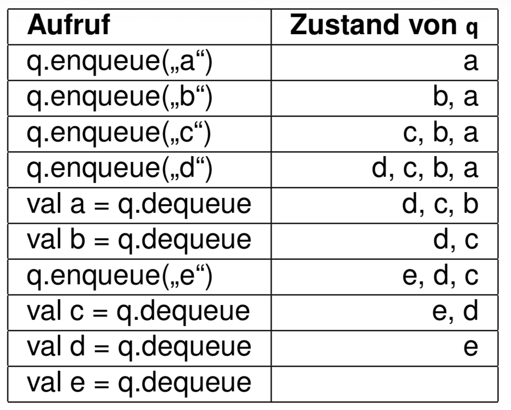
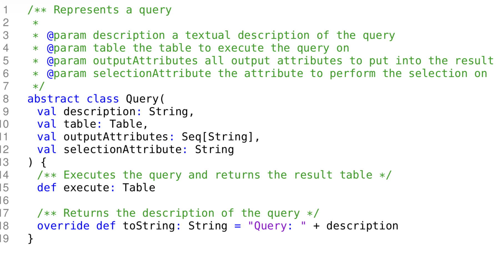
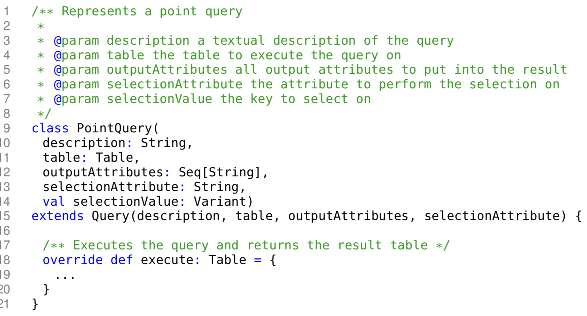
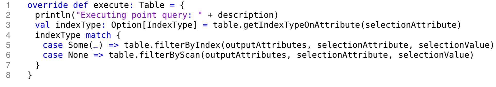
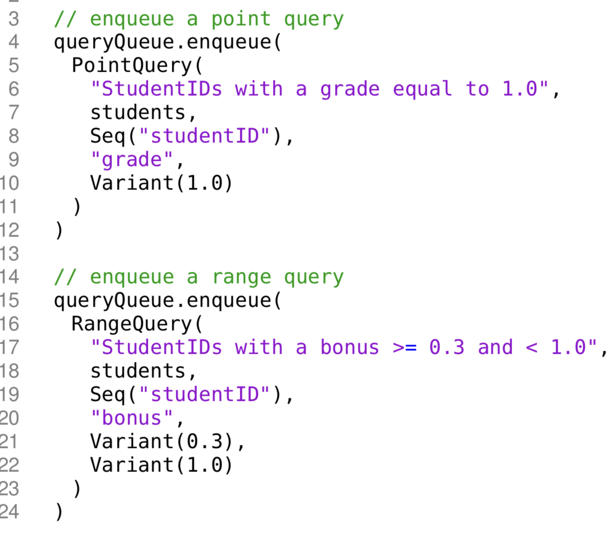
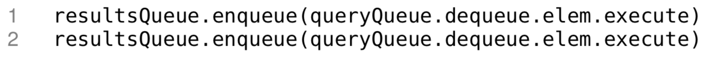
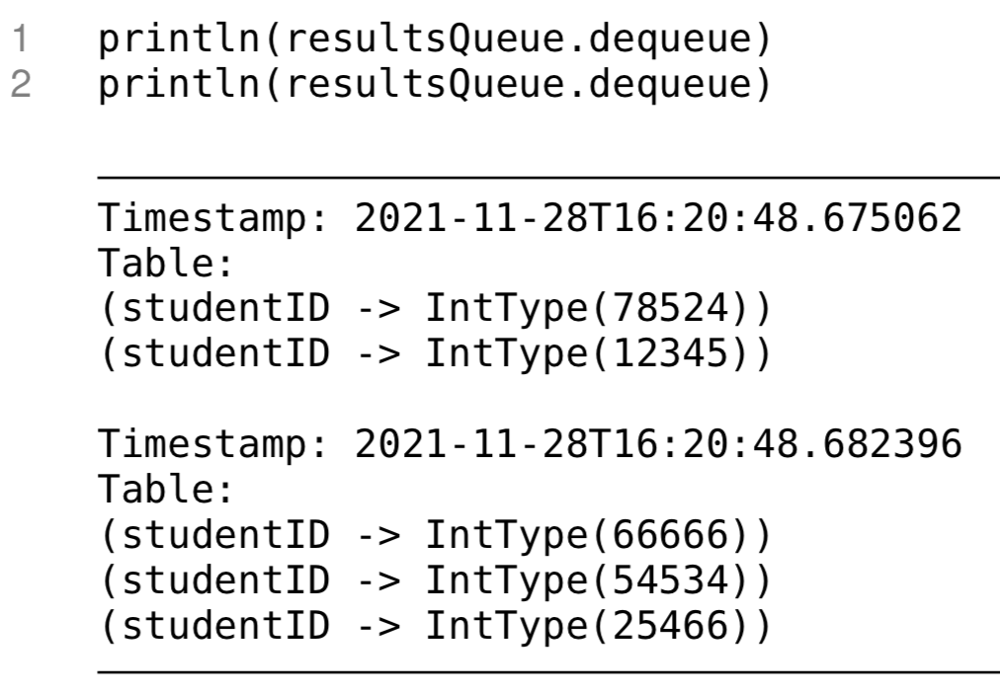

<style>
  code {
    background-color: #e9e9e9ff;
    color: #999999ff;
    padding: 2px 6px;          /* Ein bisschen Abstand, damit es gut aussieht */
    border-radius: 3px;  
       }
  details {
    border: #e4e3e3ff 1px solid;
  }

  h1 {
    text-decoration: underline;
    font-weight: bold;
  }

  h2 {
    text-decoration: underline;
    font-weight: bold;
  }

  h3 {
    text-decoration: underline;
    font-weight: bold;
  }

  body{
    background: #ffffff;
    color: black;
  }

  .sub {
    font-weight: bold;
    text-decoration: underline
  }
</style>


# Meine Gedankengänge f. d. neue Übungsblatt. 

> Da es zu warm ist & ich nicht all meine Sachen n. unten tragen möchte (es ist schon unordentlich genug) mache ich es hier:

## <u>Aufgabe 1)</u>


* so soll mein Code aussehen !

### <u>Gleichheit</u>
* <u>Wann gelten 2 Tabellen als gleich ?</u>
  * Records gleich
  * Records in derselben Reihenfolge vorkommen
  * die Reihenfolge der Attribute innerhalb des Schemas oder der Records die Gleichheit nicht beeinflusst

* <u>Wie sieht eine Tabelle aus ?</u>
  ```scala
  val table1 = new Table(
    Seq(
        "studentID": Int -> ...,
        "grade": Double -> ...,
        "bonus": Double -> ...
    )
  )
  ```

>* <u>Vorlesung</u>


---

```scala
override def equals(other: Any): Boolean = other match {
  case thatTable: Table =>
    //Vgl. Zeilenanzahl
    this.numRecords == thatTable.numRecords &&
    //Vgl. Schema
    this.schema == thatTable.schema &&
    (0 until numRecords).forall { i =>
    this.records(i) == thatTable.records(i)
    }
  case _ => false
}
```
* Hier wird bei Tabelle A & Tabelle B jeweils d. Einträge geöffnet (Zeilen) & zeilenweise durchiteriert.

* Da wir `numRecords` verw. ist es garantiert, dass wir $\lnot$ <span style="color: #81B9DB">out of range</span> sind.  
  * Wir müssen $\lnot$ `this.numRange` & `that.numRange` bestimmen, weil wir bereits in d. ersten Kontrolle d. Längen vergleichen haben.
  * Damit wir bei `this.records(i)` ankommen können, muss ja d. erste Bedingung schon stimmen, weil wir d. Bedingungen mit `&&` verbunden haben.
* Diese würden dann $\lnot$ mehr gleich sein, weshalb wir den <code style="color: #D281DB">hashCode</code> verw. können. In der Aufgabenstellung wurde gesagt, dass d. Reihenfolge im inneren d. Tabellen egal ist, wobei d. Werte stimmen sollten. D. Schema haben wir bereits ein Schritt davor kontrolliert. Deswegen können wie das `def hashCode` überschreiben & unser eigenen hashCode def.

```scala
override def hashCode(): Int = {
  //Mein hashCode soll aus den Werten die Summe ausrechnen
  (schema, records).hashCode
}
```
* <code style="color: #d35843ff">(schema, records).hashCode</code>: Wenn ich `(a,b).hashCode` aufrufe dann wird autom. zunächst `a.hashCode` aufgerufen, dann `b.hashCode`
* Scala nutzt f. Tupel eine ausgeklügelte Formel, d. d. Werte miteinander vermischt & multip., damit d. genaue Position wichtig bleibt. So haben `(5, 10)` & `(10, 5)` garantiert unterschiedl. Codes!


* Beim <span style="color: #8CD4C2">hashCode</span> geht es nur darum, dass wir ein "Ober-Index" verw. d. quazi d. Index einer "Ober-Klasse" ist, d. dann mehrere Tabellen in sich hat (`HashSet[Table[Records[Schema[String, Int|Double]]]]`)

---

* `0 until 4` = Exklusiv $\implies$ `0123`
* `0 to 4` = Inklusiv $\implies$ `01234`

<details>
  <summary style="font-size:15px"><b><u>Wie kann man mit `.foreach` eine Schleife v. a bis b erstellen ?</b></u></summary>
  
  ```scala
  (0 until upTo).forall(i => tableA(i) <= tableB(i))
  ```

  D. ist identisch zu:
  ```python
  for i in range(a,b):
    if False:
      break
  ```

  Mit `(0 until upTo).forall(i => ...)`. Somit erstellen wir eine Variabel `i`, d. d. Werte v. 0 bis upTo einnimmt.
</details>


# <u><b>Aufgabe 2</u></b>

<details>
  <summary style="font-size: 20px;"><u><b>Aufgabe:</u></b></summary>
  <div style="border: black 1px solid">

  Arbeiten Sie in:

  - `src/main/scala/dbms/v2/indexing/HashIndex.scala`
  - `src/main/scala/dbms/v2/indexing/TreeIndex.scala`
  - `src/main/scala/dbms/v2/indexing/MapBasedIndex.scala`

  Das Template enthält `toString`-Implementierungen für `HashIndex` und `TreeIndex`, diese sind aber nicht ganz
  korrekt.

  Gefordertes Verhalten:

  - Finden und beheben Sie das Problem.
  - Ändern Sie den Code so, dass es nur noch eine gemeinsame `toString`-Methode für `HashIndex` und `TreeIndex`
    gibt.

  Relevante Testsuite:

  ```bash
  sbt "testOnly dbms.v2.ScoredIndexRepresentationSuite"
  ```
</div></details>

<details>
  <summary sytle="font-size: 10px"> HashIndex.scala</summary>
  <div sytle="border: black 1px solid">
  
  ```scala
  package dbms.v2.indexing

  import dbms.v2.misc.{RecordID, Variant}
  import dbms.v2.store.Table
  import scala.collection.mutable

  /** Represents an index that is internally materialized as hash map
   *
   * @param table     the table on which the index is built
   * @param attribute the name of the attribute to build the index on
   */
  class HashIndex(table: Table, attribute: String) extends MapBasedIndex(table, attribute) {

      /** The internal data structure (a HashMap) used to represent our index data. */
      protected val index: mutable.HashMap[Variant, Seq[RecordID]] = getIndexMapping.to(mutable.HashMap)

      /** Returns a string representation of this index. */
      override def toString: String = index
          .toSeq
          .sorted
          .map((value, idString) => s"value $value occurs in row(s) $idString\n").mkString("")
  }
  ```
  * wenn ich den Code ausführen möchte, steht, dass es ein Fehler bei `.sorted` ist
    * <u>Grund</u>: Scala weiß $\lnot$ wie es mit `...:Variant`(<i>eigener komplexer Datentyp</i>) umgehen soll, um damit zu vgl.
    * ```scala
      object Variant {
      /** Returns a new IntType for the given Int */
      def apply(i: Long): Variant = LongType(i)

      /** Returns a new DoubleType for the given Double */
      def apply(d: Double): Variant = DoubleType(d)

      /** Returns a new StringType for the given String */
      def apply(s: String): Variant = StringType(s)
      }
      ```
        * `variant` kann 3 Datentypen haben $\implies$ <b>LongType, DoubleType, StringType</b>
        * Können wir es nicht an equals schicken oder ein neues implementieren, weil wir bei equals einen Parameter mit dem Typen Any erwarten, das alles annimmt. Dann können wir es mit dem case auffangen & weitere Kontrollen implementieren.

  * wenn ich den Code ausführen möchte, steht, dass es ein Fehler bei `.sorted` ist
    * <u>Grund</u>: Scala weiß $\lnot$ wie es mit `...:Variant`(<i>eigener komplexer Datentyp</i>) umgehen soll, um damit zu vgl.
    * ```scala
      object Variant {
      /** Returns a new IntType for the given Int */
      def apply(i: Long): Variant = LongType(i)

      /** Returns a new DoubleType for the given Double */
      def apply(d: Double): Variant = DoubleType(d)

      /** Returns a new StringType for the given String */
      def apply(s: String): Variant = StringType(s)
      }
      ```
        * `variant` kann 3 Datentypen haben $\implies$ <b>LongType, DoubleType, StringType</b>

        * `def apply(i: <Type>)` nutzen wir, damit autom. eins d. Funktionen aufgerufen, wo d. Datentypen ü.einstimmen. Wir müssen keine komplizierte If-Bedingungen implementieren.

        * wir suchen uns ein Attribut aus $\implies$, dan. soll sortiert werden $=$ Typen untereinander $\lnot$ unterscheiden, weil Typen bei einem Attribut d. gleiche ist. Bei `Schema` wird bereits kontrolliert, ob `Id` zum Bsp. ein `Int` ist. 

        * `.sortBy(_._1.toString)`: dadurch wird d. Problem gelöst
          * wir vgl. d. String-Repräsentation
          * `_` = Platzhalter f. Objekt
          * `_1` = bedeutet, d. wir n. dem ersten Element sortieren
</div></details>

<details>
  <summary sytle="font-size: 10px">TreeIndex.scala</summary>
  <div sytle="border: black 1px solid">
  
  ```scala
  package dbms.v2.indexing

  import dbms.v2.misc.{RecordID, Variant}
  import dbms.v2.store.Table
  import scala.collection.mutable

  /** Represents an index that is internally materialized as hash map
   *
   * @param table     the table on which the index is built
   * @param attribute the name of the attribute to build the index on
   */
  class HashIndex(table: Table, attribute: String) extends MapBasedIndex(table, attribute) {

      /** The internal data structure (a HashMap) used to represent our index data. */
      protected val index: mutable.HashMap[Variant, Seq[RecordID]] = getIndexMapping.to(mutable.HashMap)

      /** Returns a string representation of this index. */
      override def toString: String = index
          .toSeq
          .sorted
          .map((value, idString) => s"value $value occurs in row(s) $idString\n").mkString("")
  }
  ```
  * hier ist es genau d. Gleiche wie `Hashindex.scala`

  ```scala
  package dbms.v2.indexing

  import dbms.v2.misc.{RecordID, Variant}
  import dbms.v2.store.Table
  import scala.collection.mutable

  /** Represents an index that is internally materialized as hash map
  *
  * @param table     the table on which the index is built
  * @param attribute the name of the attribute to build the index on
  */
  class HashIndex(table: Table, attribute: String) extends MapBasedIndex(table, attribute) {

      /** The internal data structure (a HashMap) used to represent our index data. */
      protected val index: mutable.HashMap[Variant, Seq[RecordID]] = getIndexMapping.to(mutable.HashMap)
  }   
  ```

  ```scala
  package dbms.v2.indexing

  import dbms.v2.misc.{DBType, Variant, RecordID}
  import dbms.v2.store.Table

  /** Represents an index. */
  abstract class MapBasedIndex(table: Table, attribute: String) extends IsIndex {

      /** Requires each inheriting index to use a Map as internal data structure. */
      protected val index: collection.mutable.Map[Variant, Seq[RecordID]]

      /** The data type that is stored in the index */
      override def dataType: DBType = table.schema.getDataType(attribute)

      /** Returns a mapping that represents the index. */
      protected def getIndexMapping: Map[Variant, Seq[RecordID]] = {
          (0 until table.numRecords)
              .groupBy(recordID => table.getRecord(recordID).getValue(attribute))
      }

      /** Returns the number of keys currently indexed. */
      override def numEntries: Int = index.size

      /** Adds a key and a recordID to the index.
      *
      * Can handle keys that are already present in the index.
      *
      * @param key      the key to index.
      * @param recordID the recordID of the record from which the key originates
      * @return true iff the key was already in the index
      */
      def add(key: Variant, recordID: RecordID): Unit = {
          val currentRecordIDs = index.getOrElse(key, Seq())
          val updatedRecordIDs = currentRecordIDs.appended(recordID)
          index.update(key, updatedRecordIDs)
      }

      /** Clears the index from all elements */
      override def clear(): Unit = index.clear

      /** Retrieves all recordIDs associated with the given key
      *
      * @param key the key to lookup in the index
      * @return a sequence of all recordIDs associated with the given key (can be empty if key is not indexed)
      */
      def get(key: Variant): Seq[RecordID] = {
          if (this.dataType != key.dataType)
              throw IllegalArgumentException("The datatype of the passed key differs from the datatype of the index.")

          index.getOrElse(key, Seq())
      }

      override def toString: String = 
          index.toSeq.sortBy(_._1.toString).map((value, idString) => s"value $value occurs in row(s) $idString\n").mkString("")    
  }
  ```
  * `HashMap`& `TreeMap` erben v. <code style="color: #7C7CBF">Map</code> $\to$ funktionieren v. `.sortBy` 
</div></details>

<details>
  <summary sytle="font-size: 10px">MapBasedIndex.scala</summary>
  <div sytle="border: black 1px solid">
  
  ```scala
  package dbms.v2.indexing

  import dbms.v2.misc.{DBType, Variant, RecordID}
  import dbms.v2.store.Table

  /** Represents an index. */
  abstract class MapBasedIndex(table: Table, attribute: String) extends IsIndex {

      /** Requires each inheriting index to use a Map as internal data structure. */
      protected val index: collection.mutable.Map[Variant, Seq[RecordID]]

      /** The data type that is stored in the index */
      override def dataType: DBType = table.schema.getDataType(attribute)

      /** Returns a mapping that represents the index. */
      protected def getIndexMapping: Map[Variant, Seq[RecordID]] = {
          (0 until table.numRecords)
              .groupBy(recordID => table.getRecord(recordID).getValue(attribute))
      }

      /** Returns the number of keys currently indexed. */
      override def numEntries: Int = index.size

      /** Adds a key and a recordID to the index.
       *
       * Can handle keys that are already present in the index.
       *
       * @param key      the key to index.
       * @param recordID the recordID of the record from which the key originates
       * @return true iff the key was already in the index
       */
      def add(key: Variant, recordID: RecordID): Unit = {
          val currentRecordIDs = index.getOrElse(key, Seq())
          val updatedRecordIDs = currentRecordIDs.appended(recordID)
          index.update(key, updatedRecordIDs)
      }

      /** Clears the index from all elements */
      override def clear(): Unit = index.clear

      /** Retrieves all recordIDs associated with the given key
       *
       * @param key the key to lookup in the index
       * @return a sequence of all recordIDs associated with the given key (can be empty if key is not indexed)
       */
      def get(key: Variant): Seq[RecordID] = {
          if (this.dataType != key.dataType)
              throw IllegalArgumentException("The datatype of the passed key differs from the datatype of the index.")

          index.getOrElse(key, Seq())
      }

      override def toString: String = 
          index.toSeq.sortBy(_._1.toString).map((value, idString) => s"value $value occurs in row(s) $idString\n").mkString("")    
  }
  ```
  * Wie schon gesagt, erben `HashMap` & `TreeMap` v. <code style="color: #7C7CBF ">Map</code> $\implies$ haben $\forall$ Funktionen d. auch <code style="color: #7C7CBF ">Map</code> hat
    * somit können wir d. Code <code>override def tostring: Int = ...</code> <span style="color: #ca2828ff">aus den beiden anderen Datein entf.</span>  
</div></details>

---


<h1>Aufgabe 3</h1>

<details>
<summary><b><u>Aufgabe:</u></b></summary>


- `src/main/scala/dbms/v2/store/Table.scala`

Implementieren Sie die beiden `sortBy`-Varianten in `Table`:

- `sortBy(attribute: String): Table`
- `sortBy(attributes: Seq[String]): Table`

Verwenden Sie `sortWith` oder eine andere Sortiermethode aus der Scala-Standardbibliothek. Implementieren Sie
keinen eigenen Sortieralgorithmus.

Die Methoden sollen eine `IllegalArgumentException` werfen, wenn ein angegebenes Attribut in der Tabelle nicht
existiert.

Relevante Testsuite:

```bash
sbt "testOnly dbms.v2.ScoredTableSortSuite"
```
</details>

<details>
<summary><b><u>sortBy(attribute: String): Table</u></b></summary>

* <u><b>Was soll ü.haupt geschehen ?</b></u>

  * <u>Kontrolle</u>: Wenn `Attribut` $\underrightarrow{\ \ \ \ \textcolor{#c72483}{\text{nicht nethalten}}\ \ \ \ }$ `IllegalArgumentException`
  * `Attribut` wird ü.geben
  * danach werden d. Tabelle sortiert
  * <u>Rückgabe</u>: Ein neuen `Table`
  * <span style="color: red">Keine eigenen Sortier-Algorithmus implementieren</span> $\underrightarrow{\ \ \ \ \textcolor{#c72483}{\text{sondern}}\ \ \ \ }$ aus Scala-StandardMethode !
  
  ```scala
  /** Returns a new table that is sorted by the given attribute */
    def sortBy(attribute: String): Table = {
        ???
    }
  ```
  * Kontrolle einf.
    * `Schema.scala` hat `def contains(attribute: String): Boolean = attributes.contains(attribute)`, welches wir benutzen können, ob d. `attribute` enthalten ist oder nicht
  
  ```scala
  if (!schema.contains(attribute))
    throw new IllegalArgumentException("Das Attribut wo nach sortiert werden soll, ist nicht in ihrer Tabelle enthalten.")
  ```
  ---
  __Sortieren__

  * Bei <code style="color: #daa922ff">Table.scala</code> erkennt man: `records: ArrayBuffer[TableRecord]`. D. heißt d. Inhalt d. wir sortieren müssen ist ein <code sytle="color: #63bdd6">TableRecord</code>. Somit muss ich mir angucken, wie <code style="color: #63bdd6">TableRecord</code> aufgebaut ist. <code style="color: #63bdd6">TableRecord</code> besteht aus `Iterable[(String, Variant)]`, also aus unserem Attributen & dessen Werten. Wenn wir weiter in d. <code style="color: #e03481ff">class TableRecord</code> gucken sehen wir, d. wir eine Methode bekommen, indem wir d. Werte d. einzelnen Attribute zurück bekommen: 
    ```scala
    def getValue(attribute: String): Variant = {
            ...
        }
    ```
  * Daraus ergibt sich folgernder Code:
    ```scala
    val sortedRecords = records.sortWith((r1: TableRecord, r2: TableRecord) => r1.getValue(attribute) <= r2.getValue(attribute))

    Table(schema, sortedRecords)
    ```
  * <u>__Wrm. Table(schema, sortedRecords) ?__</u>
    ```scala
    def this(schema: Schema, initialRecords: Iterable[TableRecord]) = {}
    ```
    * D. ist d. Leitfaden f. jegl. Tabelle mit dem Typen v. `Table`. 
</details>

<details>
<summary><b><u>sortBy(attributes: String): Table</u></b></summary>

* <u><b>Was soll ü.haupt geschehen ?</b></u>
  * soll n.einander d. Liste n. den ü.ggb. `attributen` sortieren
  
  1) __<u>Kontrolle</u>__:
  * sind $\forall$ Attribute in Schema ?
    ```scala
    //False -> True
    if (!attributes.forall(a => schema.contains(a)))
      throw new IllegalArgumentException("Die übergebenen Attribute stimmen mit dem Schema nicht überein.")
    ```

  1) __<u>Sortieren</u>__:
  * `getValue(attribute: String)`
  ```scala
  val sortedRecords = records.sortBy(row => 
    attributes.map(a => row.getValue(a))
    )

  Table(schema, sortedRecords)
  ```
  * wir nutzen <code style="color: #4eb591ff">.map</code> & $\lnot$ <code style="color: #e2a816ff">.forall</code>, weil <code style="color: #e2a816ff">.forall</code> nichts zurückgibt & wir quazi bei `attributes.forall` keine Werte haben, mit dem wir arbeiten können. <code style="color: #4eb591ff">.map</code> jedoch schon. 
</details>


---

# <u><b>Aufgabe 4</u></b>

```scala
/** Joins two tables sharing exactly one attribute. */
def naturalJoin(other: Table): Table = {
???
}
```
* <u>Ist Attribut enthalten ?</u>

  * <code style="color:  #4eb591ff">A</code> & <code style="color:  #a94eb5ff">B</code> = genau eine gemeinsame Spalte
    * Haben Spalten den gleichen Datentypen ?
    * Diese Spalte f. Join verw..
      * Wenn Bedingungen $\lnot$ erfüllt $\to$ <code style="color:  #ff0000ff">IllegalArgumentException</code>
  
<details>
<summary><u><b>Gleiche Attribute ?</b></u></summary>

* `attribut: String`
  * liegt in `Schema:(attribute: String, value: Variant)`
  ```scala
  //1. durch Schema iterieren
  //2. A_Schema(1) ?= B_Schema(2)
  if (!other.schema.contrins(this.schema))
    throw new IllegalArgumentException("Beide Tabellen teilen keinen gleichen Attributen")
  ```
* `Attribute` -> `.toSet `-> `.intersect()`
  * wenn `.size == 1`, dann geeignet 
    ```scala
    val commonElements: Set[String] = this.schema.attributes.toSet.intersect(other.schema.attributes.toSet)

    if (commonElements.size != 1) {
      throw new IllegalArgumentException("Die Tabellen müssen exakt ein gemeinsames Attribut teilen!")
    }

    // 2. Den Attributnamen als String herausholen
    val joinAttribute: String = commonElements.head

    ```  
    * Aus dem Schema v. A & B müssen wir ein Schema machen
    ```scala
    //Zsm.führen beider Schemas
    this.schema.attributes ++ other.schema.attributes
    ```
</details>

<details>
  <summary><u><b>Gleicher Datentyp ?</b></u></summary>

  * `getDateType(attribute)`

  <h3>Schema zsm.führen</h3>

  * <code style="color: #c7862bff">TableRecord.attributes:  Map[attribute: String, value: Variant]</code>
    * wir müssen d. `Schnittmenge` aus einer d. beiden Tabellen rausfiltern, weil Schema immer sofort untersucht, ob ein Attribut einzigartig ist. Wenn $\lnot \to$ Sofortiges abbrechen
      * table2 = Symmetrische Differenz($\forall$ Elem. außer Schnittmenge)
    * mit `++` zsm.führen
    * `.toMap` entf. autom. identische Tupel
    * Am Ende zu `class Schema(elems)` schicken, damit wir Datentyp: Schema haben!

    <details>
      <summary><u><b>Was passiert beim filter ?</b></u></summary>
      
      * `other.schema = Iterable[(String, DBType)]`
        * <code style="color: #ff00aeff">Iterable[]</code> ist wie eine <span style="color: #ff0000ff">normale Liste</span>
      * ```scala
        val otherCleanedTable = other.schema.filter(x => x == joinAttribute)
        ```
        * `x`:
          * (String, DBType)
          * wir müssen d. erste Elem. zum filtrieren raussuchen: `x._1`
    </details>

  <h3>Typen vgl.</h3>

  1) Zeielweise iterieren (`records(i)`)
  1) Wert d. Schnittmenge f. `Tabelle A` & `Tabelle B` rausholen mit <code style="color: #6426b6ff">.schema.getValue(joinAttribute)</code>
     * wenn gleich: `Record A` & `Record 2` $\implies$ `new Record()`
     * wenn nicht: einfach hinzufügen

  <h3>New Schema</h3>
  
  ```scala
  val otherCleanedTable = other.schema.filter(x => x._1 != joinAttribute)
  // Hier führen wir beie "Mengen" zusammen
  val combinedSchema = (this.schema ++ otherCleanedTable)
  //Hier erstellen wir aus den zusammengeführten Schemas eine neues Schema-Objekt
  val newSchema = new Schema(combinedSchema)
  ```

  <h3>Fusion</h3>

  * wenn identische Records vorhanden sind, dann werden diese kombiniert
  <details>
    <summary><code>records</code></summary>

    * `records: ArrayBuffer[TableRecord]` \to `Iterable[(String, Variant)]`
  </details>

  ```scala
  val joinedRecords = for {
    tableA <- this.records
    tableB <- other.records
    if tableA.getValue(joinAttribute) == tableB.getValue(joinAttribute)
    } yield {
      // Kombiniere tableA mit tableB (ohne das Join-Attribut aus tableB)
      val combinedTuples = tableA ++ tableB.filter(x => x._1 != joinAttribute)
      
      // yield liefert das fertige Record für die Liste
      new TableRecord(combinedTuples) 
    }

  // 2. Erstelle die neue Tabelle außerhalb des for-Blocks
  new Table(newSchema, joinedRecords)
  ```
</details>

---
<h1>Aufgabe 5</h1>

<details>
<summary><code>def knownExams(students: Table, exams: Table): Table</code></summary>

<h2>Was soll geschehen ?</h2>

* return Tabelle mit Spalten(`examDate`, `examSubject`)
* enthält $\forall$ bekannten Klausuren
* keine Duplikate: `distinct: Table = Table(schema, records.distinct)`

<h2>Mein Plan ?</h2>

Wir haben `Table(val schema: Schema) extends Iterable[TableRecord]` & da kann man erkennen, dass ein <code style="color: #ff6a00ff">Schema</code> & ein <code style="color: #ff6a00ff">Iterable[TableRecord]</code> benötigt wird.

<h3>Schema</h3>

  * <code style="color: grey">Schema(elems: Iterable[(String, DBType)])</code>
  * <code style="color: grey">def getSubsetOfAttributes(subsetOfAttributes: Seq[String]): Schema</code>

<h3>Record</h3>

  * <code style="color: grey">class TableRecord(elems: Iterable[(String, Variant)])</code>
  * Tupel erstellen
    * `String` = ["examDate", "examSubject"]; `Variant` = .getValue()

```scala
// Table(val schema: Schema) extends Iterable[TableRecord]
// TableRecord(elems: Iterable[(String, Variant)])
// Table(examDate -> String, examSubject -> String)

def knownExams(students: Table, exams: Table): Table = {
    val examSchema = exams.schema.getSubsetOfAttributes(Seq("examDate","examSubject"))
    
    val examRecords = exams.map(r => {
        val tuples = examSchema.map(s => (s._1, r.getValue(s._1)))
        new TableRecord(tuples)
    })

    Table(examSchema, examRecords).distinct
}
```
</details>

<details>
<summary><code>def topStudents(students: Table, exams: Table): Table</code></summary>

<h2>Was soll geschehen ?</h2>

* @return Tabelle mit nur einer Spalte
* Alle Studenten, die in EiS eine 1.0 geschieben haben

<h2>Mein Plan ?</h2>

* v. `students` $\to$ StudentID raussuchen

* ist == 1.0 

* <code style= "color: grey">def filterByScan(selectionAttribute: String, requiredValue: Variant): Table</code>


```scala
val students = Table(TableRecord(Seq(
            "examDate" -> Variant("2023-04-17"),
            "matriculationNumber" -> Variant(133676),
            "examSubject" -> Variant("EIS"),
            "examGrade" -> Variant(1.3)
        )), ...
)

/** Returns a [[Table]] containing all students scoring the highest grade on the software design exam.
 *
 * @param students a [[Table]] containing student info
 * @param exams    a [[Table]] containing a list of exam results
 */
def topStudents(students: Table, exams: Table): Table = {
  
}
```

</details>


<h1>Übung 5</h1>

<h2>Aufgabe 1</h2>

<details>
<summary><u><b>Aufgabe 1</b></u></summary>

<h3>Geg. Code:</h3>

```scala
package datastructures

class Counter[A](initialElements: Iterable[A]) {

    private val counts = scala.collection.mutable.HashMap[A, Long]()
    
    /** Sets the count for the specified key to the specified value.
     *
     * @throws IllegalArgumentException if the specified count is negative
     */
    def setCount(key: A, count: Long): Unit = ???

    /** Modifies the count for the specified key by adding the specified amount. Count cannot drop below zero. */
    def modifyCount(key: A, amount: Long): Unit = ???

    /** Returns the count for the specified key. */
    def getCount(key: A): Long = ???

    /** Increments the count by one for each of the specified keys. */
    def incrementCounts(keys: Iterable[A]): Unit = ???

    /** Decrements the count by one for each of the specified keys. Counts cannot drop below zero. */
    def decrementCounts(keys: Iterable[A]): Unit = ???

    override def toString: String = ???

    override def equals(obj: Any): Boolean = ???

    override def hashCode: Int = ???
}
```

> setCount setzt den Zählwert eines Elements & wirft bei negativen Werten eine IllegalArgumentException.

* meine Kontrolle, ob `count < 0`
  ```scala
  def setCount(key: A, count: Long): Unit = {
      if (count < 0) {
          throw new IllegalArgumentException("Der count darf nicht negativ sein !")
      }
  }
  ```

<h3>Wie speichern wir die Counts ?</h3>

<code>private val counts = scala.<code style="color: #ff6a00ff">collection.mutable.</code><code style="color: #a356a5ff">HashMap</code><code style="color: #49a3d6ff">[A, Long]</code>()</code>

* `collection.mutable.HashMap[A, Long]` hier def. wir den Datentyp 
  * <code style="color: #a356a5ff">HashMap</code> $\implies$ key: A $\to$ Value: Long
  * <code style="color: #49a3d6ff">[A, Long]</code> $\implies$ Datentypen für Key und Value
* `()` $\implies$ ruft Konstruktor d. HashMap auf $\to$ erzeugt eine neue, leere Instanz

<h3>Wie Werte zählen ?</h3>

* gehe durch die Liste
  * wenn Elem. $\lnot$ in counts, dann $$A = key \ | \ count = \text{Anzahl v. key in Iterable}$$
  * 


</details>


---
# __Auf meinen Lernblatt__

* `sortWith()`
  * vergl. n. $\le$
  * __<u>Ergebnis</u>__: Liste v. kleinsten n. größten sortiert
  * __<u>Syntax</u>__:
    ```scala
    users.sortWith(_.attribute > _.attribute)
    ```

* `.sortBy()`
  * wenn wir `_.attribute1.attribute2.attribute3` $\underrightarrow{\ \ \ \ \textcolor{#c72483}{\text{wird autom.}}\ \ \ \ }$ v. links n. rechts sortiert

<h2>Set</h2>

* `.intersect()`
  * Schnittmenge

* `.head`
  * gibt d. aller erste Elem.
  * Set = ungeordnet

<h2>Nested for-loop</h2>

```scala
for {
  i <- listeA
  j <- listeB

  //filter
  if ()
} yield {
  //wie soll das Elem. in d. Liste aussehen
}
```

---

<h1>Generische Typen</h1>

* Wir haben es bereits benutzt: `Collections`(Bsp.: ArrayBuffer, Seq) $\underrightarrow{\ \ \ \ \textcolor{#83b7ea}{\text{mitgegeben}}\ \ \ \ }$ `Typenparameter` $\underrightarrow{\ \ \ \ \textcolor{#83b7ea}{\text{instanziert}}\ \ \ \ }$ genereische Typen
  * ```scala
    val s: Seq[Int] = Seq(1,2,3) //type parameter "Int"
    val a: ArrayBuffer[String] = ArrayBuffer("a", "b", "c") //type parameter "String"
    ```
<h2>Warteschalange</h2>

* Funltioniert n. `FIFO Prinzip`(First In, First Out)
  * Als erstes hinzugefügtes Elem. $\underrightarrow{\ \ \ \ \textcolor{#83b7ea}{\text{return}}\ \ \ \ }$ als erstes
    * `enqueue` = Elem. am <span style="color: red">Ende</span> d. Warteschlange hinzugefügt
    * `denqueue` = Elem. am <span style="color: red">Anfang</span> d. Warteschlange __entnommen__ & __returned__
    * 
* `collection.mutable.Queue`
* Wir wollen ein `Timestap` implementieren $\underrightarrow{\ \ \ \ \textcolor{#83b7ea}{\text{erstellt}}\ \ \ \ }$ __Zeitstempel__ des Eingabezeitpunktes $\underrightarrow{\ \ \ \ \textcolor{#83b7ea}{\text{Implementierung}}\ \ \ \ }$ `class QueueWithTimeStamp` $\underrightarrow{\ \ \ \ \textcolor{#83b7ea}{\text{verw. intern}}\ \ \ \ }$ `collection.mutable.Queue`

```scala 
/** Represents a pair of an element and a timestamp */
class ElementWithTimestamp(val elem: Int, val timestamp: Timestamp)
```
* Wir erstellen einen __Typ-Alias__: 
  * ```scala
    type Timestamp = java.time.LocalDateTime
    ```
     * mit `LocalDateTime.now` bekommen wir den __aktuellen Zeitstempel__


* <span class="sub">Problem</span>:
  * Es ist nur auf ein `Int` spezialisiert $\underrightarrow{\ \ \ \ \textcolor{#83b7ea}{\text{Lösung}}\ \ \ \ }$ Neue Klasse def.: `class ElementWithTimestamp(val elem: Int, val timestamp: Timestamp)`
  * Hinzufügen v. `[A]` n. dem Klassenbezeichner $\underrightarrow{\ \ \ \ \textcolor{#83b7ea}{\text{Einfügung}}\ \ \ \ }$

  * <span style="color: red">generischer Typ A</span> als __Typenparameter__ ein $\to$ `class ElementWithTimestamp[A](val elem: Int, val timestamp: Timestamp)` $\underrightarrow{\ \ \ \ \textcolor{#83b7ea}{\text{diese Klasse ist somit}}\ \ \ \ }$ <code style="color: #ff00b3ff">Generische Klasse</code>
    * man kann auch mehrere Typenparameter einf. `class ElementWithTimestamp[A,B,C](val elem: Int, val timestamp: Timestamp)`

<h3>Die Verwendung</h3>

```scala
/** Represents a pair of an element and a timestamp */
class ElementWithTimestamp[A](val elem: A, val timestamp: Timestamp)
```
* <span>Mögl.</span> = mit unters. Typen instanzieren
   ```scala
    val e1: ElementWithTimestamp[Int] = ElementWithTimestamp(42, LocalDateTime.now)
    val e2: ElementWithTimestamp[String] = ElementWithTimestamp("hello", LocalDateTime.now)
   ```


```scala
import collection.mutable.Queue

/** First-in-first-out (FIFO) queue that keeps a timestamp for each element */
class QueueWithTimestamp[A] {

  /** Uses the mutable queue as data structure */
  val queue: Queue[ElementWithTimestamp[A]] = Queue()

  /** Returns the current size of the queue */
  def size: Int = queue.size

  /** Dequeues an element and returns it with its timestamp */
  def dequeue: ElementWithTimestamp[A] = queue.dequeue

  /** Removes all elements from the queue */
  def clear: Unit = queue.clear

  /** Adds an element to the queue with the current timestamp and returns that*/
  def enqueue(elem: A): ElementWithTimestamp[A] = {
    val e = ElementWithTimestamp[A](elem, LocalDateTime.now)
    queue.enqueue(e)
    e
  }
}
```

* Mit einer Warteschlage wollen wir __Anfragen verwalten__

* <span class="sub">Unsere Unterklasse<span>


* <span class="sub">Execute<span>
  * __unterscheidet__, ob `Index` auf `SelectionAttribute` existiert oder $\lnot$


* <span class="sub">Anwendung v. Queue<span>
   

* <span class="sub">Ausf.<span>
  
  


<h1>Schnittstellen</h1>

* `trait`
* * <code style="color: #924ebfff">Klassen</code> können mehrere `traits` erben


<script>
  window.MathJax = {
    tex: {
      inlineMath: [['$', '$'], ['\\(', '\\)']]
    }
  };
</script>
<script type="text/javascript" async
  src="https://cdn.jsdelivr.net/npm/mathjax@3/es5/tex-mml-chtml.js">
</script>