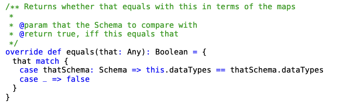
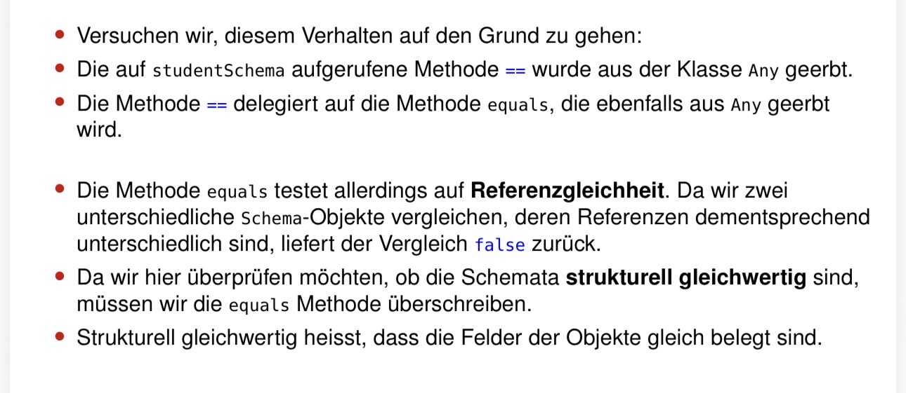
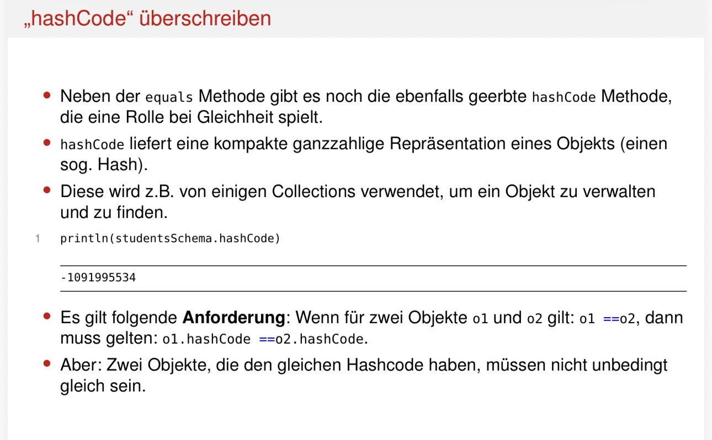

<style>
  code {
    background-color: #dddcdcff;
    color: #6bc31eff;
    padding: 2px 6px;          /* Ein bisschen Abstand, damit es gut aussieht */
    border-radius: 4px;       /* Schicke abgerundete Ecken */
  }
  .üschrift1 {
    text-decoration: underline;
    font-weight: bold;
  }

  details {
    border: #e4e3e3ff 1px solid
  }
</style>


# Meine Gedankengänge f. d. neue Übungsblatt. 

> Da es zu warm ist & ich nicht all meine Sachen n. unten tragen möchte (es ist schon unordentlich genug) mache ich es hier:

## <u>Aufgabe 1)</u>


* so soll mein Code aussehen !

### <u>Gleichheit</u>
* <u>Wann gelten 2 tabellen als gleich ?</u>
  * Records gleich
  * Records in derselben Reihenfolge vorkommen
  * die Reihenfolge der Attribute innerhalb des Schemas oder der Records die Gleichheit nicht beeinflusst

* <u>Wie sieht eine Tabelle aus ?</u>
  ```scala
  val table1 = new Table(
    Seq(
        "studentID": Int -> ...,
        "grade": Double -> ...,
        "bonus": Double -> ...
    )
  )
  ```

>* <u>Vorlesung</u>



---

```scala
override def equals(other: Any): Boolean = other match {
  case thatTable: Table =>
    //Vgl. Zeilenanzahl
    this.numRecords == thatTable.numRecords &&
    //Vgl. Schema
    this.schema == thatTable.schema &&
    (0 until numRecords).forall { i =>
    this.records(i) == thatTable.records(i)
    }
  case _ => false
}
```
* Hier wird bei Tabelle A & Tabelle B jeweils d. Einträge geöffnet (Zeilen) & zeilenweise durchiteriert.

* Da wir `numRecords` verw. ist es garantiert, dass wir $\lnot$ <span style="color: #81B9DB">out of range</span> sind.  
  * Wir müssen $\lnot$ `this.numRange` & `that.numRange` bestimmen, weil wir bereits in d. ersten Kontrolle d. Längen vergleichen haben.
  * Damit wir bei `this.records(i)` ankommen können, muss ja d. erste Bedingung schon stimmen, weil wir d. Bedingungen mit `&&` verbunden haben.
* Diese würden dann $\lnot$ mehr gleich sein, weshalb wir den <code style="color: #D281DB">hashCode</code> verw. können. In der Aufgabenstellung wurde gesagt, dass d. Reihenfolge im inneren d. Tabellen egal ist, wobei d. Werte stimmen sollten. D. Schema haben wir bereits ein Schritt davor kontrolliert. Deswegen können wie das `def hashCode` überschreiben & unser eigenen hashCode def.

```scala
override def hashCode(): Int = {
  //Mein hashCode soll aus den Werten die Summe ausrechnen
  (schema, records).hashCode
}
```
* <code style="color: #d35843ff">(schema, records).hashCode</code>: Wenn ich `(a,b).hashCode` aufrufe dann wird autom. zunächst `a.hashCode` aufgerufen, dann `b.hashCode`
* Scala nutzt f. Tupel eine ausgeklügelte Formel, d. d. Werte miteinander vermischt & multip., damit d. genaue Position wichtig bleibt. So haben `(5, 10)` & `(10, 5)` garantiert unterschiedl. Codes!


* Beim <span style="color: #8CD4C2">hashCode</span> geht es nur darum, dass wir ein "Ober-Index" verw. d. quazi d. Index einer "Ober-Klasse" ist, d. dann mehrere Tabellen in sich hat (`HashSet[Table[Records[Schema[String, Int|Double]]]]`)

---

* `0 until 4` = Exklusiv $\implies$ `0123`
* `0 to 4` = Inklusiv $\implies$ `01234`

<details>
  <summary style="font-size:15px"><b><u>Wie kann man mit `.foreach` eine Schleife v. a bis b erstellen ?</b></u></summary>
  
  ```scala
  (0 until upTo).forall(i => tableA(i) <= tableB(i))
  ```

  D. ist identisch zu:
  ```python
  for i in range(a,b):
    if False:
      break
  ```

  Mit `(0 until upTo).forall(i => ...)`. Somit erstellen wir eine Variabel `i`, d. d. Werte v. 0 bis upTo einnimmt.
</details>


# <u><b>Aufgabe 2</u></b>

<details>
  <summary style="font-size: 20px;"><u><b>Aufgabe:</u></b></summary>
  <div style="border: black 1px solid">

  Arbeiten Sie in:

  - `src/main/scala/dbms/v2/indexing/HashIndex.scala`
  - `src/main/scala/dbms/v2/indexing/TreeIndex.scala`
  - `src/main/scala/dbms/v2/indexing/MapBasedIndex.scala`

  Das Template enthält `toString`-Implementierungen für `HashIndex` und `TreeIndex`, diese sind aber nicht ganz
  korrekt.

  Gefordertes Verhalten:

  - Finden und beheben Sie das Problem.
  - Ändern Sie den Code so, dass es nur noch eine gemeinsame `toString`-Methode für `HashIndex` und `TreeIndex`
    gibt.

  Relevante Testsuite:

  ```bash
  sbt "testOnly dbms.v2.ScoredIndexRepresentationSuite"
  ```
</div></details>

<details>
  <summary sytle="font-size: 10px"> HashIndex.scala</summary>
  <div sytle="border: black 1px solid">
  
  ```scala
  package dbms.v2.indexing

  import dbms.v2.misc.{RecordID, Variant}
  import dbms.v2.store.Table
  import scala.collection.mutable

  /** Represents an index that is internally materialized as hash map
   *
   * @param table     the table on which the index is built
   * @param attribute the name of the attribute to build the index on
   */
  class HashIndex(table: Table, attribute: String) extends MapBasedIndex(table, attribute) {

      /** The internal data structure (a HashMap) used to represent our index data. */
      protected val index: mutable.HashMap[Variant, Seq[RecordID]] = getIndexMapping.to(mutable.HashMap)

      /** Returns a string representation of this index. */
      override def toString: String = index
          .toSeq
          .sorted
          .map((value, idString) => s"value $value occurs in row(s) $idString\n").mkString("")
  }
  ```
  * wenn ich den Code ausführen möchte, steht, dass es ein Fehler bei `.sorted` ist
    * <u>Grund</u>: Scala weiß $\lnot$ wie es mit `...:Variant`(<i>eigener komplexer Datentyp</i>) umgehen soll, um damit zu vgl.
    * ```scala
      object Variant {
      /** Returns a new IntType for the given Int */
      def apply(i: Long): Variant = LongType(i)

      /** Returns a new DoubleType for the given Double */
      def apply(d: Double): Variant = DoubleType(d)

      /** Returns a new StringType for the given String */
      def apply(s: String): Variant = StringType(s)
      }
      ```
        * `variant` kann 3 Datentypen haben $\implies$ <b>LongType, DoubleType, StringType</b>
        * Können wir es nicht an equals schicken oder ein neues implementieren, weil wir bei equals einen Parameter mit dem Typen Any erwarten, das alles annimmt. Dann können wir es mit dem case auffangen & weitere Kontrollen implementieren.

  * wenn ich den Code ausführen möchte, steht, dass es ein Fehler bei `.sorted` ist
    * <u>Grund</u>: Scala weiß $\lnot$ wie es mit `...:Variant`(<i>eigener komplexer Datentyp</i>) umgehen soll, um damit zu vgl.
    * ```scala
      object Variant {
      /** Returns a new IntType for the given Int */
      def apply(i: Long): Variant = LongType(i)

      /** Returns a new DoubleType for the given Double */
      def apply(d: Double): Variant = DoubleType(d)

      /** Returns a new StringType for the given String */
      def apply(s: String): Variant = StringType(s)
      }
      ```
        * `variant` kann 3 Datentypen haben $\implies$ <b>LongType, DoubleType, StringType</b>

        * `def apply(i: <Type>)` nutzen wir, damit autom. eins d. Funktionen aufgerufen, wo d. Datentypen ü.einstimmen. Wir müssen keine komplizierte If-Bedingungen implementieren.

        * wir suchen uns ein Attribut aus $\implies$, dan. soll sortiert werden $=$ Typen untereinander $\lnot$ unterscheiden, weil Typen bei einem Attribut d. gleiche ist. Bei `Schema` wird bereits kontrolliert, ob `Id` zum Bsp. ein `Int` ist. 

        * `.sortBy(_._1.toString)`: dadurch wird d. Problem gelöst
          * wir vgl. d. String-Repräsentation
          * `_` = Platzhalter f. Objekt
          * `_1` = bedeutet, d. wir n. dem ersten Element sortieren
</div></details>

<details>
  <summary sytle="font-size: 10px">TreeIndex.scala</summary>
  <div sytle="border: black 1px solid">
  
  ```scala
  package dbms.v2.indexing

  import dbms.v2.misc.{RecordID, Variant}
  import dbms.v2.store.Table
  import scala.collection.mutable

  /** Represents an index that is internally materialized as hash map
   *
   * @param table     the table on which the index is built
   * @param attribute the name of the attribute to build the index on
   */
  class HashIndex(table: Table, attribute: String) extends MapBasedIndex(table, attribute) {

      /** The internal data structure (a HashMap) used to represent our index data. */
      protected val index: mutable.HashMap[Variant, Seq[RecordID]] = getIndexMapping.to(mutable.HashMap)

      /** Returns a string representation of this index. */
      override def toString: String = index
          .toSeq
          .sorted
          .map((value, idString) => s"value $value occurs in row(s) $idString\n").mkString("")
  }
  ```
  * hier ist es genau d. Gleiche wie `Hashindex.scala`

  ```scala
  package dbms.v2.indexing

  import dbms.v2.misc.{RecordID, Variant}
  import dbms.v2.store.Table
  import scala.collection.mutable

  /** Represents an index that is internally materialized as hash map
  *
  * @param table     the table on which the index is built
  * @param attribute the name of the attribute to build the index on
  */
  class HashIndex(table: Table, attribute: String) extends MapBasedIndex(table, attribute) {

      /** The internal data structure (a HashMap) used to represent our index data. */
      protected val index: mutable.HashMap[Variant, Seq[RecordID]] = getIndexMapping.to(mutable.HashMap)
  }   
  ```

  ```scala
  package dbms.v2.indexing

  import dbms.v2.misc.{DBType, Variant, RecordID}
  import dbms.v2.store.Table

  /** Represents an index. */
  abstract class MapBasedIndex(table: Table, attribute: String) extends IsIndex {

      /** Requires each inheriting index to use a Map as internal data structure. */
      protected val index: collection.mutable.Map[Variant, Seq[RecordID]]

      /** The data type that is stored in the index */
      override def dataType: DBType = table.schema.getDataType(attribute)

      /** Returns a mapping that represents the index. */
      protected def getIndexMapping: Map[Variant, Seq[RecordID]] = {
          (0 until table.numRecords)
              .groupBy(recordID => table.getRecord(recordID).getValue(attribute))
      }

      /** Returns the number of keys currently indexed. */
      override def numEntries: Int = index.size

      /** Adds a key and a recordID to the index.
      *
      * Can handle keys that are already present in the index.
      *
      * @param key      the key to index.
      * @param recordID the recordID of the record from which the key originates
      * @return true iff the key was already in the index
      */
      def add(key: Variant, recordID: RecordID): Unit = {
          val currentRecordIDs = index.getOrElse(key, Seq())
          val updatedRecordIDs = currentRecordIDs.appended(recordID)
          index.update(key, updatedRecordIDs)
      }

      /** Clears the index from all elements */
      override def clear(): Unit = index.clear

      /** Retrieves all recordIDs associated with the given key
      *
      * @param key the key to lookup in the index
      * @return a sequence of all recordIDs associated with the given key (can be empty if key is not indexed)
      */
      def get(key: Variant): Seq[RecordID] = {
          if (this.dataType != key.dataType)
              throw IllegalArgumentException("The datatype of the passed key differs from the datatype of the index.")

          index.getOrElse(key, Seq())
      }

      override def toString: String = 
          index.toSeq.sortBy(_._1.toString).map((value, idString) => s"value $value occurs in row(s) $idString\n").mkString("")    
  }
  ```
  * `HashMap`& `TreeMap` erben v. <code style="color: #7C7CBF">Map</code> $\to$ funktionieren v. `.sortBy` 
</div></details>

<details>
  <summary sytle="font-size: 10px">MapBasedIndex.scala</summary>
  <div sytle="border: black 1px solid">
  
  ```scala
  package dbms.v2.indexing

  import dbms.v2.misc.{DBType, Variant, RecordID}
  import dbms.v2.store.Table

  /** Represents an index. */
  abstract class MapBasedIndex(table: Table, attribute: String) extends IsIndex {

      /** Requires each inheriting index to use a Map as internal data structure. */
      protected val index: collection.mutable.Map[Variant, Seq[RecordID]]

      /** The data type that is stored in the index */
      override def dataType: DBType = table.schema.getDataType(attribute)

      /** Returns a mapping that represents the index. */
      protected def getIndexMapping: Map[Variant, Seq[RecordID]] = {
          (0 until table.numRecords)
              .groupBy(recordID => table.getRecord(recordID).getValue(attribute))
      }

      /** Returns the number of keys currently indexed. */
      override def numEntries: Int = index.size

      /** Adds a key and a recordID to the index.
       *
       * Can handle keys that are already present in the index.
       *
       * @param key      the key to index.
       * @param recordID the recordID of the record from which the key originates
       * @return true iff the key was already in the index
       */
      def add(key: Variant, recordID: RecordID): Unit = {
          val currentRecordIDs = index.getOrElse(key, Seq())
          val updatedRecordIDs = currentRecordIDs.appended(recordID)
          index.update(key, updatedRecordIDs)
      }

      /** Clears the index from all elements */
      override def clear(): Unit = index.clear

      /** Retrieves all recordIDs associated with the given key
       *
       * @param key the key to lookup in the index
       * @return a sequence of all recordIDs associated with the given key (can be empty if key is not indexed)
       */
      def get(key: Variant): Seq[RecordID] = {
          if (this.dataType != key.dataType)
              throw IllegalArgumentException("The datatype of the passed key differs from the datatype of the index.")

          index.getOrElse(key, Seq())
      }

      override def toString: String = 
          index.toSeq.sortBy(_._1.toString).map((value, idString) => s"value $value occurs in row(s) $idString\n").mkString("")    
  }
  ```
  * Wie schon gesagt, erben `HashMap` & `TreeMap` v. <code style="color: #7C7CBF ">Map</code> $\implies$ haben $\forall$ Funktionen d. auch <code style="color: #7C7CBF ">Map</code> hat
    * somit können wir d. Code <code>override def tostring: Int = ...</code> <span style="color: #ca2828ff">aus den beiden anderen Datein entf.</span>  

</div></details>

---


# <span class="üschrift1">Aufgabe 3</span>

<details>
<summary><b><u>Aufgabe:</u></b></summary>


- `src/main/scala/dbms/v2/store/Table.scala`

Implementieren Sie die beiden `sortBy`-Varianten in `Table`:

- `sortBy(attribute: String): Table`
- `sortBy(attributes: Seq[String]): Table`

Verwenden Sie `sortWith` oder eine andere Sortiermethode aus der Scala-Standardbibliothek. Implementieren Sie
keinen eigenen Sortieralgorithmus.

Die Methoden sollen eine `IllegalArgumentException` werfen, wenn ein angegebenes Attribut in der Tabelle nicht
existiert.

Relevante Testsuite:

```bash
sbt "testOnly dbms.v2.ScoredTableSortSuite"
```
</details>

<details>
<summary><b><u>sortBy(attribute: String): Table</u></b></summary>

* <u><b>Was soll ü.haupt geschehen ?</b></u>
  * <u>Kontrolle</u>: Wenn `Attribut` $\underrightarrow{\ \ \ \ \textcolor{#c72483}{\text{nicht nethalten}}\ \ \ \ }$ `IllegalArgumentException`
  * `Attribut` wird ü.geben
  * danach werden d. Tabelle sortiert
  * <u>Rückgabe</u>: Ein neuen `Table`
  * <span style="color: red">Keine eigenen Sortier-Algorithmus implementieren</span> $\underrightarrow{\ \ \ \ \textcolor{#c72483}{\text{sondern}}\ \ \ \ }$ aus Scala-StandardMethode !
  
  ```scala
  /** Returns a new table that is sorted by the given attribute */
    def sortBy(attribute: String): Table = {
        ???
    }
  ```
  * Kontrolle einf.
    * `Schema.scala` hat `def contains(attribute: String): Boolean = attributes.contains(attribute)`, welches wir benutzen können, ob d. `attribute` enthalten ist oder nicht
  
  ```scala
  if (!schema.contains(attribute))
    throw new IllegalArgumentExeption("Das Attribut wo nach sortiert werden soll, ist nicht in ihrer Tabelle enthalten.")
  ```
  ---
  * Sortieren

  * d. gesamte Inhalt ist in `records: ArrayBuffer[TableRecord]` enthalten
    * wir müssen also durch `records` iterieren & sortieren
      * `.sortBy()`?
        * `_._1` fällt mir jetzt ein, aber d. nimmt d. erste Elem. & $\lnot$ d. gewünschte Elem.
        * `.toString` muss ich verw. weil `Variant` $\begin{cases}Double \\ Int \\ String \end{cases}$
  * 
  * `appendRecord()`: Am Ende müssen wir unseren ArrayBuffer in unsere neue Tabelle hinzufügen


</details>


---

# <u><b>Aufgabe 4</u></b>

```scala
/** Joins two tables sharing exactly one attribute. */
def naturalJoin(other: Table): Table = {
???
}
```
* <u>Ist Attribut enthalten ?</u>
  * Attribute vgl.
    * <span style="color: #a9a9a9ff">D. Attribute sind in den Schemas gespeichert, also kann ich gucken, ob d. gesuchte Attribut enthalten ist </span>
  * `TableRecord.attributes: Map[String, Variant]`("grade" -> 1.0): Wir können hier d. beiden Strings vgl.
    * Gleich $\implies$ füge d. `Record` in das neue Table mit `.appendRecord`
    * $\lnot$ Gleich $\implies$ mache weiter
  
<details>
<summary><u>Brauche ich ein Index?</u></summary>

* Weil wir mehrere Tables kontrollieren
</details>


---
# __Auf meinen Lernblatt__

* `sortWith()`
  * vergl. n. $\le$
  * __<u>Ergebnis</u>__: Liste v. kleinsten n. größten sortiert


<script>
  window.MathJax = {
    tex: {
      inlineMath: [['$', '$'], ['\\(', '\\)']]
    }
  };
</script>
<script type="text/javascript" async
  src="https://cdn.jsdelivr.net/npm/mathjax@3/es5/tex-mml-chtml.js">
</script>