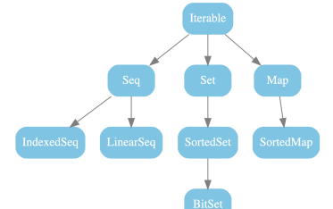

<style>
  code {
    background-color: #e9e9e9ff;
    color: #999999ff;
    padding: 2px 6px;          /* Ein bisschen Abstand, damit es gut aussieht */
    border-radius: 3px;  
  }

  details {
    border: #e4e3e3ff 1px solid;
    padding: 8px
  }

  h1 {
    text-decoration: underline;
    font-weight: bold;
  }

  h2 {
    text-decoration: underline;
    font-weight: bold;
  }

  h3 {
    text-decoration: underline;
    font-weight: bold;
  }

  body{
    background: #ffffff;
    color: black;
  }

  .sub {
    font-weight: bold;
    text-decoration: underline
  }


  .richtig { color: green; font-weight: bold; }
  .falsch { color: red; font-weight: bold; }
</style>


<details>
<summary><u><b>Was muss ich verwenden, wenn ich eine Liste für Key-Value-Parre verwenden möchte ? </b></u></summary>

* `Map`
    <details>
    <summary><u><b>Wie mache ich sie veränderlich ?</b></u></summary>

    * <input type="text" id="eingabe" placeholder="Wort eingeben...">
      <div id="ergebnis"></div>

      <script>
      const musterloesung = "scala.collection.mutable.Map"; // Hier das Zielwort definieren
      const inputFeld = document.getElementById("eingabe");
      const ergebnisDiv = document.getElementById("ergebnis");

      inputFeld.addEventListener("keypress", function(event) {
          if (event.key === "Enter") {
              const nutzerEingabe = inputFeld.value;
              
              if (nutzerEingabe === musterloesung) {
                  ergebnisDiv.innerHTML = `<span class="richtig">Richtig!</span>`;
              } else {
                  ergebnisDiv.innerHTML = `<span class="falsch">Falsch!</span> Das Wort war nicht "${nutzerEingabe}".`;
              }
        }
      });
      </script>

    </details>
</details>


<details>
<summary><u><b>Du hast eine Liste: <code>scala.collection.mutable.Map[A]</code> & möchtest den Wert bekommen, wenn es nicht vorhanden ist, dann soll (0: Long) zurückgegeben werden, wann es vorhanden ist, dann soll der Wert zurückgegeben werden.</b></u></summary>

* `val current_count = <list>.getOrElse(key, 0L)`
</details>


<details>
<summary><u><b>Entpackt .getOrElse() automatisch oder muss muss ich es mit .head extrahieren ?</b></u></summary>

* `.getOrElse()` entpackt autom.
</details>


<details>
<summary><u><b>Wie macht man aus einer Liste eine String-Repräsentation ?</b></u></summary>

* `<list>.mkString(<Was soll am Angfang stehen>, <Wie sollen die Elemente getrennt werden>, <was soll am Ende stehen>)`
</details>


<details>
<summary><u><b>Wie funktioniert <code>override def equals(obj: any): Boolean = ???</code> ?</b></u></summary>

* Wir vgl. unser aktuelle Objekt(`this`) mit einem anderen(`obj`)

  <details>
  <summary><u><b>Wie wird `equals` aufgerufen ?</b></u></summary>

  ```scala
  <obj1>.equals(<obj2>)
  ```
  </details>

  <details>
  <summary><u><b>Wie guckt man, ob das ü.geb. Objekt den gleichen Typ hat ?</b></u></summary>
  
  * <span class="sub">Bsp.</span>: wir haben eine `class Counter(inhalt: Iterable[A])`
    * wir haben also eine Objekt mit dem Typen Counter
  * <span class="sub">Kontrolle</span>:
    ```scala
    obj match {
      case other: Counter[_] => <tatsächl. Vgl.>
      case _ => false
    }
    ```
  </details>
</details>


<details>
<summary><u><b>Wie erstelle ich meinen eigenen <code>hashCode</code> ?</b></u></summary>

* wir packen d. __einzelnen Parameter__ d. Klasse oder jegliches <span style="color: red">in einen Tupel</span> & fügen am Ende `.##` hinzu
  
  * <span class="sub">Bsp.</span>:
    ```scala
    class Person(val vorname: String, val nachname: String, val alter: Int) {
      override def equals(obj: Any): Boolean = {
          obj match {
              case p: Person => vorname == p.vorname && nachname == p.nachname && alter == p.alter
              case _         => false
          }
      }
      // TODO: Implementiere hashCode
      override def hashCode: Int = (vorname, nachname, alter).##
    }
    ```
    <details>
    <summary><u><b>Worauf muss ich achten, wenn ich Parameter für den hashCode verwenden möchte ?</b></u></summary>
    
    * $parameterEquals \equiv parameterHashCode$ 
    </details>

    <details>
    <summary><u><b>Was währe empfehlenswert, wenn wir etwas f. den hashCode verwenden möchten ?</b></u></summary>

    * Das __verw. eines Objekts__, dass <span style="color: red">unveränderl.</span> ist
    </details>
</details>


# Object

<details>
<summary><u><b>Wie wird ein Object noch genannt ?</b></u></summary>

* Singleton


  <details>
  <summary><u><b>Was ist die Eigenschaft eines Singletons ?</b></u></summary>

  * _Während d. Laufzeit_ $\underrightarrow{\ \ \ \ \textcolor{#83b7ea}{\text{Erstellung einer einizigen}}\ \ \ \ }$ <span style="color: red">__Instanz__</span>
  * <b><span style="color: red">kann keine Parameter bekommen</span></b>

    <details>
    <summary><u><b>Wann genau wird eine Instanz für dieses Object erstellt ?</b></u></summary>

    * Wenn es _im Code_ __zum ersten Mal aufgerufen__ wird
    </details>


    <details>
    <summary><u><b>Was schreiben wir in ein <code>object</code> & wie verwenden wir eine <code>class</code> mit dem object ?</b></u></summary>

    * <span class="sub">Was schreiben wir in einem object ?</span>
      * <code style="color: rgb(203, 52, 175)">Variabeln</code> oder <code style="color: rgb(69, 201, 159)">Methoden</code>, d. f. $\forall$ Objekte des __gleichen Typs__ gelten sollen
      * wenn wir aber _mehrere Objekte_ erstellen wollen, dann def. wir ein `class` mit dem __gleichen Namen__ wie das `object` = <code style="color: rgb(255, 0, 111)">Companion-Klasse</code>
    

    <details>
    <summary><u><b>Welche Eigenschaften haben diese "best friends" ?</b></u></summary>

    * gegenseitiger Zugriff auf <code style="color: #ff6a00ff">private</code> Felder

      <details>
      <summary><u><b>Mit was kann ich "Fabrik-Methoden" erstellen, die bequem Objekte erstellt ohne die Verwendung von <code>new</code> ?</b></u></summary>

      * <code style="color: rgb(83, 201, 67)">def apply()</code>

      <details>
      <summary><u><b>Wie funktioniert <code style="color: rgb(83, 201, 67)">def apply()</code> ?</b></u></summary>

      * ist nur eine gewöhnl. Methode $\implies$ man kann mehrere hintereinander erstellen (ist bisschen wwie d. pattern-matching)
        * ```scala
          class Counter[A](initialElements: Iterable[A]) { 
            // ... Implementierung ... 
          }

          object Counter {
            // 1. Die "Standard-Fabrik" (wie der Konstruktor)
            def apply[A](elements: Iterable[A]): Counter[A] = new Counter(elements)

            // 2. Eine "Spezial-Fabrik" für einen leeren Counter
            def apply[A](): Counter[A] = new Counter(Iterable.empty)
          }
          ```
      </details>

      <details>
      <summary><u><b>Steht apply immer nur in einem Objekt ?</b></u></summary>

      * __Nein__, sie ist $\lnot$ spezifisch f. ein `object`
        * <span class="sub">Normal class</span>:
          ```scala
          class Multiplizierer(faktor: Int) {
            // Wenn ich eine Instanz "m" habe, kann ich schreiben: m(5)
            def apply(x: Int): Int = x * faktor
          }

          val malZwei = new Multiplizierer(2)
          println(malZwei(5)) // Gibt 10 aus. Hier wird intern malZwei.apply(5) aufgerufen.
          ```
        * <span class="sub">object</span>:
          * ```scala
            object Counter {
              // Hier wird das Object wie eine Funktion aufgerufen, um eine Klasse zu bauen
              def apply[A](elements: Iterable[A]): Counter[A] = new Counter(elements)
            }
            val c = Counter(Iterable(1, 2, 3)) // Aufruf von Counter.apply(...)
            ``` 
      </details>


      </details>
    </details>
    </details>
  </details> 

  * <span class="sub">Beispiel: </span>
    * ```scala
      // 1. Die Klasse für die individuellen Personen
      class Person(val name: String)

      // 2. Das Companion Object für die "allgemeinen" Dinge
      object Person {
        // Eine Konstante, die für alle gilt
        val spezies = "Mensch"
        
        // Eine Hilfsmethode, die nicht an einer speziellen Person klebt
        def printSpezies(): Unit = println(s"Alle Personen sind vom Typ $spezies")
        
        // Die "Fabrik"-Methode (apply)
        def apply(name: String): Person = new Person(name)
      }

      // Benutzung im Code:
      @main def main(): Unit = {
        // Individuelle Personen (Instanzen)
        val p1 = Person("Efe") 
        val p2 = Person("Sude")
        
        // Aufruf von globaler Logik aus dem Companion Object
        Person.printSpezies() 
      }
      ```
      * ```scala
        object A {
          private var count: Int = 0
          def numberOfObjects: Int = count
        }

        class A {
        A.count += 1
        }

        val a1 = A()
        val a2 = A()
        val a3 = A()
        println(A.numberOfObjects) // 3     
        ```
</details>


# Traits

<details>
<summary><u><b>Was sind traits ?</b></u></summary>

* Schnittstellen
</details>


<details>
<summary><u><b>Wie viele traits kann eine Klasse erben ?</b></u></summary>

* mehrere
</details>


<details>
<summary><u><b>Wir haben folgendes
<pre><code>trait CanBark {
  def bark: String = "Wau"
}

trait CanHowl {
  def howl: String = "Awooo"
}
</code></pre></b></u></summary>

  <details>
  <summary><u><b>Wie können wir sie jzt. in die Klassen Dog und Wolf einmixen ?</b></u></summary>

  * wir können sie einzeln oder kombiniert einmixen
  ```scala
  class Dog extends CanBark
  class Wolf extends CanBark, CanHowl

  val dog = Dog()
  println(dog.bark) // Wau

  val wolf = Wolf()
  println(wolf.bark) //Wau
  println(wolf.howl) // Awooo
  ```
  </details>


  <details>
  <summary><u><b>Kann man ein trait überschreiben ?</b></u></summary>

  * Ja. man kann es mit <input type="text" id="eingabe1" placeholder="Wort eingeben..."><div id="ergebnis1"></div> ü. schrieben
  
  * ```scala
    trait CanBark {
      def bark: String = "Wau"
    }

    trait CanHowl {
      def howl: String = "Awooo"
    }

    class Dog extends CanBark {
      override def bark: String = "Wuff"
    }
    class Wolf extends CanBark with CanHowl

    val dog = Dog()
    println(dog.bark)

    val wolf = Wolf() //Wuff
    println(wolf.bark) //Wau
    ```
  </details>


<details>
<summary><u><b>Können traits Felder haben ?</b></u></summary>

* Ja
  * ```scala
    trait CanBark {
      val barkVolume: Int = 30
      def bark: String = "Wau"
    }

    trait CanHowl {
      val howlVolume: Int = 100
      def howl: String = "Awooo"
    }
    ```

  <details>
  <summary><u><b>Worauf müssen wir hier beim einmixen beachten ?</b></u></summary>

  * es dürfen keine `traits` zsm. eingemixt werden, d. __gleiche benannte Felder__ oder __Methoden__ haben !

  ```scala
  trait CanBark {
    val volume: Int = 30 // conflicting field
    def bark: String = "Wau"
  }
    
  trait CanHowl {
    val volume: Int = 100 // conflicting field
    def howl: String = "Awooo"
  }
  
  class Wolf extends CanBark, CanHowl // error
  ``` 
  </details>

  <details>
  <summary><u><b>Wir wollen, dass eine Klasse von einem trait und von Klassen erbt. Was ist das Verhältnis der Erbung ? </b></u></summary>

  * max. eine Klasse
  * mehrere Traits

  ```scala
  trait CanBark {
   val barkVolume: Int = 30
   def bark: String = "Wau"
  }
  
  trait CanHowl {
    val howlVolume: Int = 100
    def howl: String = "Awooo"
  }
  
  class Canine { // "hundeartig"
    val cuteAsAPuppy: Boolean = true
  }
  
  class Dog extends Canine, CanBark // inherits from Canine, mixes in CanBark
  class Wolf extends Canine, CanBark, CanHowl
  ```
  </details>
</details>


<details>
<summary><u><b>Können traits Sachen erben ?</b></u></summary>

* <code style="color: rgb(91, 218, 120)">Ja</code>

  <details>
  <summary><u><b>Wie können wir sicherstellen, dass mansche traits nur in bestimmten Klassen eingemixt werden können ? </b></u></summary>

  * Wir lassen das `trait` v. __einer Klasse erben__
    * wenn wir jzt. unsere Klasse v. diesem `trait` erben lassen & eine weitere Klasse erben möchten, dann geht es $\lnot$, weil wir bereits in unserem `trait` eine Klasse geerbt haben (Wir dürfen nur von einem `class` erben)
  
  ```scala
  class Canine { // "hundeartig"
    val cuteAsAPuppy: Boolean = true
  }

  trait CanBark extends Canine { // inherits from Canine
    val barkVolume: Int = 30
    def bark: String = "Wau"
  }

  trait CanHowl extends Canine { // inherits from Canine
    val howlVolume: Int = 100
    def howl: String = "Awooo"
  }


  class Feline { // katzenartig
    val sevenLifes: Boolean = true
  }
  class Cat extends Feline, CanBark //Cat -> Feline: class -> CanBark -> Canine(class) <- error
  ```
  </details>

  <details>
  <summary><u><b>Was ist eine andere Methode, die das einmixen in bestimmten Objekt-Typen ermöglicht ?</b></u></summary>

  * <code style="color: rgb(77, 152, 195)">Self-Type Annotations</code>

  ```scala
  trait CanBark {
    this: Canine => // Self-Type: Dieser Trait darf nur in Instanzen von Canine eingemixt werden
    def bark: String = "Wau"
  }
  ```
  </details>

  <details>
  <summary><u><b>Wir haben folgendes <code>class C extends A with B with C</code>. Nach welcher Reihenfolge werden die traits ausgeführt ? </b></u></summary>

  * $C \to B \to A \to (Superklasse)$
  </details>
</details>


<details>
<summary><u><b>Was erzeugt ein trait autom. & was ermögl. es uns ?</b></u></summary>

* `trait` $\underrightarrow{\ \ \ \ \textcolor{#83b7ea}{\text{erzeugt}}\ \ \ \ }$ __Typ__

```scala
class Canine { // "hundeartig"
    val cuteAsAPuppy: Boolean = true
}

trait CanBark extends Canine { // inherits from Canine
  val barkVolume: Int = 30
  def bark: String = "Wau"
}

class Dog extends Canine, CanBark {
  val trustful: Boolean = true
}

val barker: CanBark = Dog()
// Wir können über barker nun auch wieder nur auf die Felder und Methoden zugreifen, die im CanBark (und dessen Oberklasse Canine) bekannt sind:
println(barker.bark) // ok
println(barker.cuteAsAPuppy) // ok
println(barker.trustful) // error
```     
</details>


<details>
<summary><u><b>Was sind die wichtigsten Unterschiede zu einer abstrakten Klasse ? </b></u></summary>

* es lassen sich mehrere traits einmixen $\overset{!}{=}$ man kann nur v. einer abstrakten Klasse erben 
</details>


<script>
const musterloesung = "override"; // Hier das Zielwort definieren
const inputFeld = document.getElementById("eingabe1");
const ergebnisDiv = document.getElementById("ergebnis1");

inputFeld.addEventListener("keypress", function(event) {
    if (event.key === "Enter") {
        const nutzerEingabe = inputFeld.value;
        
        if (nutzerEingabe === musterloesung) {
            ergebnisDiv.innerHTML = `<span class="richtig">Richtig!</span>`;
        } else {
            ergebnisDiv.innerHTML = `<span class="falsch">Falsch!</span> Das Wort war nicht "${nutzerEingabe}".`;
        }
  }
});
</script>
</details>


# cala.collection.mutable

<details>
<summary><u><b>Wie sieht d. Hierarchie v. <code>scala.collection</code> aus ?</b></u></summary>


</details>


<details>
<summary><u><b>Wie werden collection-Schnittstellen implementiert ?</b></u></summary>

* mit `Factory-Methoden`

  <details>
  <summary><u><b>Was passiert hier im Hintergrund ?: 
  <pre><code>val s = Seq(1,2,3)

  println(s) //List(1,2,3)
</code></pre> Wir haben in unserem Tabellen-Projekt bereits d. <code>iterable</code>-Schnittstelle implementiert:</b></u></summary>

  * eine Collection. d. Iterable ist stellt folgende Funktionen bereit:
    * Iteration: forach, map, flatMap, ...
    * UmWandlung: toSeq, toSet, ...
    * Größe: isEmpty, size, ...
    * Elem.-Prüfungen: exists, forall, ...
  </details>


  ## Seq

  <details>
  <summary><u><b>Welche Eigenschaft hat `Seq` ?</b></u></summary>

  * ist ein `Iterable` $\underrightarrow{\ \ \ \ \textcolor{#83b7ea}{\text{Elem.}}\ \ \ \ }$ __feste Pos.__ $\implies$ man kann anhand dieser Pos. auf d. Elem. zugreifen
    <details>
    <summary><u><b>Welche Eigenschaften werden `Seq` bereit gestellt ?</b></u></summary>

    * Zugriff ü. Position: `apply` (f. den Zugriff an bestimmter Pos.), `indexOf` (um Pos. eines bestimmten Elements zu bekommen)
    * Sortierung: `sorted`, `sortBy`
    * Vgl.: `contains`, `startsWith`, `distinct`
    </details>
  </details>

  <details>
  <summary><u><b>Was sind Besonderheiten einer <code>LinearSeq</code>?</b></u></summary>

  * effiziente `head` & `tail`__-Methoden__
  </details>


  <details>
  <summary><u><b>Was sind Besonderheiten einer <code>IndexSeq</code>?</b></u></summary>

  * Verfügung v. effizienten Methoden, um auf beliebige Elem. d. Seq. zuzugreifen
  </details>

  ## Set

  <details>
  <summary><u><b>Was sind die Eigenschaften eines Sets ?</b></u></summary>

  * keine feste Reihenfolge
  * Jedes Elem. nur $1 \times$
  </details>


  <details>
  <summary><u><b>Welche Funktionalität stellen Sets zur Verfügung ?</b></u></summary>

  * __Tests__: `contains`
  * __Mengenoperationen__: `intersect`, `union`
  </details>


  <details>
  <summary><u><b>Was muss ich verw., wenn ich ein Set sortieren möchte ?</b></u></summary>

  * `SortedSet`
  </details>


  <details>
  <summary><u><b>Was muss ich verw., wenn ich ein Set speicherplatzsparend speichern möchte ?</b></u></summary>

  * `BitSet`

    <details>
    <summary><u><b>Was ist ein BitSet im Grunde ?</b></u></summary>

    * ein `sortedSet`, bei dem d. __Zahlen__ _speichersparend gespeichert_ werden
    </details>
  </details>


  ## Map

  <details>
  <summary><u><b>Was ist ein Map ?</b></u></summary>

  * ein `Iterable` v. __Schlüssel-Wert-Paaren__
  </details>
  

  <details>
  <summary><u><b>Welche Funktionalitäten stellen Maps bereit ?</b></u></summary>

  * __Suche von Wert mit Schlüssel__: `get`, `getOrElse`, `contains`
  * __Schlüssel und Werte__: `keys`, `values`
  * __Transformationen__: `filterKeys`, `mapValues`
  </details>

  <details>
  <summary><u><b>Was muss ich verwenden, wenn ich möchte, dass ein Map sortiert ist ? </b></u></summary>

  * `SortedMap`

    <details>
    <summary><u><b>Wonach wird hier sortiert ?</b></u></summary>

    * N. den <code style="color: #ff6a00ff">keys</code>
    </details>
  </details>
</details>


# scala.collection.immutable


<script>
  window.MathJax = {
    tex: {
      inlineMath: [['$', '$']]
    }
  };
</script>
<script type="text/javascript" async
  src="https://cdn.jsdelivr.net/npm/mathjax@3/es5/tex-mml-chtml.js">
</script>