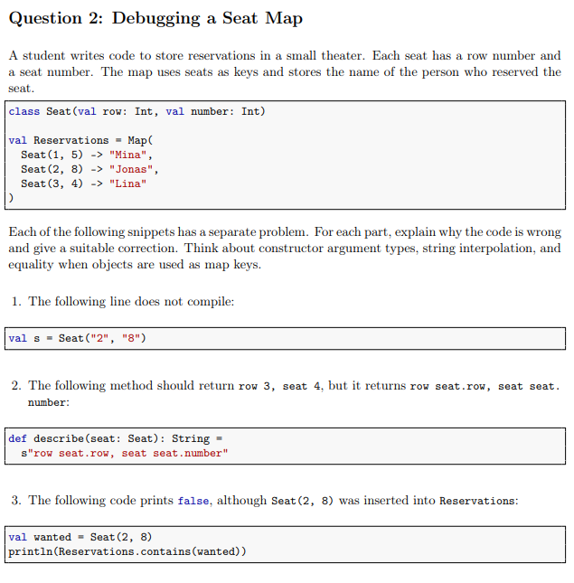
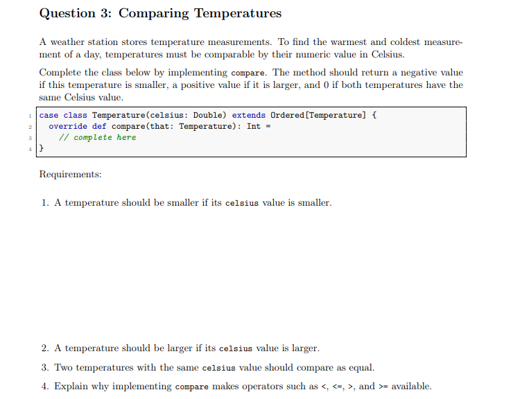
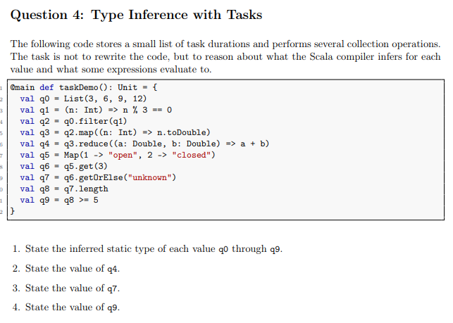
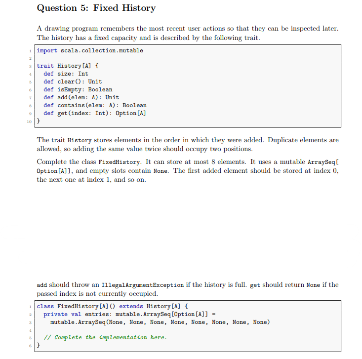
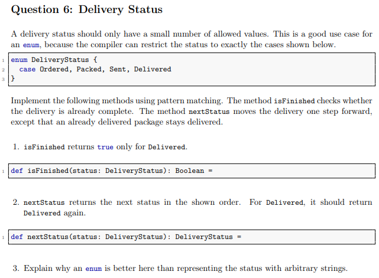
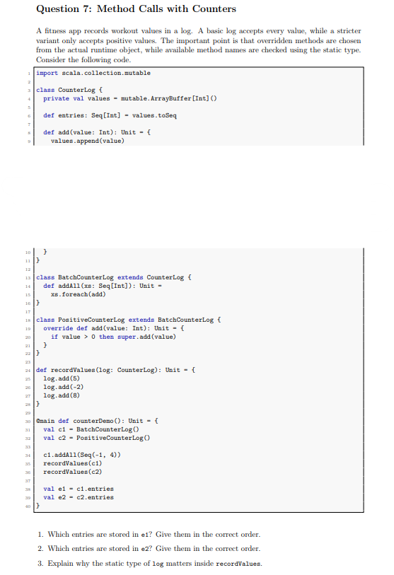

<style>
  details {
    margin-bottom: 7px  ;
    border: lightgrey 1px solid;
    padding: 8px
}
  summary {
    font-size: 20px
  }
  img {
    width: auto;
    height: auto;
  }

  code {
    background: #eeeeeeff 2px;
    padding: 2px 2px 2px 2px;
    border-radius: 6px
  }

  body {
    background: #ffffffff;
    color: #000000ff;
  }

  h1 {
    font-weight: bold;
    text-decoration: underline;
  }

  h2 {
    font-weight: bold;
    text-decoration: underline;
  }

  h3 {
    font-weight: bold;
    text-decoration: underline;
  }
  
  /* Zielvorgabe für alle Blockquotes */
  blockquote {
    border-left: 5px solid #7cb459ff; /* Ein farbiger Strich links */
    padding-left: 20px;             /* Abstand zum Text */
    background-color: #edfbeaff;      /* Ein leichter Hintergrund */
    margin-left: 10px;              /* Die eigentliche Einrückung */
    color: #333;                    /* Textfarbe */
  }

  /* Optional: Wenn du das Aussehen der Liste im Blockquote verändern willst */
  blockquote ul {
    list-style-type: square;
  }


  ul li, ol li {
    margin-top: 20px; /* Gewünschten Abstand hier anpassen */
  }

  .a1 {
    font-weight: bold;
    text-decoration: underline;
  }

  .mermaid {
    background: white;
    padding: 30px;
    border-radius: 8px;
    box-shadow: 0 4px 6px rgba(0,0,0,0.05);
  }

  .r {
    background: #b7e99bff
  }

  .f {
    background: #e99b9bff
  }
  .n {
    background: #9bb5e9ff
  }
  .w{
    background: #ff0090ff
  }
</style>

# Aufgabe 2



## 1. `val s = Seat("2","8")`

* Das Problem ist, dass die Parameter der Klasse `Seat` die Datentypen <code style="color: rgb(76, 215, 58)">Int</code> haben müssen, welches eine ganze Zahl repräsentiert. Die ü.geb. Parameter jedoch haben den Datentyp <code style="color: rgb(76, 215, 58)">String</code>. Somit muss der ü.geb. Datentyp __IMMER__ ein  <code style="color: rgb(76, 215, 58)">Int</code> sein !

* <span class="a1">Lösung</span>:
    ```scala
    val s = Seat(2,8)
    ```

___
## 2

```scala
def describe(seat: Seat): String = 
    s"row seat.row, seat seat.number"
```
* D. Problem hierbei ist, dass wir `s` autom. `.toString` repräsentiert, wobei es den eingegeben Text zu einem reinen String macht. Das war wir machen müssnen ist, die Platzthalter in ${} schreiben müssen. Somit führt Scala zunächst einmal den Ausdruck in den Klammern und fügt das Ergebnis mit dem String zu einem einzelnen String zusammen.

* <span class="a1">Lösung</span>:
    ```scala
    def describe(seat: Seat): String = {
        s"row ${seat.row},  seat ${seat.number}"
    }
    ```

## <span class="f">3  </span>

* Es handelt sich um eine <span style="color: red">normale Klasse</span>, nicht um eine case class. 
* Scala (und Java) $\underrightarrow{\ \ \ \ \textcolor{#83b7ea}{\text{vgl.}}\ \ \ \ }$ __normale Klassen__ $\implies$ __Referenzidentität__ (Speicheradresse)
    * Da `wanted` = <span style="color: red">neu erzeugtes Objekt</span> $\implies$ andere __Speicheradresse__ als das Objekt, das in der Map liegt
        * deshalb liefert `contains` d. Ergebnis <code style="color: rgb(76, 215, 58)">False</code>

* <span class="a1">Lösung</span>: `case class` def. (`case class Seat(row: Int, number: Int)`), da Case Classes autom. strukturelle Gleichheit (equals und hashCode) implementieren


# Aufgabe 3)



## 1

```scala
case class Temperature(celsius: Double) extends Ordered[Temperature] {
    override def compare(that: Temperature): Int =
        if (this.celsius < that.celsius) {
            -1
        } else if (this.celsius > that.celsius) {
            +1
        } else {
            0
        }
}
```
# <span class="f">4  </span>
* `Ordered[Temperature]` = <span style="color: red">Trait von Scala</span>
    * enthält bereits die vollständige, fertige Logik für sämtliche Vergleichsoperatoren (<, <=, >, >=)
        * Diese Operatoren sind dort so def., dass sie intern einfach compare aufrufen & d. Ergebnis auswerten (z. B. ist a < b intern definiert als a.compare(b) < 0). Sobald du also compare implementierst, funktionieren alle anderen Operatoren autom. „out of the box“.

* durch Erben v. `Ordered[Temperature]` (`extends Ordered[...]`) $\underrightarrow{\ \ \ \ \textcolor{#83b7ea}{\text{meine Klasse bekommt bereitgestellt}}\ \ \ \ }$ Methode compare


>* __Trait__ (Ordered): Das Wort ist ein Eigenschaftswort (Adjektiv)
>    * beschreibt eine Fähigkeit
>    * Wenn eine Klasse Ordered implementiert, bedeutet das einfach nur: „Man kann Objekte dieser Klasse miteinander vergleichen (größer, kleiner, gleich).“
>
>* Die __Datenstruktur__ (z. B. List, Set, Tree): Das sind Hauptwörter (Substantive). Das sind die tatsächlichen Behälter, in denen man ganz viele Temperaturen speichert.


# Aufgabe 4




## 1

* q0 = List[int]
* q1 = Int => Boolean
* q2 = List[Int]
* q3 = List[Double]
* q4 = Double
* q5 = Map[Int,String]
* q6 = Option[String]
* q7 = String
* q8 = Int
* q9 = Boolean

## 2
* q4 = 30.0

## 3
* q7 = "unknown"

## 4
* q9 = True


### Spickzettel:

>* Immer gucken, was am __Ende herauskommt__
>* <span class="a1">Klassen-Typen</span>: Wenn eine Klasse schon feste Datentypen hat Student(name: String, points: Int) $\underrightarrow{\ \ \ \ \textcolor{#83b7ea}{\text{Typ}}\ \ \ \ }$  Student
>* eine `normale Klasse` wird <span style="color: red">immer anhand dessen __Speicheraddresse__ vergl.</span>
>   * Beim `case class` wird mit dem HashCode vergl. 


# Aufgabe 5



```scala
class FixedHistory[A]() extends History[A] {
    private val entries: mutable.ArraySeq[Option[A]] =
        mutable.ArraySeq(None, None, None, None, None, None, None, None)

    private var iterator: Int = 0

    override def size: Int = entries.count(_.isDefined)

    override def clear(): Unit = {
        for (i <- entries.indices) entries(i) = None
        iterator = 0
    }

    override def isEmpty: Boolean = size == 0

    override def add(elem: A): Unit = {
        if (iterator >= 8) {
            throw new IllegalArgumentException("History ist voll.")
        }
        entries(iterator) = Some(elem) // Verpacken!
        iterator += 1
    }

    override def contains(elem: A): Boolean = entries.contains(Some(elem)) // Verpackt suchen!

    override def get(index: Int): Option[A] = entries(index) // Ist schon eine Option!
}
```


# Aufgabe 6



## 1

```scala
def isFinished(status: DeliveryStatus): Boolean = {
    status match {
        case DeliveryStatus.Delivered => true
        case _ => false
    }
}
```

# 2

```scala
def nextStatus(status: DeliveryStatus): DeliveryStatus = {
    status match {
        case DeliveryStatus.Ordered => DeliveryStatus.Packed
        case DeliveryStatus.Packed => DeliveryStatus.Sent
        case DeliveryStatus.Sent => DeliveryStatus.Delivered
        case DeliveryStatus.Delivered => DeliveryStatus.Delivered
    }
}
```
## 3

* Es ist besser, dass wir `enum` verw. haben und somit einen eigenen Datentyp def. haben, weil wir somit garantieren, dass es` Ordered, Packed, Sent` oder `Delivered` sein muss. Wäre es ein <code style="color: rgb(76, 215, 58)">String</code>, dann könnte man es ganz einfach mit einem anderen String ersätzen und es würde x Status geben. Somit könnten wir auch das Pattern-Matching $\lnot$ so schön anw. können.


# Aufgabe 7



## 1

* e1 = Seq(-1,4,5,-2,8)

## 2

* e2 = Seq(5,8)

## 3

* statische Typ $\underrightarrow{\ \ \ \ \textcolor{#83b7ea}{\text{bestimmt}}\ \ \ \ }$  zur Kompilierzeit, welche Methoden ü.haupt auf dem Objekt aufgerufen werden dürfen
    * garantiert dem `Compiler`, dass jedes ü.geb Objekt <span style="color: red">mind. d. __Schnittstelle v. CounterLog__ (also d. Methode <code>add</code>) besitzt.</span>


<script>
  window.MathJax = {
    tex: {
      inlineMath: [['$', '$'], ['\\(', '\\)']]
    }
  };
</script>
<script type="text/javascript" async
  src="https://cdn.jsdelivr.net/npm/mathjax@3/es5/tex-mml-chtml.js">
</script>