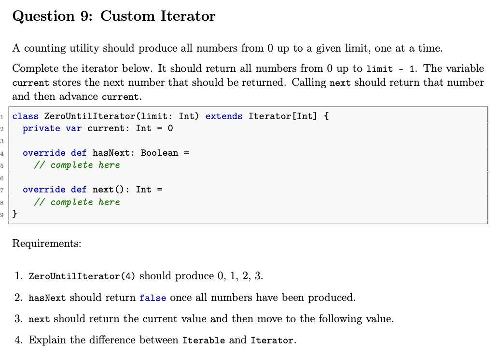
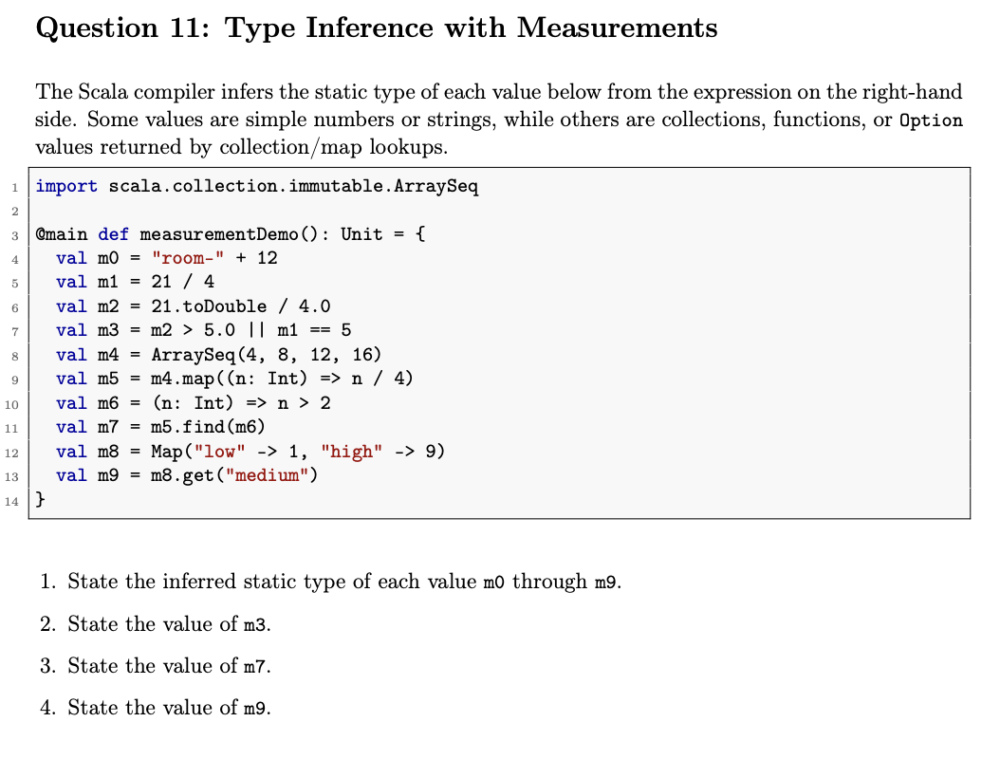
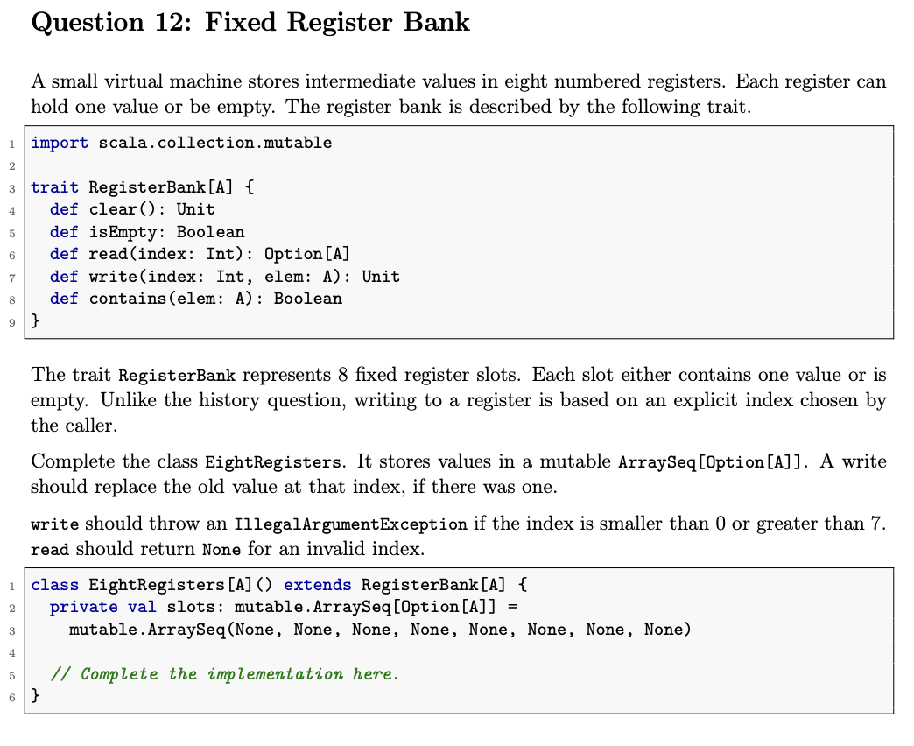
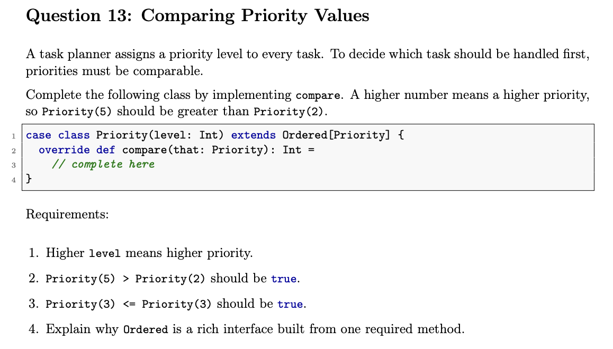
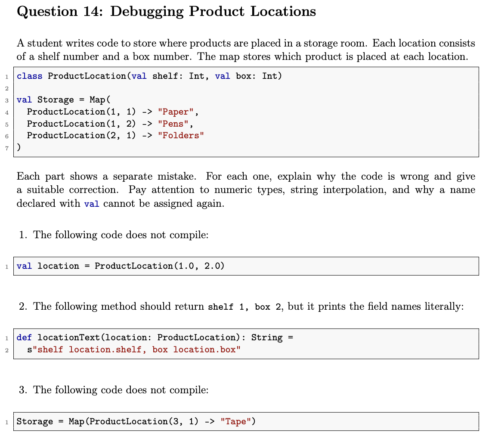
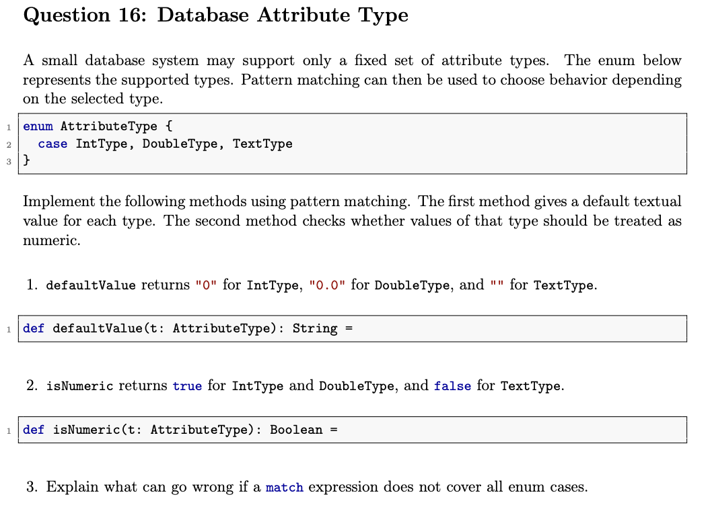

<style>
  details {
    margin-bottom: 7px  ;
    border: lightgrey 1px solid;
    padding: 8px
}
  summary {
    font-size: 20px
  }
  img {
    width: auto;
    height: auto;
  }

  code {
    background: #eeeeeeff 2px;
    padding: 2px 2px 2px 2px;
    border-radius: 6px
  }

  body {
    background: #ffffffff;
    color: #000000ff;
  }

  h1 {
    font-weight: bold;
    text-decoration: underline;
  }

  h2 {
    font-weight: bold;
    text-decoration: underline;
  }

  h3 {
    font-weight: bold;
    text-decoration: underline;
  }
  
  /* Zielvorgabe für alle Blockquotes */
  blockquote {
    border-left: 5px solid #7cb459ff; /* Ein farbiger Strich links */
    padding-left: 20px;             /* Abstand zum Text */
    background-color: #edfbeaff;      /* Ein leichter Hintergrund */
    margin-left: 10px;              /* Die eigentliche Einrückung */
    color: #333;                    /* Textfarbe */
  }

  /* Optional: Wenn du das Aussehen der Liste im Blockquote verändern willst */
  blockquote ul {
    list-style-type: square;
  }


  ul li, ol li {
    margin-top: 20px; /* Gewünschten Abstand hier anpassen */
  }

  .a1 {
    font-weight: bold;
    text-decoration: underline;
  }

  .mermaid {
    background: white;
    padding: 30px;
    border-radius: 8px;
    box-shadow: 0 4px 6px rgba(0,0,0,0.05);
  }

  .r {
    background: #b7e99bff
  }

  .f {
    background: #e99b9bff
  }
  .n {
    background: #9bb5e9ff
  }
  .w{
    background: #ff0090ff
  }
</style>

# Aufgabe 2


## 1. `val s = Seat("2","8")`

* Das Problem ist, dass die Parameter der Klasse `Seat` die Datentypen <code style="color: rgb(76, 215, 58)">Int</code> haben müssen, welches eine ganze Zahl repräsentiert. Die ü.geb. Parameter jedoch haben den Datentyp <code style="color: rgb(76, 215, 58)">String</code>. Somit muss der ü.geb. Datentyp __IMMER__ ein  <code style="color: rgb(76, 215, 58)">Int</code> sein !

* <span class="a1">Lösung</span>:
    ```scala
    val s = Seat(2,8)
    ```

___
## 2

```scala
def describe(seat: Seat): String = 
    s"row seat.row, seat seat.number"
```
* D. Problem hierbei ist, dass wir `s` autom. `.toString` repräsentiert, wobei es den eingegeben Text zu einem reinen String macht. Das war wir machen müssnen ist, die Platzthalter in ${} schreiben müssen. Somit führt Scala zunächst einmal den Ausdruck in den Klammern und fügt das Ergebnis mit dem String zu einem einzelnen String zusammen.

* <span class="a1">Lösung</span>:
    ```scala
    def describe(seat: Seat): String = {
        s"row ${seat.row},  seat ${seat.number}"
    }
    ```

## <span class="f">3  </span>

* Es handelt sich um eine <span style="color: red">normale Klasse</span>, nicht um eine case class. 
* Scala (und Java) $\underrightarrow{\ \ \ \ \textcolor{#83b7ea}{\text{vgl.}}\ \ \ \ }$ __normale Klassen__ $\implies$ __Referenzidentität__ (Speicheradresse)
    * Da `wanted` = <span style="color: red">neu erzeugtes Objekt</span> $\implies$ andere __Speicheradresse__ als das Objekt, das in der Map liegt
        * deshalb liefert `contains` d. Ergebnis <code style="color: rgb(76, 215, 58)">False</code>

* <span class="a1">Lösung</span>: `case class` def. (`case class Seat(row: Int, number: Int)`), da Case Classes autom. strukturelle Gleichheit (equals und hashCode) implementieren


# Aufgabe 3)


## 1

```scala
case class Temperature(celsius: Double) extends Ordered[Temperature] {
    override def compare(that: Temperature): Int =
        if (this.celsius < that.celsius) {
            -1
        } else if (this.celsius > that.celsius) {
            +1
        } else {
            0
        }
}
```
# <span class="f">4  </span>
* `Ordered[Temperature]` = <span style="color: red">Trait von Scala</span>
    * enthält bereits die vollständige, fertige Logik für sämtliche Vergleichsoperatoren (<, <=, >, >=)
        * Diese Operatoren sind dort so def., dass sie intern einfach compare aufrufen & d. Ergebnis auswerten (z. B. ist a < b intern definiert als a.compare(b) < 0). Sobald du also compare implementierst, funktionieren alle anderen Operatoren autom. „out of the box“.

* durch Erben v. `Ordered[Temperature]` (`extends Ordered[...]`) $\underrightarrow{\ \ \ \ \textcolor{#83b7ea}{\text{meine Klasse bekommt bereitgestellt}}\ \ \ \ }$ Methode compare


>* __Trait__ (Ordered): Das Wort ist ein Eigenschaftswort (Adjektiv)
>    * beschreibt eine Fähigkeit
>    * Wenn eine Klasse Ordered implementiert, bedeutet das einfach nur: „Man kann Objekte dieser Klasse miteinander vergleichen (größer, kleiner, gleich).“
>
>* Die __Datenstruktur__ (z. B. List, Set, Tree): Das sind Hauptwörter (Substantive). Das sind die tatsächlichen Behälter, in denen man ganz viele Temperaturen speichert.


# Aufgabe 4


## 1

* q0 = List[int]
* q1 = Int => Boolean
* q2 = List[Int]
* q3 = List[Double]
* q4 = Double
* q5 = Map[Int,String]
* q6 = Option[String]
* q7 = String
* q8 = Int
* q9 = Boolean

## 2
* q4 = 30.0

## 3
* q7 = "unknown"

## 4
* q9 = True


### Spickzettel:

>* Immer gucken, was am __Ende herauskommt__
>* <span class="a1">Klassen-Typen</span>: Wenn eine Klasse schon feste Datentypen hat Student(name: String, points: Int) $\underrightarrow{\ \ \ \ \textcolor{#83b7ea}{\text{Typ}}\ \ \ \ }$  Student
>* eine `normale Klasse` wird <span style="color: red">immer anhand dessen __Speicheraddresse__ vergl.</span>
>   * Beim `case class` wird mit dem HashCode vergl. 


# Aufgabe 5


```scala
class FixedHistory[A]() extends History[A] {
    private val entries: mutable.ArraySeq[Option[A]] =
        mutable.ArraySeq(None, None, None, None, None, None, None, None)

    private var iterator: Int = 0

    override def size: Int = entries.count(_.isDefined)

    override def clear(): Unit = {
        for (i <- entries.indices) entries(i) = None
        iterator = 0
    }

    override def isEmpty: Boolean = size == 0

    override def add(elem: A): Unit = {
        if (iterator >= 8) {
            throw new IllegalArgumentException("History ist voll.")
        }
        entries(iterator) = Some(elem) // Verpacken!
        iterator += 1
    }

    override def contains(elem: A): Boolean = entries.contains(Some(elem)) // Verpackt suchen!

    override def get(index: Int): Option[A] = entries(index) // Ist schon eine Option!
}
```


# Aufgabe 6


## 1

```scala
def isFinished(status: DeliveryStatus): Boolean = {
    status match {
        case DeliveryStatus.Delivered => true
        case _ => false
    }
}
```

# 2

```scala
def nextStatus(status: DeliveryStatus): DeliveryStatus = {
    status match {
        case DeliveryStatus.Ordered => DeliveryStatus.Packed
        case DeliveryStatus.Packed => DeliveryStatus.Sent
        case DeliveryStatus.Sent => DeliveryStatus.Delivered
        case DeliveryStatus.Delivered => DeliveryStatus.Delivered
    }
}
```
## 3

* Es ist besser, dass wir `enum` verw. haben und somit einen eigenen Datentyp def. haben, weil wir somit garantieren, dass es` Ordered, Packed, Sent` oder `Delivered` sein muss. Wäre es ein <code style="color: rgb(76, 215, 58)">String</code>, dann könnte man es ganz einfach mit einem anderen String ersätzen und es würde x Status geben. Somit könnten wir auch das Pattern-Matching $\lnot$ so schön anw. können.


# Aufgabe 7


## 1

* e1 = Seq(-1,4,5,-2,8)

## 2

* e2 = Seq(5,8)

## 3

* statische Typ $\underrightarrow{\ \ \ \ \textcolor{#83b7ea}{\text{bestimmt}}\ \ \ \ }$  zur Kompilierzeit, welche Methoden ü.haupt auf dem Objekt aufgerufen werden dürfen
    * garantiert dem `Compiler`, dass jedes ü.geb Objekt <span style="color: red">mind. d. __Schnittstelle v. CounterLog__ (also d. Methode <code>add</code>) besitzt.</span>


# Aufgabe 8


## 1

```scala
def movieCount(movies: Seq[Movie]): Int = movies.size
```

## 2

* mind. 120 min. lang
* available == True

```scala
def availableLongMovies(movies: Seq[Movie]): Seq[Movie] = {
  movies.filter((m: Movie) => m.available == true && m.minutes >= 120)
}
```

## 3

```scala
def hasRating(movies: Seq[Movie], rating: Double): Boolean = {
  movies.exists((m:Movie) => m.rating == rating)
}
```

## 4

```scala
def bestMovie(movies: Seq[Movie]): Movie = {
  if (movies.isEmpty) {
    throw new IllegalArgumentException("Die übergebene Liste ist leer.")
  }

  movies.maxBy(_.rating)
}
```


# Aufgabe 9



## 1,2,3

* "current stores the next number that should be returned": Bevor es returned wird muss kontrolliert werden, dass `current < limit -1` ist 

```scala
class ZeroUntilIterator(limit: Int) extends Iterator[Int] {
  private var current: Int = 0

  override def hasNext: Boolean = {
    current < limit //Gibt autom. true und false zurück
  }

  override def next(): Int = {
    if (hasNext == true) {
      val hasNextBool = true
      println(current)
    } else {
      hasNextBool = false
    }
  }
}

```
## 4

* `Iterator`: Konkrete __Cursor/Zeiger__, d. den Zustand des aktuellen Durchlaufs hält
  * liefert ü. next() d. Elem. nacheinander & ist n. einem Durchlauf verbraucht (kann $\lnot$ zurückgesetzt werden)
* `Iterable` ist jedoch ein `trait`, welches einer Collection d. Eigenschaften verleit durchiteriert zu werden. Man kann also durch sie wandern & mit den einzelnen Elem. arbeiten => filter, minBy, maxBy, ...


# Aufgabe 10


# 1

* Man kann `Report` $\lnot$ direkt instanzieren, weil es verschiede Arten v. einem __Report__ gibt. Würde mann nur `class Report` machen, dann müssten $\forall$ Report-Objekte den gleichen Aufbau wie `class Report` haben. Zudem handelt es sich hier um eine __abstrakte Klasse__, welches einf. nur bedeutet, dass d. Klasse ein reines Baumplan f. d. Unterklassen ist. D. Unterklassen d. v. d. abstrakten Klasse erben, müssen d. vordefinierten Felder v. d. abstrakten Klasse erben !
* Zudem haben wir `def body: String`, welches $\lnot$ def. ist, sondern __abstrakt__ 

# 2

* wir "müssen" `protected` ver., damit jeder Reporter Zugriff auf den Titel haben kann oder vlt. sogar verändern kann.

# 3
```text
Report: Status
All good
```

# 4
```text
Report: Values
2, 4, 6
```

> * wenn man von einer abstrakten Klasse erbt, dann muss man es auch als Parameter d. Unterklasse schrieben (<span style="color: red">ohne val/var!</span>)
>```scala
>abstract class Workout(val duration: Int) {
>  // Eine bereits fertig definierte Methode (Konkret)
>  def summary: String = s"Workout dauerte $duration Minuten."
>
>  // Eine unvollständige Methode (Abstrakt)
>  def caloriesBurned: Int
>}
>
>class WeightTraining(val weights: Seq[Int], duration: Int) extends Workout(duration){
>  override def caloriesBurned: Int = {
>    duration * 5 + weights.sum
>  }
>}
>```


# Aufgabe 11



## 1

* m0 = String
* m1 = Int
* m2 = Double
* m3 = Boolean
* m4 = ArraySeq[Int]
* m5 = ArraySeq[Int]
* m6 = Int => Boolean
* m7 = Option[Int]
* m8 = Map[String, Int]
* m9 = Option[Int]

## 2

* m3 = true

## 3

* m7 = Some(3)

## 4

* m9 = None

# Aufgabe 12



```scala
class EightRegisters[A]() extends RegisterBank[A] {
  private val slots: mutable.ArraySeq[Option[A]] = 
    mutable.ArraySeq(None, None, None, None, None, None, None, None)

  override def clear(): Unit = {
    for (i <- slots.indices) slots(i) = None
  }

  override def isEmpty: Boolean = slots.forall(_ == None)

  override def read(index: Int): Option[A] = {
    if (index < 0 || index > 7) None // Beide ungültigen Grenzen abfangen!
    else slots(index)                 // Ist bereits ein Option[A]
  }

  override def write(index: Int, elem: A): Unit = {
    if (index < 0 || index > 7) {
      throw new IllegalArgumentException("Index out of bounds")
    }
    slots(index) = Some(elem) // Unbedingt verpacken!
  }

  override def contains(elem: A): Boolean = slots.contains(Some(elem))
}
```


# Aufgabe 13



```scala
case class Priority(level: Int) extends Ordered[Priority] {
   override def compare(that: Priority): Int = this.level - that.level
}
```

## 4

* Es heißt "Rich Interface", weil Entwickler nur eine einzige Methode selbst ausprogrammieren müssen (compare), d. `Trait` dir dafür aber geschenkt einen riesigen Satz an fertigen Operatoren mitliefert! Sobald `compare` steht, funktionieren auf deinen Objekten autom. `<`, `>`, `<=`, & `>=`

# Aufgabe 14



## 1

* D. Grund f. den Fehler ist, dass man statt ein Int, ein Double ü.geb. hat.
```scala
val location = ProductLocation(1,2)
```

## 2
* D. Grund f. den Fehler ist, dass location.shelf \lnot einmal ausgeführt wird, sondern, aufgrund v. s"" sofort zu einem String anwendet. 

```scala
def locationText(location: ProductLocation): Strong = s"shelf ${location.shelf}, box ${location.box}"
```

## 3

* D. Fehler ist, dass Storage mit einem `val` deklariert wurde, welches es zu einem unveränderl. Var. macht

```scala
val Storage2 = Storage +  (ProductLocation(3,1) -> "Tape")
```


# Aufgabe 15


## 1

```text
lamp.execute(ShowLamp()) = off
```
## 2

```scala
class LampMachine() {
  private var isOn: Boolean = false
    
  def execute(command: LampCommand): Unit =
    command match {
      case TurnOn()  => isOn = true
      case TurnOff() => isOn = false
      case Toggle()  => isOn = !isOn
      case ShowLamp() => 
        if (isOn) println("on") else println("off")
      
      // Der entscheidende Fall: Rekursiver Aufruf!
      case RepeatLamp(repetitions, commands) =>
        for (_ <- 0 until repetitions) {
          // Nutze die zweite execute-Methode, um die Liste abzuarbeiten
          execute(commands) 
        }
    }

  // Hier wird einfach die Liste von Befehlen nacheinander ausgeführt
  def execute(commands: Seq[LampCommand]): Unit = {
    commands.foreach(c => execute(c))
  }

  def reset(): Unit = { isOn = false }
}
```

# Aufagbe 16



```scala
def defaultValue(t: AttributeType): String = {
  t match {
    case IntType => "0"
    case DoubleType => "0.0"
    case TextType => ""
  }
}
```

```scala
def isNumeric(t: AttributeType): Boolean = {
  t match {
    case IntType => true
    case DoubleType => true
    case TextType => false
  }
}
```

>* Wenn ein match-Ausdruck $\lnot \forall$ Fälle abdeckt, gibt d. Compiler eine Warnung bezüglich d. __Unvollständigkeit__ ("not exhaustive") aus. 
>* Tritt dieser $\lnot$ abgedeckte Fall dann während d. Ausf. ein, stürzt d. Programm mit einem `MatchError` ab


# Aufgabe 17


## 1

```scala
def paidOrders(orders: Seq[Order]): Seq[Order] = {
  orders.filter(order => order.paid == true)
}
```

## 2

```scala
def hasLargeOrder(orders: Seq[Order]): Boolean = {
  orders.exists(order => order.totalEuro >= 100.0)
}
```

## 3

```scala
def totalItems(orders: Seq[Order]): Int = {
  orders.map(_.itemCount).sum
}
```

## 4

```scala
def smallestPaidOrder(orders: Seq[Order]): Option[Order] = {
  orders.filter(_.paid).minByOption(_.totalEuro)
}
```

>* erst filtern und dann minByOption verw. 


# Aufgabe 18


<script>
  window.MathJax = {
    tex: {
      inlineMath: [['$', '$'], ['\\(', '\\)']]
    }
  };
</script>
<script type="text/javascript" async
  src="https://cdn.jsdelivr.net/npm/mathjax@3/es5/tex-mml-chtml.js">
</script>