

# Stetigkeit:
Immer gucken, ob man den Ausdruck vereinfachen kann!

## <u>Wann stetig f. einen Parameter ?</u>

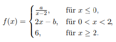

1) ***Wo stetig ?***
    * **hier:** = $\mathbb{R}\backslash \{0,2\}$ 
1) ***Wo kommt $x$ vor, wobei hier $x = \{0,2\}$ ist***
    * Gleichsetzen & n. einer d. Variabeln umstellen

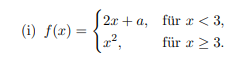
* Genau d. Gleiche

# <u>Zwischenwertsatz</u>

## <u>Stetigkeit im mehrdimensionalem Raum</u>

### <u>Sandwich-Lemma</u>:
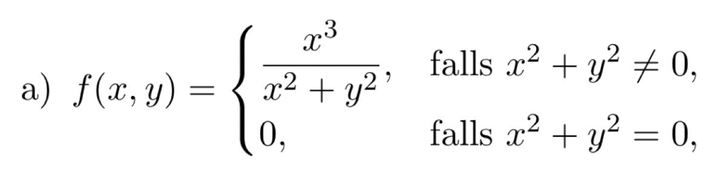
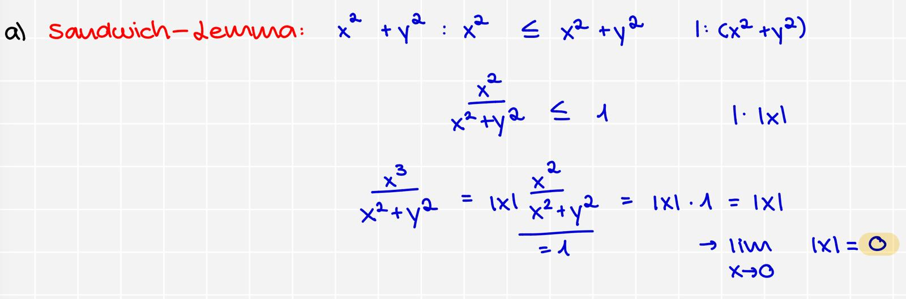

### <u>Wenn Audruck vereinfacht</u>:
1) $\lim_{\binom{x}{y} \to \binom{x_0}{y_0}}$
1) Das Ergebnis = dem Funktionwert
    * Bsp.: $f(x,y) = \begin{cases} \frac{x^2 - y^2}{x + y}, & \text{falls } y \neq -x, \\ 2, & \text{falls } y = -x. \end{cases}$
        * hier ist es d. $\mathbf{2}$

# Wachstumshierachie
$$\ln(n) \lt n^a \lt a^n \lt n! \lt n^n$$

# Grenzwerte

* man kann theoretisch immer den dominanten Teil ausklammern $\to$ kürzen und dann den Grenzwert bestimmen !

## <u>Sandwitch-Lemma</u>
* häufige Anwendung: ***Fakultät***

* Wir müssen eine ***obere*** & eine ***untere Grenze*** def.
    * beweisen, ab welchen $n$ es gültig ist !

* bei $(-1)^n \dots$

    

* $a_n =\sqrt[n]{\dots}$
    

* $\sum_{k=1}^{n} \frac{1}{\sqrt{n^2 + k}}$
    * ***obere Schranke*** = $k$
        * $\mathbf{n} \cdot \frac{1}{\sqrt{n^2 + 1}}$, weil es $n \ \times$ berechnet wird
    * ***untere Schranke*** = $n$
        * $\mathbf{n} \cdot \frac{1}{\sqrt{n^2 + n}}$

## <u>L'hôpital</u>

###  <u>Wann darf ich es benutzen ?</u>
1) $\lim_{x \to c} \frac{f(x)}{g(x)} = \frac{0}{0}$

1) $\lim_{x \to c} \frac{f(x)}{g(x)} = \frac{\pm \infty}{\pm \infty}$

1) $\lim_{x \to c} \frac{f(x)}{g(x)} = 0 \cdot \pm \infty$
    * **Kehrbruch** bilden & dann anwenden

## <u>Grenzwertbetrachtung im Mehrdimensionalen</u>

### <u>Sandwitch_Lemma</u>:
* $\sin(x), \cos(x)$
    

### <u>Normale Berechnung</u>:

Sobald eine Bedingung $\lnot$ stimmt, existiert d. Grenze $\lnot$

**1) Fall**: $x = 0$ mit $\lim_{y \to [\text{zur jeweiligen Grenze}]} \  \lor \ y = 0$ mit $\lim_{x \to [\text{zur jeweiligen Grenze}]}$

**2) Fall**: $y = mx \ \lor x = my$

**3) Fall**: $y = x^2 \ \lor x = y^2$

# **Reihen**
## <u>Spezielle Reihen:</u>
* <u>geometrische Reihe</u>
    * $\sum_{k=0}^{\infty} a \cdot r^k$
        * $|r|\lt 1$ = konvergent
            * [Formel](#Formelf.KonvergenzgeometrischerReihen)

* <u>p-Reihe</u>
    $$\sum_{k=1}^{\infty}\frac{1}{n^p}$$

    * harmonische ist nur p=1:$\sum_{k=1}^{\infty}\frac{1}{n^1 = n}$
  
    * wenn $p \le 1$, dann ***divergiert*** sie, weil sie langsamer wächst als d. harmonische Reihe, weil sie bereits zu langsam ist
      * p ist somit garantiert ein Bruch = $\sqrt[n]{n}$

    * wenn $p \gt 1$, dann ***konvergiert*** sie, weil die schneller wächst !

* <u>[Whatever this is](#Whatever-this-is)</u>
$$\sum_{n=1}^{\infty}\frac{1}{n(n+1)}$$

* <u>Teleskopsumme</u>
$$\sum_{k=1}^{n} (a_k - a_{k+1})$$

* $S_n = (a_1 - a_2) + (a_2 - a_3) + (a_3 - a_4) + \dots + (a_{n-1} - a_n) + (a_n - a_{n+1})$

* N. dem Wegheben
 aller Terme v. $a_2$ bis $a_n$ bleiben nur d. _erste Term_ des _ersten Gliedes_
 & d. _letzte Term_ des _letzten Gliedes_ 
übrig: $S_n = a_1 - a_{n+1}$
        *  $\sum_{k=1}^{\infty} (a_k - a_{k+1}) = \lim_{n \to \infty} S_n = \lim_{n \to \infty} (a_1 - a_{n+1})$
            * Wenn $\lim_{k \to \infty} a_k = L$ existiert, dann konvergiert d. $\infty$-Reihe gegen:
$$S = a_1 - L$$

* <u>Exponentialreihe</u>
$$\mathbf{e^x = \sum_{n=0}^{\infty} \frac{x^n}{n!} = 1 + x + \frac{x^2}{2!} + \frac{x^3}{3!} + \frac{x^4}{4!} + \dots}$$

* <u>Alterniernde Reihen</u>
$$\sum_{k=0}^{\infty} (-1)^k \cdot a_k \quad \text{oder} \quad \sum_{k=0}^{\infty} (-1)^{k+1} \cdot a_k$$

* <u>Potenzreihen</u>
    * <u>Bedeutung:</u>
        * $x$: D. Var., meist reell oder komplex.
        * $x_0$: D. Entwicklungspunkt (oder Zentrum) d. Reihe.
        * $a_k$: Die Koeffizienten d. Reihe (oft đ Ableitungen d. Funktion $f(x)$ bestimmt).

$$\sum_{k=0}^{\infty} a_k (x - x_0)^k = a_0 + a_1(x-x_0) + a_2(x-x_0)^2 + \dots$$

* <u>Taylor-Reihe</u>
$$\sum_{n = 0}^{\infty} \frac{f^{(n)}(x_0)}{n!}(x-x_0)^n$$

* <u>Binomische Reihe</u>

$$\sum_{n = 0}^{\infty} \binom{m}{n}z^n$$

* Konvergenzradius: $\mathbf{R = 1}$, weil $z$ hier keinen Koeffizienten hat
    * Bsp.: mit Variation: $\sum_{n=0}^{\infty} (2z)^n = 1 + 2z + 4z^2 + \dots$
        * $|q| < 1$ muss dennoch gültig sein $\to |2z| \lt 1 = |z| \lt \frac{1}{2}$

### <u>Nullfolgenkriterium</u>
* Glieder einer konvergenten Reihe müssen immer gegen 0 konvergieren !
1) <u>Annahme (Voraussetzung)</u>: D. $\infty$ Reihe $\sum_{n=0}^{\infty} a_n$ sei konvergent.
    * <u>Folge</u>: Dies bedeutet per Def., dass d. Folge d. Partialsummen $S_n = \sum_{k=0}^{n} a_k$ gegen einen endl. Grenzwert $S$ konvergiert: $\lim_{n \to \infty} S_n = S$.
1) <u>Beziehung zw. Glied & Partialsumme</u>: Jedes einzelne Reihenglied $a_n$ kann als d. Differenz zw. d. $n$-ten Partialsumme $S_n$ & d. $(n-1)$-ten Partialsumme $S_{n-1}$ ausgedrückt werden: $a_n = S_n - S_{n-1}$
1) Da die Folge d. Partialsummen konvergiert, strebt sowohl $S_n$ als auch d. direkt vorhergehende Term $S_{n-1}$ gegen denselben Grenzwert $S$:$\lim_{n \to \infty} a_n = \lim_{n \to \infty} (S_n - S_{n-1})$ $\lim_{n \to \infty} a_n = \lim_{n \to \infty} S_n - \lim_{n \to \infty} S_{n-1} = S - S = 0$

# **Legendre-Polynome**

* **Die Bestapproximation**
* *d. ist wie Taylorpolynom, aber **global***

* <u>Thema</u>: Bestapproximation im Quadratischen Mittel ($\text{L}^2\text{-Approximation}$)

* <u>Ziel</u>: D. Minimierungsproblem: $\mathbf{\min_{p_{n}}\int_{-1}^{1}|f(x)-p_{n}(x)|^{2}dx \text{, wobei } p_{n} \text{ ein Polynom vom Grad } n \text{ ist}}$
    * Die Lösung $p_n$ ist das Bestapproximationspolynom $L_n(x)$.

* Berechnung d. Koeffizienten: $L^2$-Skalarprodukt
    * $c_k = \langle f,g\rangle = \int_{-1}^{1}\overline{f(x)}g(x)dx$ (für $\mathbb{C}$) 5 oder $\int_{a}^{b}f(x)g(x)dx$ (für $\mathbb{R}$

## <u>Schritte</u>:
1) <u>Ansatz des Bestapproximationspolynoms</u>
$$L_{n}(x)=\sum_{k=0}^{n}c_{k}P_{k}(x)$$

1) <u>Berechnung der Koeffizienten $c_k$B</u>
* Für $\mathbb{C}$: $c_{k}=\frac{\langle P_{k},f\rangle}{||P_{k}||_{L^{2}(-1,1)}^{2}}$

* Für. $\mathbb{R}$: $\ell_k = \frac{\langle f, P_k \rangle}{||P_k||^2}$

1) <u>Endgültige Formel des Bestapproximationspolynoms</u>

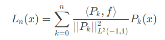

* $P_0(x) = 1$

* $P_1(x) = x$

* $P_2(x) = \frac{1}{2} \left( 3x^2 - 1 \right)$

* $P_3(x) = \frac{1}{2} \left( 5x^3 - 3x \right)$

# **Fourier-Reihen**

* D. einzige Unterschied zu Legendre-Polynome ist, dass wir jzt. Trigonometrische Funktionen verw.

* Fourier-Reihen: $\frac{1}{2}a_0 + \sum_{k=1}^{n}(a_k \cos(kx) + b_k \sin(kx))$

    * $a_k = 2 \text{Re}(c_k) = \frac{1}{\pi} \int_{-\pi}^{\pi} f(x) \cos(kx) dx$

    * $b_k = -2 \text{Im}(c_k) = \frac{1}{\pi} \int_{-\pi}^{\pi} f(x) \sin(kx) dx$

    * wichtig: $\cos(x)=$ gerade & $\sin(x)=$ ungerade
        * Wenn z.B. $f(x) = x$, dann wissen wir sofort, dass $x$ ungerade ist = $a_k$ (also $\cos(x)$) $= 0$

        * Wir müssen also nur $b_k$ berechnen
    
* `Re` = Realteil
* `Im` = Imaginärteil
    * Bsp.: $z = x + iy$
        * $x =$ Re, $y =$ Im

* $P_0(x) = 1$
* $P_1(x) = x$
* $P_2(x) = \frac{1}{2} \left( 3x^2 - 1 \right)$
* $P_3(x) = \frac{1}{2} \left( 5x^3 - 3x \right)$

## **Konvergenzkriterien**

### <u>Formel f. Konvergenz geometrischer Reihen</u>:
$$\sum_{k=0}^{\infty} a \cdot x^k = 1 + x + x^2 + x^3 + \dots$$
mit a = 1
* Grenzwert dieser Reihe:  $\boxed{\sum_{k=0}^{\infty} a \cdot r^k = \frac{a}{1-r}}$

    * nur gültig wenn, $|x|\lt 1$, also muss x im Intervall $(-1, 1)$ liegen

### <u>Majorantenkriterium (Vgl.kriterium)</u>:
Seien $\sum_{k=1}^{\infty} a_k$ und $\sum_{k=1}^{\infty} b_k$ zwei Reihen, deren Glieder ab einem Index $k_0$ nicht-negativ sind ($a_k \ge 0$ und $b_k \ge 0$).
1) **Bedingung der Glieder:**
    * Die Glieder d. zu unters. Reihe $a_k$ sind $\le$ den Gliedern d. Vgl.reihe $b_k \forall k \ge k_0$: $0 \le a_k \le b_k$
1) **Bedingung der Konvergenz (Majorante):**
    * Die Vgl.reihe $\sum b_k$ ist konvergent
        * Dann konvergiert auch d. zu unters. Reihe $\sum_{k=1}^{\infty} a_k$.
* <u>Bsp.:</u>
* Um beispielsweise zu zeigen, dass $\sum_{k=1}^{\infty} \frac{1}{2k}$ divergiert, kann man d. _Minorantenkriterium_ verw., indem man d. Glieder vergl.: $$\frac{1}{2k} = \frac{1}{2} \cdot \frac{1}{k}$$ Da d. Reihe $\sum \frac{1}{k}$ divergiert, divergiert auch $\sum \frac{1}{2} \cdot \frac{1}{k}$ (Multiplikation mit einem konstanten Faktor
 ungleich Null ändert d. Konvergenz nicht). Da $\sum b_k = \sum \frac{1}{2k}$ divergiert und für $k \ge 1$ gilt $\frac{1}{2k} \le \frac{1}{k}$, wäre $\sum \frac{1}{2k}$ d. Minorante, wenn wir diese mit $\sum \frac{1}{k}$ vergl. würden.

### <u>Minorantenkriterium (Vgl.kriterium)</u>:
Seien $\sum_{k=1}^{\infty} a_k$ & $\sum_{k=1}^{\infty} b_k$ zwei Reihen, deren Glieder ab einem Index $k_0$ nicht-negativ sind ($a_k \ge 0$ und $b_k \ge 0$).
1) **Bedingung der Glieder:**
    * Die Glieder d. zu unters. Reihe $a_k$ sind $\le$ den Gliedern d. Vgl.reihe $b_k$ für alle $k \ge k_0$:
    $0 \le b_k \le a_k$
1) **Bedingung der Divergenz (Minorante):**
    * Bedingung der Divergenz (Minorante): Die Vergleichsreihe $\sum b_k$ ist divergent.
        * Dann divergiert
 auch d. zu unters. Reihe $\sum_{k=1}^{\infty} a_k$.
* Die am häufigsten verwendete Minorante ist die Harmonische Reihe $\sum_{k=1}^{\infty} \frac{1}{k}$
* **Bsp.:**
    * Ein besseres Bsp ff. d. Anw. ist d. Reihe $\sum_{k=1}^{\infty} \frac{1}{\sqrt{k}}$. Wir wählen d. Minorante $b_k = \frac{1}{k}$ (divergiert). F. $k \ge 1$ gilt $\sqrt{k} \le k$.Daher ist $\frac{1}{\sqrt{k}} \ge \frac{1}{k}$.Weil $b_k \le a_k$ und $\sum b_k$ divergiert, divergiert auch $\sum \frac{1}{\sqrt{k}}$.

### <u>Absolute Konvergenz</u>:
* $z = |z|(\cos \varphi + i \sin \varphi)$
* Eine Reihe $\sum_{n=0}^{\infty} a_n$ heißt absolut konvergent, wenn die Reihe der Beträge $\sum_{n=0}^{\infty} |a_n|$ konvergiert.
$$\sum z^n$$
* Die Reihe der Beträge ist hier:$\sum_{n=0}^{\infty} |z^n| = \sum_{n=0}^{\infty} |z|^n$
    * Dies ist eine reelle geometrische Reihe mit dem Quotienten $r = |z|$.
    * **Konvergenz:** D. Summe konvergiert genau dann, wenn d. Quotient $|z| \lt 1$. Die Summenformel ist dann $\frac{1}{1-|z|}$.$$\sum_{n=0}^{\infty} |z|^n = \frac{1}{1-|z|}, \quad \text{falls } |z|<1$$
    * **Divergenz:** D. Summe divergiert (gegen $+\infty$), falls $|z| \ge 1$  ist. $\sum_{n=0}^{\infty} |z|^n \quad \text{divergiert (gegen }+\infty), \quad \text{falls } |z| \ge 1$

### <u>Quotientenkriterium</u>
* Sei $(a_k)_{k \in \mathbb{N}}$ eine Folge:
    * $\mathbf{\rho = \lim_{k \to \infty} \left| \frac{a_{k+1}}{a_k} \right|}$
    * **dann gilt:**:
        1) <u>Konvergenz</u>: Falls $\mathbf{\rho < 1}$, so ist $\sum_{k=0}^{\infty} a_k$ absolut konvergent.
        1) <u>Divergenz</u>: Falls $\mathbf{\rho > 1}$, so ist $\sum_{k=0}^{\infty} a_k$ divergent.
        1) <u>Keine Aussage</u>: Falls $\mathbf{\rho = 1}$, ist keine Aussage möglich.
            * Man muss ein anderes Kriterium (z.B. Majoranten-
 oder Wurzelkriterium
) verwenden.

* <u>Bsp.:</u>
* [Exponentialreihe](#Exponentialreihe)
* <u>Reihe</u>: $\sum_{n=0}^{\infty} a_n$, wobei d. Glieder $a_n = \frac{1}{n!} x^n$ sind
$$\left| \frac{a_{n+1}}{a_n} \right| = \left| \frac{\frac{1}{(n+1)!} x^{n+1}}{\frac{1}{n!} x^n} \right|$$
$$\left| \frac{x^{n+1}}{(n+1)!} \cdot \frac{n!}{x^n} \right|$$
* Potenzen: $\frac{x^{n+1}}{x^n} = x$
* Fakultäten: $\frac{n!}{(n+1)!} = \frac{n!}{(n+1)n!} = \frac{1}{n+1}$
$$\left| x \cdot \frac{1}{n+1} \right| = |x| \cdot \frac{1}{n+1}$$

Jzt. berechnet man den Grenzwert $\rho$ für $n \to \infty$:

$$\rho = \lim_{n \to \infty} \left| x \right| \cdot \frac{1}{n+1}$$

Da $|x|$ für jedes $x$ eine feste, endliche Zahl ist und $\lim_{n \to \infty} \frac{1}{n+1} = 0$:

$$\rho = |x| \cdot 0 = \mathbf{0}$$
* <u>Schlussfoglerung</u>: Da der Grenzwert $\rho = 0$ ist, gilt immer $\rho < 1$, unabhängig davon, welche komplexe Zahl $x$ gewählt wurde:

$\rho = 0 \implies \sum_{n=0}^{\infty} \frac{1}{n!} x^n \text{ ist absolut konvergent } \forall x \in \mathbb{C}$ 

<u>Daher konvergiert d. Exponentialreihe $\forall x$ im gesamten komplexen Raum.</u>

### <u>Leibniz-Kriterium</u>
* <u>Verwendung:</u> [Alterniernde Reihen](#alterniernde_Reihen)
* <u>Kriterien:</u>

    * **Monotonie**: D. Folge der Beträge $(a_k)_{k \in \mathbb{N}}$ muss  monoton fallend sein:$$a_{k+1} \le a_k \quad \text{für fast alle } k$$

    * **Nullfolge**: D.Folge d. Beträge muss eine Nullfolge sein: $$\lim_{k \to \infty} a_k = 0$$

### <u>Wurzelkriterium</u>
* Besonders nützlich, wenn Glieder d. Reihe Potenzen v. $k$ enthalten.
$$\mathbf{\rho = \lim_{k \to \infty} \sqrt[k]{|a_k|}}$$

* <u>Konvergenz:</u>
    1) $\mathbf{\rho < 1} \implies \sum_{k=0}^{\infty} a_k$ absolut konvergent.
    1) $\mathbf{\rho > 1} \implies \sum_{k=0}^{\infty} a_k$ divergent.
    1) $\mathbf{\rho = 1} \implies$ keine Aussage möglich
        * Man muss ein anderes Kriterium verw. (z.B. d. Quotientenkriterium).
* <u>Bsp.:</u> $$\sum_{k=1}^{\infty} \left( \frac{3k}{2k + 1} \right)^k$$
1) <u>Grenzwert bestimmen:</u>

$$\rho = \lim_{k \to \infty} \sqrt[k]{|a_k|} = \lim_{k \to \infty} \sqrt[k]{\left| \left( \frac{3k}{2k + 1} \right)^k \right|}$$

* $\forall$ Terme $\gt 0 \implies$ $k$-te Wurzel & d. $k$-te Potenz heben sich auf

$$\rho = \lim_{k \to \infty} \sqrt[k]{|a_k|} = \lim_{k \to \infty} \sqrt[\cancel{k}]{\left| \left( \frac{3k}{2k + 1} \right)^{\cancel{k}} \right|}$$

$$\rho = \lim_{k \to \infty} \frac{3k}{2k + 1}$$

1) <u>Grenzwert berechnen</u>

$$\rho = \lim_{k \to \infty} \frac{3}{2 + \frac{1}{k}}$$

* Da $\lim_{k \to \infty} \frac{1}{k} = 0$:

$$\rho = \frac{3}{2 + 0} = \mathbf{\frac{3}{2}}$$

1) <u>Schlussfolgerung</u>: 
Da $\rho = \frac{3}{2} = 1.5$ ist, gilt $\rho > 1$. Nach dem Wurzelkriterium ist d. Reihe divergent.

### <u>Konvergenzradius $R$</u>
* kann mit [Quotientenkriteriums](#Quotientenkriteriums) oder  [Wurzelkriteriums](#Wurzelkriteriums) gefunden werden
* konvergiert absolut $\forall x$, d. innerhalb des Radius liegen: $|x - x_0| < R$
* divergiert $\forall x$, d. außerhalb des Radius liegen: $|x - x_0| > R$
* muss auch an den Rändern des Intervalls selbst geprüft werden: $|x - x_0| = R$.
* Man kann sie wie normale Polynome behandeln !
    * **Bsp.**: $$\frac{d}{dx} \left( \sum_{k=0}^{\infty} a_k x^k \right) = \sum_{k=1}^{\infty} k \cdot a_k x^{k-1}$$

### <u>Monotonie-Kriterium</u>
* Wenn eine Folge n. ***unten beschränkt*** & ***monoton fallend*** ist, dann ***konvergiert*** sie !

* <u>Bei explizieten Folgen $\to$ Differenz bilden</u>:
    * $a_{n+1} - a_n \le 0$
* <u>Bei Produkten oder Potenzen $\to$ Quotient</u>:
    * $\frac{a_{n+1}}{a_n} \le 1$
* <u>Rekursive Folgen $\to$ Induktion</u>

# <b>Taylor Polynom</b>

## <u>Formel:</u>

$$T_n(x;a) = \sum_{k=0}^n \frac{f^{(k)}}{k!} \cdot (x-a)^k$$

# <b>Ableitungen</b>

## $\mathbf{x^x}$
* Sonderfall
    * $x^x = e^{\ln(x)\cdot x}$

## $\mathbf{\sin(x)^2}$
* es ist eine verschachtelte Funktion
    * außen = $v^2$
    * innen = $\sin(x)$

## $\mathbf{\sinh(x)^2 \leftrightarrow \cosh(x)^2}$    
* $\cosh(x) \leftrightarrow \sinh(x)$

## $\mathbf(\sin(\pi x)^2)$
* äußerste Funktion: $u(v)$
* mittlere Funktion: $v(w)$
* innerste Funktion: $w(x)$

### <u>Rechnung:</u>

$$\sin(\pi x)^2$$
$$u(v) = (v)^2 \to 2(v) $$
$$v(w) = \sin(\pi x) \to \cos(w)$$
$$w(x) = \pi x \to \pi$$
$$= 2(\sin(\pi x)) \cdot \cos(\pi x) \cdot \pi \iff \overbrace{2 \pi}^{\text{Identität}}
 (\sin(\pi x)) \cdot \cos(\pi x) $$ 
 * wobei hier $\alpha = \pi x$

$$\iff \pi = 2 \cdot (2 \sin(\pi x) \cdot \cos(\pi x)) \iff \pi \sin(2 \pi x)$$

$$\underline{\underline{f'(x)= \pi \sin(2 \pi x)}}$$

## <u><b>Wie berechnet man $\cos^2(x)$ für $x = 0$ ?</u></b>
* wir können uns erst einmal $\cos(0)$ angucken: $\cos(0) = 1$ & dann $1^2$ berechnen: $1^2 = 1$

<b>Ergebnis</b> : $\cos^2(0) = 1$ 

 

## <u><b>Nullstellen</u></b>
### <u>Methoden:</u>
1) <u><b>Zwischenwertsatz</u></b>
    * $f(x)$ ist einmal $\gt 0$ und einmal $\lt 0$
    = <b>Nullstelle garantiert</b>
1) <u><b>Newton Verfahren</b></u>
    * `Formel` = ${x_{n+1} = x_n - \frac{f(x_n)}{f'(x_n)}}$
        * man beginnt z.B. bei $x_0 = 0 \to 0 - \frac{f(0)}{f'(0)} = Ergebnis$
        * $x_1 = Ergebnis - \frac{f(Ergebnis)}{f'(Ergebnis)}$
        * usw.

# <b>Identitäten & Regeln</b>
## `Trigonometrie:`
* $\sin(2 \alpha) \iff 2 \sin(\alpha) \cos(\alpha)$

* $\cos(\alpha)^2 + \sin(\alpha)^2 \iff 1$

* $\cos^2(\alpha) - \sin^2(\alpha) \iff \cos(2\alpha)$

* $\cos^2(t) = \frac{1}{2} (1 + \cos(2t))$ oder $\frac{1+ \cos(2t)}{2}$

* $\sin(x) \cdot \cos(x) = \frac{1}{2} \sin(2x)$

* $\sin^2(t) = \frac{1-\cos(2t)}{2}$

    

* ***Kehrbruch***: 
    * $\sec(x) = \frac{1}{\cos(x)} \leftrightarrow \csc(x) = \frac{1}{\sin(x)}$

* ***Verhältnis***:
    * $\tan(x) = \frac{\sin(x)}{\cos(x)} \leftrightarrow  \cot(x) = \frac{\cos(x)}{\sin(x)}$    

* ***Umkehrfunktion***:
    * $arc...$

* ***Hyperbelfunktion***:
    * $\sinh(x) = \frac{e^x - e^{-x}}{2} \leftrightarrow \cosh(x) = \frac{e^x + e^{-x}}{2}$

        * $\tanh(x) = \frac{e^x - e^{-x}}{e^x + e^{-x}}$, weil $\frac{\sinh(x)}{\cosh(x)}$

    

* $\frac{d}{dx}\arctan(x) = \frac{1}{1+x^2}$

* $\frac{d}{dx} \operatorname{arccot}(x) = - \frac{1}{1+x^2}$

### `Additionstheorem:`

# <b>Gesetze</b>

## `Wurzeln`
* $k \cdot \sqrt{m} = \sqrt{k^2 \cdot m}$
    * Übung 3, Aufgabe 3.4)a)i)

## `Logaririthmus`
* <b>Umkehrfunktion</b>: $y = ln(x) \to f^{-1}(y) = e^y$

## `Exponentialfunktion`
* <b>Umkehrfunktion</b>: $y = e^x \to f^{-1}(y) = \ln(y)$

# <b>Integrale</b>
### <u>Trapetzregel:</u>
* man kann mit d. Trapetzregel dem Integralwert v. \ln(x) nähern
* $A = \frac{1}{2} \cdot (Höhe_1 + Höhe_2) \cdot Breite$
    * `Breite`: Intervall auf x-Achse
    * `Höhe` = f(x) an den Intervallgrenzen

## <u>Regeln</u>
### `Summenregel`

$$\int (x^2 + 2) \,dx = \int x^2 \,dx + \int 2 \,dx$$

### `Potenzregel:`
$$f(x) = x^n \to F(x) = \frac{1}{n+1}x^{n+1}+C $$

### `e-Funktion`
$$f(x) = e^x \to F(x) = e^x + C$$

### `Algm. Exponentialfunktion`
$$f(x) = a^x \to \frac{a^x}{\ln(a)} + C$$

## <u>Techniken</u>
### `Partielle Integration (Produktintegration)`
* Umkehrfunktion d. Produktregel

$$\int u(x) \cdot v'(x) \,dx = u(x) \cdot v(x) - \int u'(x) \cdot v(x) \,dx$$

* <u>Faustregel</u>:  $u(x)$ so asuwählen, sodass es bei d. Ableitung einfacher wird

### `Substitutionsregel`
* Umkehfunktion d. Kettenregel 

1) <u><b>unbestimmtes Integral</b></u>: $\int$
    * $\int e^{2x}$
        1) <u>Subsitution</u>: $u = 2x$ & $dx = \frac{du}{2}$
        1) <u>Integrieren</u>: $\int e^u \cdot \frac{1}{2} du = \frac{1}{2}e^u + C$

1) <u><b>Bestimmtes Integral</b></u>: 
    * $\int_{0}^{1} e^{2x} \,dx$
        1) <u>Substitution & Differential</u>: $u = 2x$ & $dx = \frac{du}{2}$
        1) <u>Grenzen anpassen</u>: $x=0 \to u=0$; $x=1 \to u=2$
        1) <u>Integrieren</u>: $\int_{\mathbf{0}}^{\mathbf{2}} e^u \cdot \frac{1}{2} \,du = \frac{1}{2} [e^u]_{0}^{2}$
        1) <u>Ende</u>: Jzt. nur n. d. neuen Grenzen eins.. KEINE Rücksubstitution v. $u$ zu $x$ mehr nötig!

1) <u><b>Trigonometrsche Substitution</b></u>:
    * $\sqrt{a^2-x^2} \to x = a \cdot \sin(t)$
    * $\sqrt{x^2+a^2} \to x = a \cdot \tan(t)$
    * $\sqrt{x^2-a^2} \to x = a \cdot \sec(t)$

## <u>Das bestimmte Integral (Hauptsatz der Differential- und Integralrechnung)</u>
* Das bestimmte Integral berechnet die Nettofläche unter d. Kurve zw. 2 Grenzen $a$ und $b$.

### `Fundamentalsatz der Analysis`

$$\int_{a}^{b} f(x) \,dx = F(b) - F(a)$$

### `Zerlegung des Integrationsintervalls`

$$\int_{a}^{b} f(x) \,dx = \int_{a}^{c} f(x) \,dx + \int_{c}^{b} f(x) \,dx \quad \text{für } a < c < b$$

### `Wechseln d. Grenzen`

$$\int_{a}^{b} f(x) \,dx = - \int_{b}^{a} f(x) \,dx$$

# <b>Integration im Mehrdimensionalem Raum</b>

## <u>Kettenlinie</u>
### **Fläche**:

$$\int_{a}^{b} y(t) \cdot \dot{x}(t) \,dt$$

### **Geschwindigkeitsvektor**:
$$c(t) = \begin{pmatrix} x(t) \\ y(t) \end{pmatrix} \implies \mathbf{\dot{c}(t) = \begin{pmatrix} \dot{x}(t) \\ \dot{y}(t) \end{pmatrix} = \begin{pmatrix} \frac{d}{dt} x(t)\\ \frac{d}{dt} y(t) \end{pmatrix}}$$

### **Bogenlänge**:
$$||\dot{c}|| = \int_{a}^{b} \sqrt{(x(t))^2 + (y(t))^2} \,dt$$

### **Parametisierung**:
$$s(t) \to t(s)$$

## <u>Einheitskreis</u>:
### **Orthogonalität**:
$$\langle z.B.: c(t), \dot{c}(t)\rangle$$

### **Länge**:
$$||\dot{c}|| =\int_{a}^{b} \sqrt{(x'(t))^2 + (y'(t))^2}$$

## <u>Formen + Kategoerien</u>

* ***Zikloide***:
    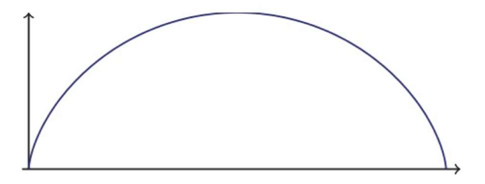

    * **Symmetrie**: $2\int_{0}^{b} \dots$

    * **Fläche**: $\int_{a}^{b} y(x) \cdot \dot{x}(t) \,dt$ 

    * **Länge**: $$\int_{a}^{b} \sqrt{(\dot{y}(t))^2+(\dot{x}(t))^2}$$

* **Astroide**:
    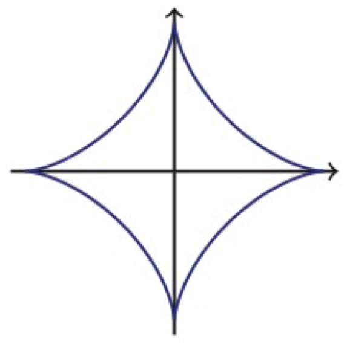

    * **Symmetrie**: $4\int_{\frac{t}{4}}^{\frac{t}{4}} \dots$

    * **Fläche**: $\int_{a}^{b} y(x) \cdot \dot{x}(t) \,dt$ für $t \in$ {I. Quadrant}

    * **Länge**: $$\int_{a}^{b} \sqrt{(y'(t))^2+(x'(t))^2}$$

* **Kreisvolvente**:
    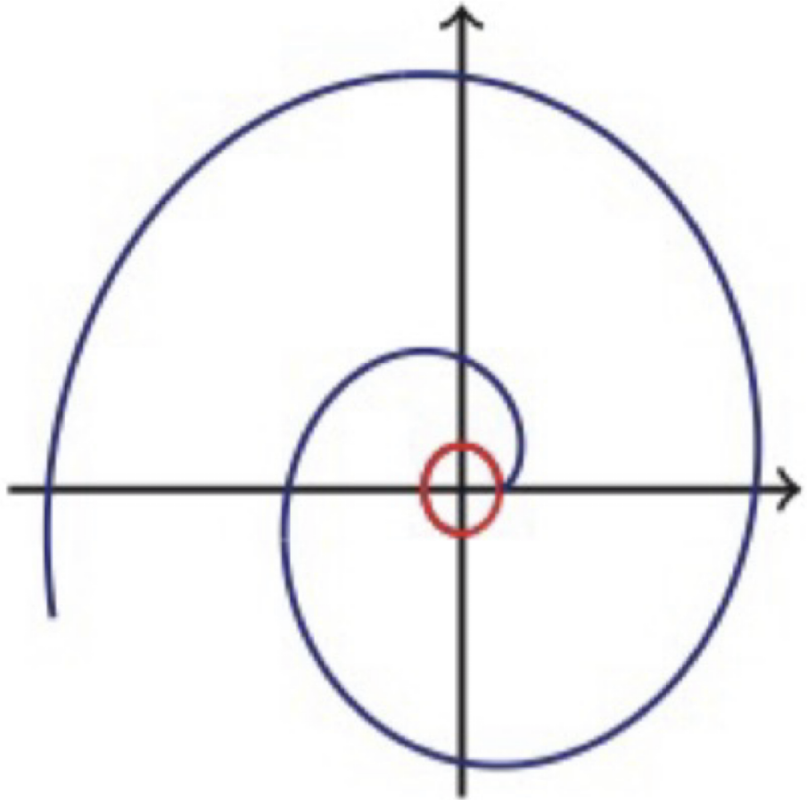

    * In der Klausur gegeben:

    $$c(t) = \begin{pmatrix} x(t) \\ y(t) \end{pmatrix} = \begin{pmatrix} r(\cos t + t \sin t) \\ r(\sin t - t \cos t) \end{pmatrix}$$

    $$\dot{c}(t) = \begin{pmatrix} \dot{x}(t) \\ \dot{y}(t) \end{pmatrix} = \begin{pmatrix} \frac{d}{dt} x(t)\\ \frac{d}{dt} y(t) \end{pmatrix}$$

* **Vierblattrose**:
    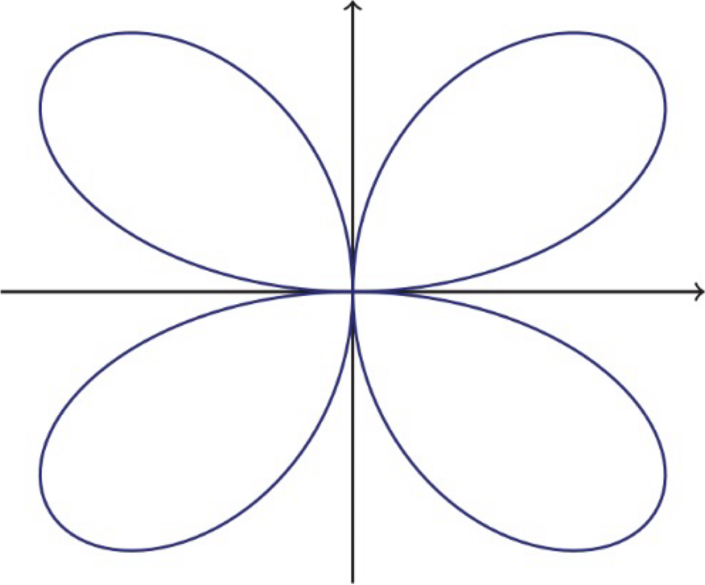

    $$c(t) = \begin{pmatrix} x(t) \\ y(t) \end{pmatrix} = \begin{pmatrix} a \cos(2t) \cos(t) \\ a \cos(2t) \sin(t) \end{pmatrix}$$

    * **Symmetrie**: $4\int_{\frac{t}{4}}^{\frac{t}{4}} \dots$

    * **Fläche**: $\int_{a}^{b} y(x) \cdot x'(t) \,dt$

* **Gerano-Lemniskate**
    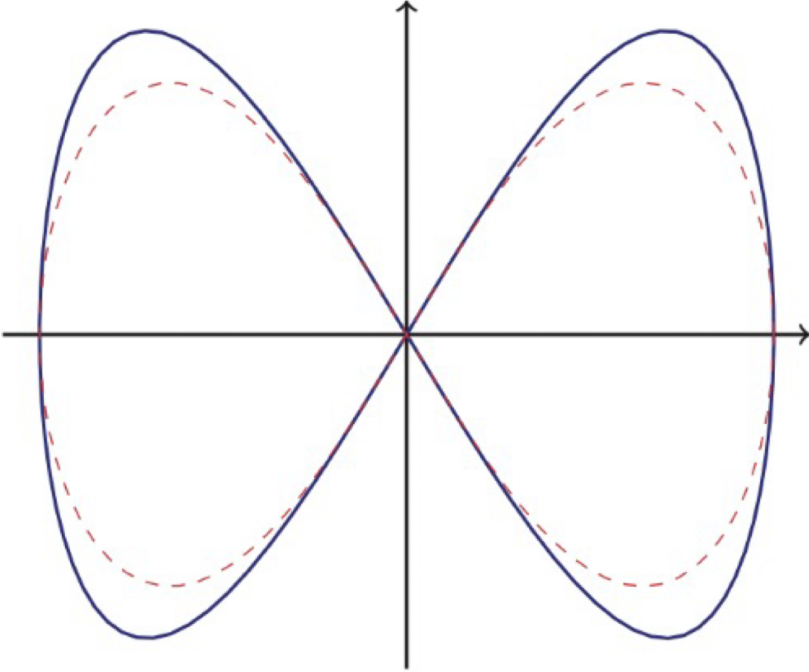

    * **Symmetrie**: $2 \int_{\frac{t}{2}}^{\frac{t}{2}} \dots$

    * **Fläche**: $\int_{a}^{b} y(x) \cdot x'(t) \,dt$ 

* **Schraublinie**

    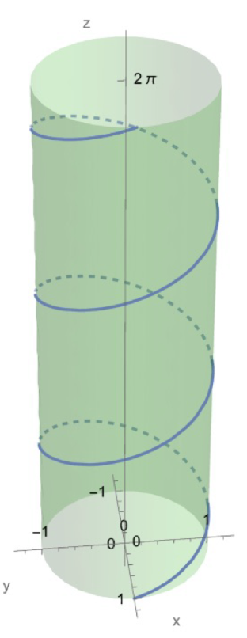

    * **Länge**: $$\int_{a}^{b} \sqrt{(\dot{y}(t))^2+(\dot{x}(t))^2}$$

    * **Parametisieren**: $$s(t) \to t(s)$$

## <u>Fläche u. d. Kurve</u>

* $c(t) = \binom{x(t)}{y(t)} = \int_{a}^{b} y(t)x'(t) \,dt$

## <u>Bogenlänge einer Kurve</u>

* $\dot{c}(t) = ||\dot{c}(t)|| = \int_{a}^{b} \sqrt{(x'(t))^2 + (y'(t))^2} \,dt$

# Gradienten
$$f^{\nabla}(x,y) = \binom{\frac{d}{dx}f(x,y)}{\frac{d}{dy}f(x,y)}$$

# Höhenlinie:
$f(x,y) = c$
* **Umstellen n. Standartform:**
    1) ***Gerade***:
        * $y = mx + b$
    1) ***Kreis um $(0,0)$***
        * $x^2 + y^2 = r^2$
    1) ***Verschobener Kreis***
        * $(x - x_0)^2 + (y-y_0)^2 = r^2$

# **Die Volumen-Formel für Rotation um die x-Achse**

$$V = \pi \cdot \int_a^b (f(x))^2 \, dx$$

# **Volumen einer Kappe**

$$V = \pi \left(R- \frac{1}{3}h \right)h^2 \, dx$$

# **Zylinderförmige Apfelstecher**

$$V_{Rest} = \frac{4}{3}\pi\sqrt{(R^2 - r^2)^3}$$

$\int \frac{\,dx}{\sin^2(x)} = \tan(x)$

# <b>Brüche</b>
## <u>Erweitern</u>

<u>Bsp.</u>:

$$\frac{7}{24}+\frac{9}{40}+\frac{11}{60}$$
<u>Wie bekomme ich den gleichen Nenner ?</u>

* KgT
    
    1) <u>Primfaktorzerlegung</u>
        
        $24 = 6 \cdot 4 = 2 \cdot 3 \cdot 2 \cdot 2 = [2^3,3]$
        $40 = 2 \cdot 20 = 2 \cdot 2 \cdot 10 = 2 \cdot 2 \cdot 2 \cdot 5 = [2^3, 5]$
        $60 = 2 \cdot 30 = 2 \cdot 2 \cdot 15 = 2\cdot 2 \cdot 3 \cdot 5 = [2^2, 3 , 5]$

        * Faktoren d. Vorkommen (größte Exponent)

        $2^3 \cdot 3 \cdot 5 = 8 \cdot 3 \cdot 5 = \underline{120}$

    1) <u>Ich kann die  gefundenen Faktoren auch zum erweitern des Zählern verwenden</u>:
        * Wir gucken uns $\frac{7}{24}$ an:
            * Wir haben d. Faktoren im Hauptenner: $2^3 \cdot 3 \cdot 5$
            * Nenner v. $T_1 = 2^3 \cdot 3 \to$ uns fehlt d. Fator 5
                $= \frac{7 \cdot 5}{24 \cdot 5} = \underline{\frac{35}{120}}$ 

## <u>Kürzen</u>
<u>Bsp.</u>:

$$\frac{84}{120}$$

<u>Wie bekomme ich d. größte Zahl zum kürzen ?</u>

* GgT

    1) <u>Primfaktorzerlegung</U>:

        $84 = 2 \cdot 42 = 2 \cdot 2 \cdot 21 = 2 \cdot 2 \cdot 3 \cdot 7 = [2^2,3,7]$
        $120 = 2 \cdot 60 = 2 \cdot 2 \cdot 30 = 2 \cdot 2 \cdot 2 \cdot 15 = 2 \cdot 2 \cdot 2 \cdot 3 \cdot 5 = [2^3,3,5]$

        * Faktoren d. bei beiden v.kommen (kleinste Exponent)
        
        $2^2 \cdot 3 = 4 \cdot 3 = \underline{12}$
        $= \frac{84 \div 12 }{120 \div 12} = \underline{\frac{7}{10}}$

## <u>Fakultät</u>

1) <u>D. rekursive Regel</U>:
    * $n! = n \cdot (n-1)!$
      * $5! = 5 \cdot 4! = 5 \cdot (4 \cdot 3 \cdot 2 \cdot 1) = 120$.

1) <u>n!!</U>:

* $n!! = \mathbf{1 \cdot 3 \cdot \dots \cdot (n-2) \cdot n}$
* $n!!! = \mathbf{3 \cdot 6 \ \dots \cdot 6 \cdot 3}$
* $(2n+1)!! = \mathbf{1 \cdot 3 \cdot \dots \cdot (2n-3) \cdot (2n-1) \cdot (2n+1)}$

* Bsp.:
    * $9!!! = 9\cdot(9-3)\cdot(9-6) = 9 \cdot 6 \cdot 3 = 162$
    * $12!!!!! = 12 \cdot (12-5)\cdot(12-10) = 12\cdot7\cdot2 = 168$

## <u>Wann verw. wir den Grad des größten Exp., um den Bruch zu vereinfachen ?</u>
* immer, wenn wir den Grenzwert eines Bruchen angucken !!! 

## <u>Der binomische Lehrsatz</u>
$$(a+b)^n = \sum_{k=0}^{n} \binom{n}{k} \cdot a^{n-k} \cdot b^{k}$$
* wobei $\binom{n}{k} = \frac{n!}{k! \cdot (n-k)!}$

## <u>Symmetrie einer Funktion</u>
$$f(-x) = |-x| = |x| = f(x)$$

* dann ist unsere Funktion gerade
    * Bsp.: $\mathbf{f(x) = |x|}$

# **Random Aufgaben**

## **<u>Grenzwert</u>**

1) $lim_{n \to \infty} \frac{3^n}{n!}$
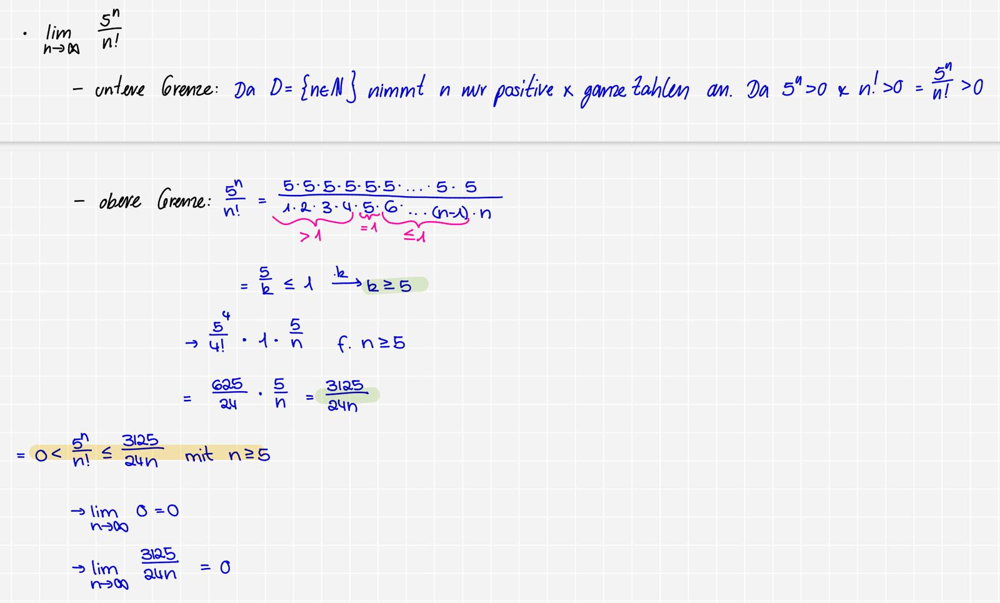

## **Konvergenz**
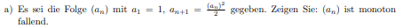

# Aufgaben:
## Konvergenz:

### $\sum_{n = 0}^{\infty} \frac{(-1)^n}{n^2+1}$

1) $\frac{1}{n^2 + 1} \approx \frac{1}{n^2}$
    * $2-0 = 2$ & somit $\gt$ 1 $\implies$ konvergent
        * d.h. ich brauche das **Majorantenkriterium**

2) <u>Der tatsächl. Beweis </u>:
* wir betrachten $\left| \sum_{n = 0}^{\infty} \frac{(-1)^n}{n^2+1} \right| = \sum \frac{1}{n^2+1}$

$n^2+1 \gt n^2$

$\frac{1}{n^2+1} \lt \frac{1}{n^2}$

Da $\frac{1}{n^2}$ eine bekannte konvergierende Reihe ist und unseres kleiner ist, ist unsere Folge **absolut konvergent** !

### $\sum_{n = 0}^{\infty} \frac{(-1)^n}{n+1}$

$\frac{(-1)^n}{n+1} \approx \frac{1}{n} \implies$ harmonische Reihe

Leibniz-Kriterium:
* Nullfolge?

    $lim_{n \to \infty} \frac{1}{n+1} = 0$

* Monotonie:

    $$a_{n+1} \le a_n$$
    $$\frac{1}{n+2} \le \frac{1}{n+1}$$

Somit ist unsere Reihe auf jeden Fall konvergent.

Absolute Konvergenz ?

* $1 - 0 = 1$ und somit divergent \to Minorantenkriterium

* ich muss ein Nenner brauen, dass größer ist als mein n+1:
$$n + 1 \lt n+n$$
$$n + 1 \lt 2n$$
$$\frac{1}{n+1} \gt \frac{1}{2n}$$
Da sich $\frac{1}{2n}$ so verhaltet wie d. harmonische Reihe & divergier, muss auch meine Reihe divergieren

*Fazit*: Meine Reihe ist bedingt konvergent. 

### $\sum_{n = 1}^{\infty} (-1)^n \sqrt[n]{n}$

1) <u>Leibnitz Kriterium</u>

* Nullfolge ?
    $$\lim_{n \to \infty} \sqrt[n]{n} = 1$$

Da d. erste Bedingung des Leibnitz-Kriterium $\lnot$ stimmt muss unsere Reihe divergieren.

### $\sum_{n = 0}^{\infty} (-1)^n \frac{1}{2^n}$

<u>Leibnitz-Kriterium</u>:
* <u>Nullreihe</u>?
    $$\lim_{n \to \infty} \frac{1}{2^n} = 0$$

* <u>Monoton fallend?</u>:
    $$\frac{1}{2^{n+1}} \lt \frac{1}{2^n}$$
    $$\frac{1}{2^n \cdot 2} \lt \frac{1}{2^n}$$

Somit können wir schon mal sagen, dass unsere Folge konvergiert.

<u>Absolute Konvergenz</u>:
* Da unser n im Exponenten ist, können wir d. Wurzelkriterium anw.

$$\sqrt[n]{\left| a_n \right|}$$
$$\sqrt[n]{\left| \frac{1}{2^n} \right|}$$
$$\sqrt[n]{\frac{1}{2^n}}$$
$$\frac{\sqrt[n]{1}}{\sqrt[n]{2^n}}$$
$$\frac{1}{2}$$

Da $\frac{1}{2} \lt 1$ ist, ist unsere Reihe absolut konvergent.

### $\sum_{n=0}^{\infty} (-1)^n \frac{n+1}{n+3}$

#### 1) Leibniz-Kriterium:
* **Nullfolge?**
    $$\lim_{n \to \infty} \frac{n+1}{n+3} \approx \frac{n}{n} = 1 \neq 0$$
    $\rightarrow$ Somit handelt es sich um **keine Nullfolge**.

**Fazit:**
Deswegen handelt es sich hier um eine **divergente Reihe**.

### b) $\sum_{n=0}^{\infty} \sin\left(\frac{n\pi}{2}\right)$

* **Innerer Teil:** $\frac{n\pi}{2}$
    $$\lim_{n \to \infty} \frac{n\pi}{2} = \infty$$

* **$\sin(\infty)$:** Die Folge nimmt folgende Werte an: $0, 1, 0, -1, 0, 1, \dots$
    $\rightarrow$ Das wiederholt sich unendlich oft.

**Fazit:**
Die Reihe ist **divergent**.

### $\sum_{n=1}^{\infty} \sin\left(\frac{\pi}{2n}\right)$

* **Innerer Teil:** $$\lim_{n \to \infty} \frac{\pi}{2n} \approx \frac{1}{n} = 0$$
* Da der innere Teil gegen $0$ geht, geht auch unser $\sin()$ gegen $0$, weil $\sin()$ bei sehr kleinen Zahlen mit dem Wert des inneren Teils übereinstimmt.

**Fazit:** Unsere Reihe ist **absolut konvergent**, weil es nur positive Werte annimmt und gegen $0$ konvergiert.

### d) $\sum_{n=1}^{\infty} \left(\sin \frac{1}{n}\right)^2$

* **Untere Schranke:** Da $n > 0$ ist und wir $(\dots)^2$ haben, haben wir nur positive Werte:
    $$0 \leq \sin^2\left(\frac{1}{n}\right)$$
* **Obere Schranke:**
    $$\sin^2\left(\frac{1}{n}\right) \approx \left(\frac{1}{n}\right)^2 = \frac{1}{n^2} \rightarrow \text{konvergiert}$$

**Zusammenfassung:**
$$0 \leq \sin^2\left(\frac{1}{n}\right) \leq \frac{1}{n^2}$$

$L = \frac{1}{\lim_{n \to \infty} \left( \left| \sqrt[n]{a_n} \right| \right)}$

$L = \lim_{n \to \infty} \left| \frac{a_n}{ a_{n+1}} \right|$

