<!-- Style:  -->

<!-- Image -->

<!-- Textgröße -->

<!-- Tabelle -->

<!-- Lückentext -->

1) [Mehrdimensionale Grenzwerte](#Mehrdimensionale_Grenzwerte)

# **Mehrdimensionale Grenzwerte**

## **Grenzwert bestimmen**

### <u>1) Einf. einsetzten</u>
* Versuchen d. Werte einzusetzen $\underrightarrow{\ \ \ \ \textcolor{#7abd2d}{\text{wenn } \frac{0}{0}}\ \ \ \ }$ d. 3 Fälle

### 2) <u>Achsen</u>

**1) Fall: Achsen**: 

Wir setzen quazi $x=0/y=0$ & setzen dann den $y,x$-Wert des $\lim$ ein
  * $y=0, x \to \dots$
  * $x=0, y \to \dots$

**2) Fall: Ursprungsgeraden**: 

<b>D. ist keine fertige Lösung, d. zeigt nur, dass wir kein Grenzwert haben. D.h., wenn hier alle Ergebnisse gleich sind, dann muss ich dennoch die anderen Beweise rechnen (Sandwitch-Lemma, Polarkoordinaten)</b>

* $y = mx \ \lor x = my$

**3) Fall: Kurven**: 
* wenn **Zähler Pot./Nenner Pot.** sehr unterschliedl.

* $y = x^2 \ \lor x = y^2$

### 2) <u>Abschätzen</u>

<u>Polarkoordinaten</u>

* nur f. **($\mathbf{\lim \to 0,0}$)**

* Wir ersetzten $x$ & $y$
  * $x = r \cdot \cos(\varphi)$
  * $y = r \cdot \sin(\varphi)$
    * d. bedeutet einf. nur, dass $r \to 0$, wobei $\varphi$ variabel bleibt
* <u>Nutzen</u>: $\cos^2(\varphi) + \sin^2(\varphi) = 1$
* WICHTIG !!! D. Ergebnis am Ende darf $\color{red}\lnot$ mehr vom Winkel abhängen

<u><b>Sandwich-Lemma</b></u>

* $|\sin(\dots)| \leq 1$ & $|\cos(\dots)| \leq 1$.
* Nenner verkleinern macht den Bruch größer: Da $x^2 \geq 0$ ist, gilt z.B. $x^2 + y^2 \geq y^2$.
* Teilbrüche sind kleiner oder gleich $1$: $\frac{x^2}{x^2+y^2} \leq 1$.

  <button popovertarget="mehrdimensionale Grenzwerte" style="border:none; background:none; color:blue; text-decoration:underline; cursor:pointer;">
    Aufgaben
  </button> 

  <u>Übung 8</u>
  

  Nr. 3a)
  
  Nr. 3b)
  
  Nr. 3c)
  
  Nr. 3d)
  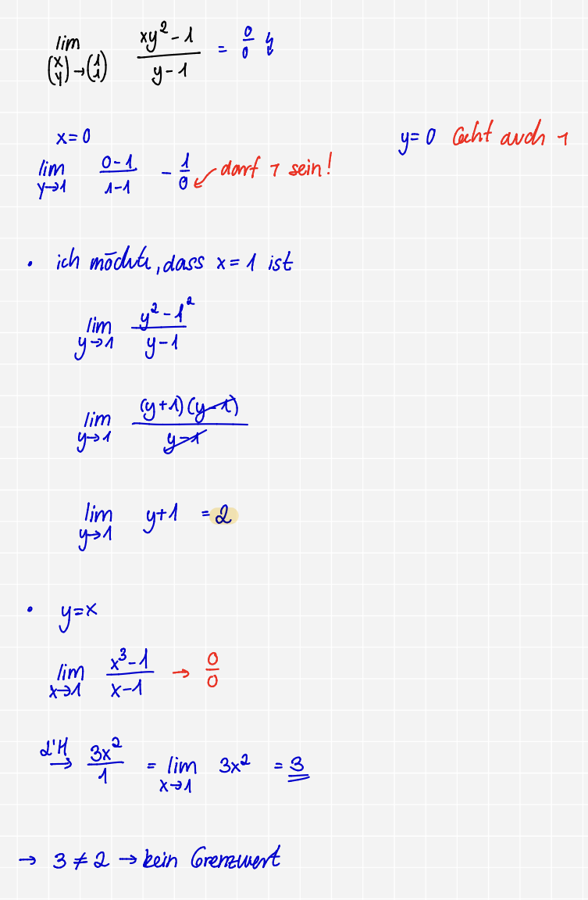

## **Unstelligkeitswerte finden bei mehreren Veränderlichen**:

* Wir haben eine Schnittstelle & wir müssen den $\lim$ einfach dort hinschichen

<u><b>Wann weiß ich, dass es direkt unstetig ist ?</b>></u>
* Wenn eine Konstate steht 

  <button popovertarget="Unstelligkeitswerte finden bei mehreren Veränderlichen" style="border:none; background:none; color:blue; text-decoration:underline; cursor:pointer;">
    Aufgaben
  </button> 

  <u><b>Übung 8</b></u>
  

  <b>Nr. 4a)</b>
  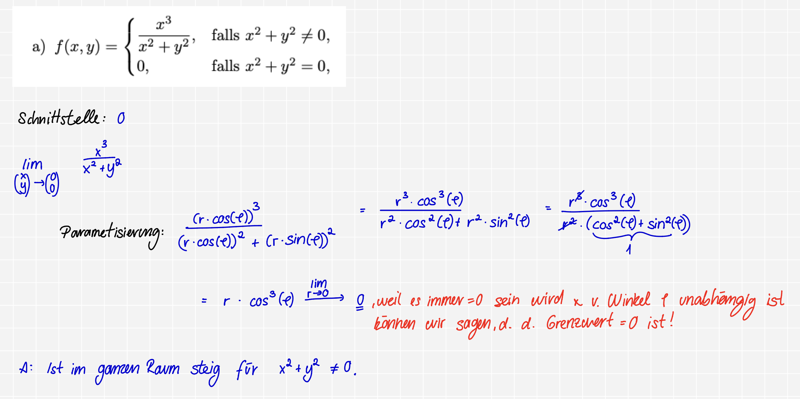
  <b>Nr. 4b)</b>
  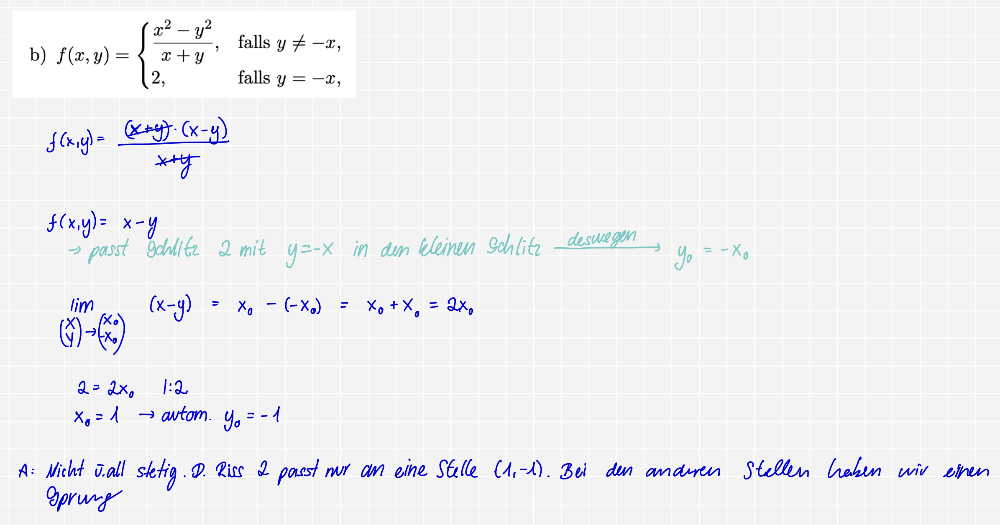
  <b>Nr. 4c)</b>
  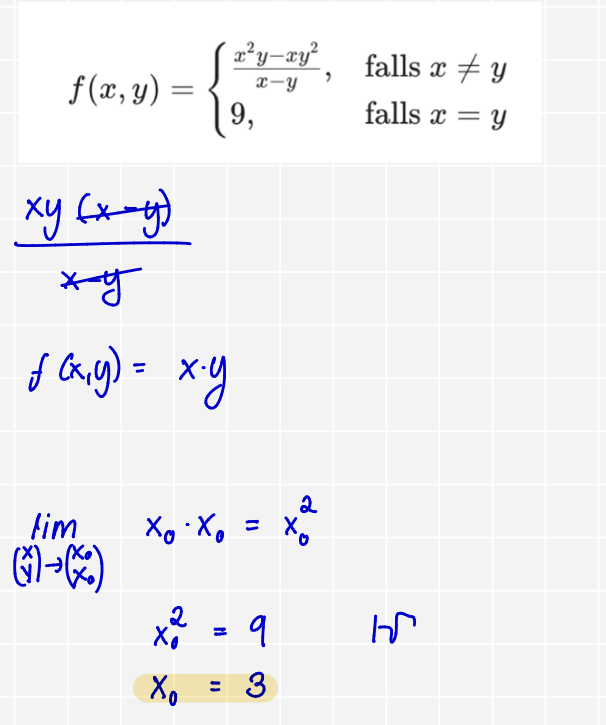
  Mein Ergebnis x_0 = $\pm$ 3. Deswegen ist es nicht stetig, weil nur hier bei (3,3), (-3,-3) das ausgeschnitte Stück 9 reinpasst & bei den anderen nicht !

  <b>Nr. 4d)</b>
  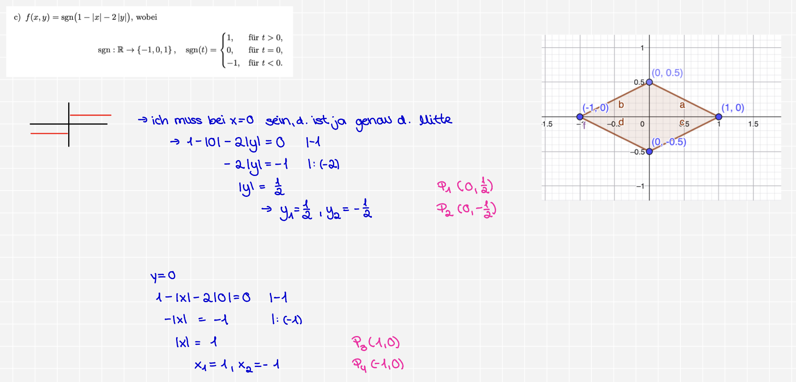

## **Bestimmung der Höhenlinien & Definitionsbereich**

## **Was ist eine Höhenlinie?**:
* Funktion mit mehreren Var. ($f(x,y)$)
  * $\forall$ Werte haben d. gleiche Höhe: $f(x,y)= c$

  <button popovertarget="Bestimmung der Höhenlinien & Definitionsbereich" style="border:none; background:none; color:blue; text-decoration:underline; cursor:pointer;">
    Aufgaben
  </button> 

  <u><b>Übung 8</b></u>
  

  <b>Nr. 5a)</b>
  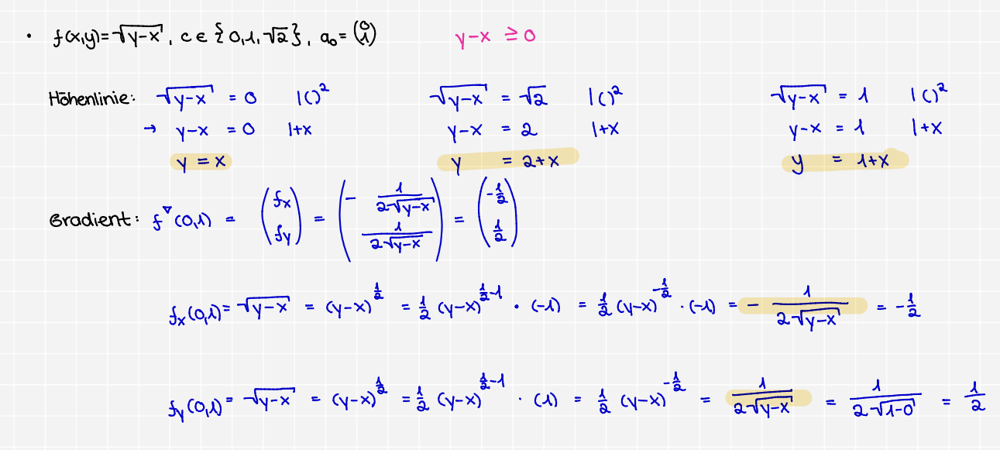
  <b>Nr. 5b)</b>
  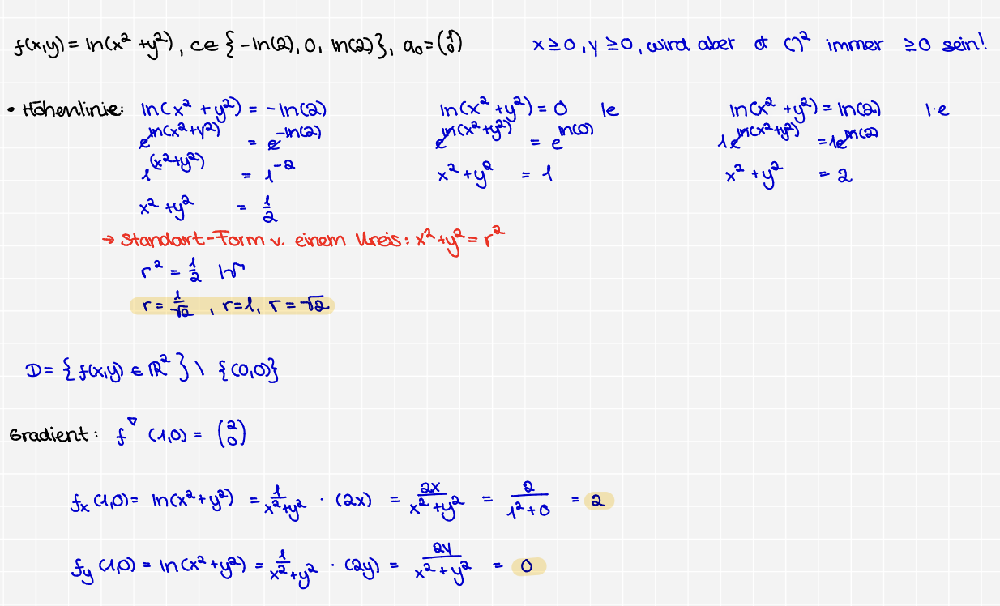
  <b>Nr. 5b)</b>
  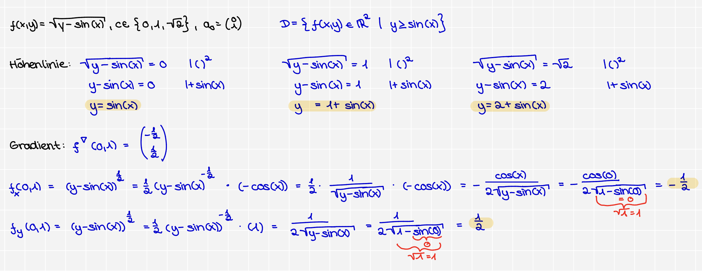

## **Die Norm**

* $||x||_{\infty} = max(|x_1|, |x_2|, \dots)$

<u>1. Positive Definitheit</u>:
* Eine Länge kann $\lnot \lt 0$

<u>2. Homogenität</u>:
* wenn ich eine Pfeil doppolt so lange ziehe ($\lambda = 2$), dann ist d. Länge v. meinem Pfeil auch 2 $\times$ so lang. Auch wenn ich d. in d. andere Seite ziehe, wie ($\lambda = -3$), dann ist sie immer noch $3 \times$ so lang, also $|\lambda|$

<u>3. Dreiecksungleichung</u>:
* wenn ich v. $\overset{\to}{AB}$, dann $\nu(x+y)$

<u>Wo ist dies Regel f. mich relevant ?</u>:
* Sandwich-Lemma: D. Dreieckungleichung hilft und die beiden Grenzen zu bestimmen !
*Wenn man n. unten abschätzen müssen oder voneinander abziehen müssen: $|\overset{\text{direkte Weg}}{\nu(x) - \nu(y)}| \le \overset{\text{mit Umweg}}{\nu(x - y)}$
* **NORME SIND IMMER STETIG**
  * wenn ich einmal bewiesen habe, dass etw. eine Norm ist, dann brauche ich kein $\epsilon$-$\delta$-Beweise oder Limes-Rechnungen

# **Kurvendiskussion mit mehreren Veränderlichen**

## **Kritischer Punkt**:
$$\text{I) } f_x(x,y) = 0$$
$$\text{II) }f_y(x,y) = 0$$
* $\text{I}$ oder $\text{II}\underrightarrow{\ \ \ \ \textcolor{#7abd2d}{\text{eins.}}\ \ \ \ }$ in d. andere eins & umstellen !

## **KP charakterisieren**:
* $H_f = \begin{pmatrix} f_{xx} & f_{yx} \\ f_{xy} & f_{yx} \end{pmatrix}$ bilden

* $\det(H_f)$
  * $\det(H_f) \gt 0$: echter Extremum(Max.,Min.)
  * $\det(H_f) = 0$: Keine Aussage
  * $\det(H_f) \lt 0$: Sattelpunkt

  <button popovertarget="Kurvendiskussion mit mehreren Veränderlichen" style="border:none; background:none; color:blue; text-decoration:underline; cursor:pointer;">
    Aufgaben
  </button> 

  <u><b>Übung 9</b></u>
  

  <b>Nr. 3a)</b>
  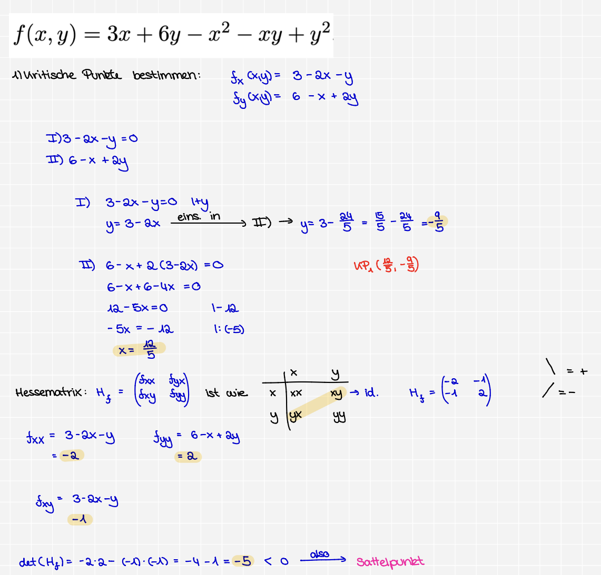
  <b>Nr. 3b)</b>
  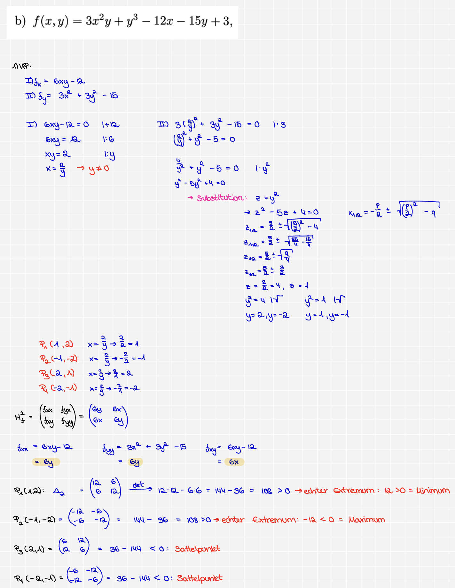
  <b>Nr. 3c)</b>
  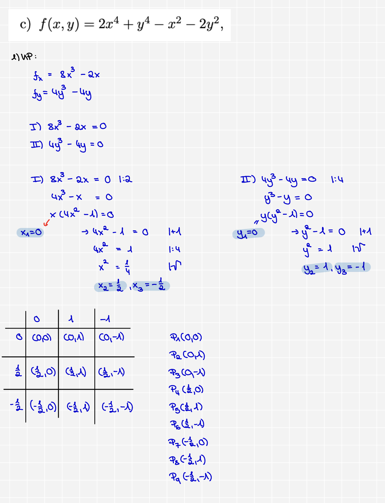

# **Kurvendiskussion mit mehreren Veränderlichen & einer Nebenbedingung**

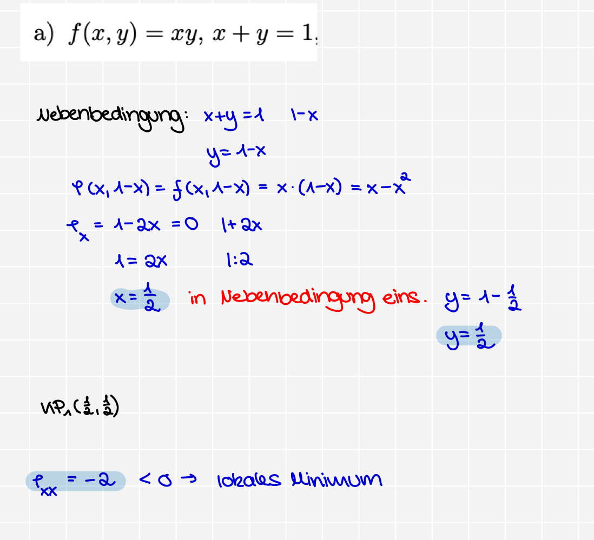

## **Lagrange-Funktion**:
### <u>**Allgem. Schritte**</u>:

1. <u>Nebenbedingung</u>:
* $\forall$ auf eine Seite bringen, sodass auf einer Seite = 0 steht
2. <u>Lagrange-Funktion</u>
* $L(x,y,\lambda) = f(x,y) + \lambda \cdot (\text{Nebenbedingung})$
3. <u>1.Ableitung</u>
4. <u>KP</u>
5. <u>2.Ableitungen</u>
6. <u>geränderte Matrix</u>

# **Implizierte Ableitung**
<b>Wichtig ist, dass bei F(x,y) am Ende = 0 steht!</b>

## **Normale Gleichung**:
Formel: $\boxed{-\frac{F_x}{F_y}}$

## **Parametische GLeichung**:
* **Formel**: $\boxed{y'(x) = \frac{\dot{y}(t)}{\dot{x}(t)}}$

## **Normale Gleichung mit mehreren Veränderlichen**:
* **Formel**: $\boxed{-\frac{F_x}{{\underset{d. was gesucht ist}{F_y}}}}$

# **Taylor Polynom**:

## $\mathbb{R}$:

* Formel: $\boxed{T_f^{\text{n}}(x, x_0) = \sum_{k = 0}^n \frac{f(x)^{(k)}}{k}(x-x_0)^k}$ 

## $\mathbb{R^n}$:

* Formel: $\boxed{T_f^{\text{n}}(\overset{x,y,z,\dots}{M}) = \sum_{k = 0}^n \frac{\nabla^k_f}{k}(x,y,z,\dots)^T}$ 
  * Hier haben wir kein $()^k$ bei $(x-x_0)$

# **Flächen**:
## Tangentialebene:

Wenn ich Normalenvektor habe: $\nabla(x,y,z) = \begin{pmatrix} F_x \\ F_y \\ F_z \end{pmatrix}$ 

$$\boxed{F_x \cdot (x - x_0) + F_y \cdot (y - y_0) + F_z \cdot (z - z_0) = 0}$$
  * $x_0, y_0, z_0$ sind d. Punkte, d. geg. sind

## Normalverktor:

$$\boxed{\vec{n} = \nabla F(x,y,z) = \begin{pmatrix} F_x \\ F_y \\ F_z \end{pmatrix}}$$

* Man muss es nicht in den Bruch packen, sondern kann es einfach in $\nabla$ einfügen

$$\boxed{\vec{n}_{normiert} = \frac{1}{\sqrt{(F_x)^2 + (F_y)^2 + (F_z)^2}} \cdot \begin{pmatrix} F_x \\ F_y \\ F_z \end{pmatrix}}$$

## Tangentialvektoren:
* $u = const$, $v = const$

* $\Phi_u, \Phi_v$ berechnen (einf. d. inneren Sachen n. d. Var. ableiten)

### <u>Normalverktor</u>:
* Kreuzprodukt berechnen: $\Phi_u \times \Phi_v$
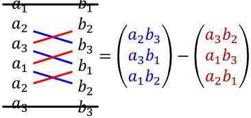

  <button popovertarget="Normalverktor" style="border:none; background:none; color:blue; text-decoration:underline; cursor:pointer;">
    Aufgaben
  </button> 

  <u><b>Übung 10</b></u>
  

  <b>Nr.10.5a)</b>
  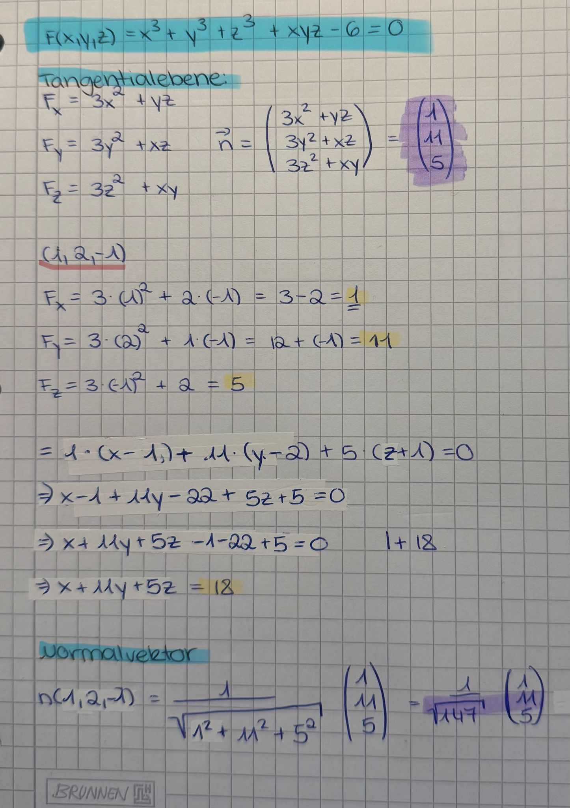

# **Trigonometrie/Identitäten**

<!-- Der richtige Lerninhalt -->
<table>
  <thead>
    <tr>
      <th>Winkel (Grad)</th>
      <th>0°</th>
      <th>30°</th>
      <th>45°</th>
      <th>60°</th>
      <th>90°</th>
    </tr>
    <tr>
      <th>Winkel (Bogenmaß)</th>
      <td>$0$</td>
      <td>$\frac{\pi}{6}$</td>
      <td>$\frac{\pi}{4}$</td>
      <td>$\frac{\pi}{3}$</td>
      <td>$\frac{\pi}{2}$</td>
    </tr>
  </thead>
  <tbody>
    <tr>
      <td><b>Sinus</b></td>
      <td>$\frac{\sqrt{0}}{2} = 0$</td>
      <td>$\frac{\sqrt{1}}{2} = \frac{1}{2}$</td>
      <td>$\frac{\sqrt{2}}{2}$</td>
      <td>$\frac{\sqrt{3}}{2}$</td>
      <td>$\frac{\sqrt{4}}{2} = 1$</td>
    </tr>
    <tr>
      <td><b>Cosinus</b></td>
      <td>$\frac{\sqrt{4}}{2} = 1$</td>
      <td>$\frac{\sqrt{3}}{2}$</td>
      <td>$\frac{\sqrt{2}}{2}$</td>
      <td>$\frac{\sqrt{1}}{2} = \frac{1}{2}$</td>
      <td>$\frac{\sqrt{0}}{2} = 0$</td>
    </tr>
  </tbody>
</table>

