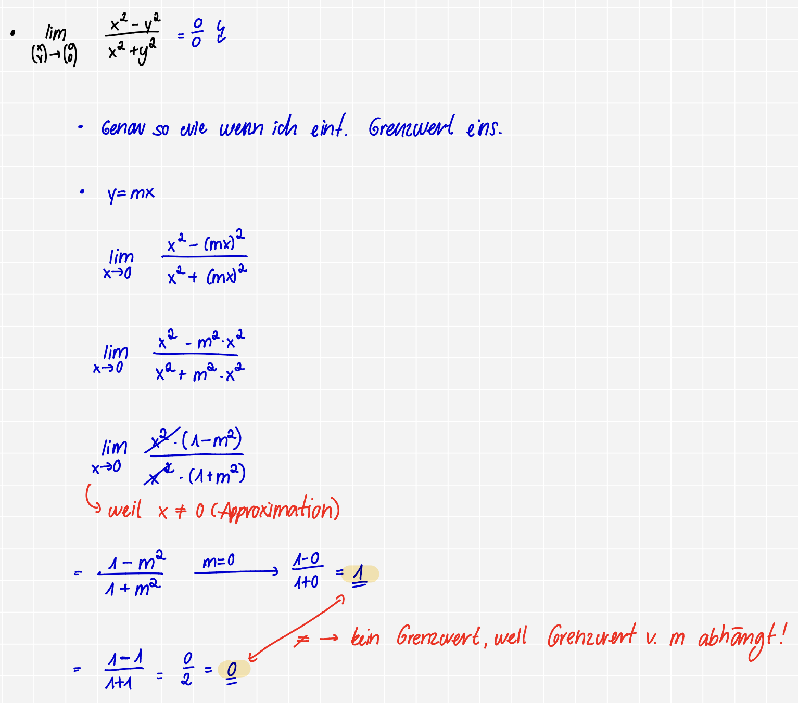
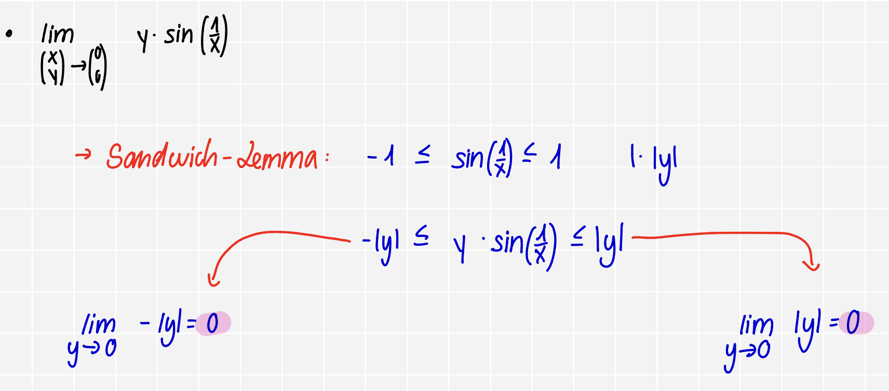
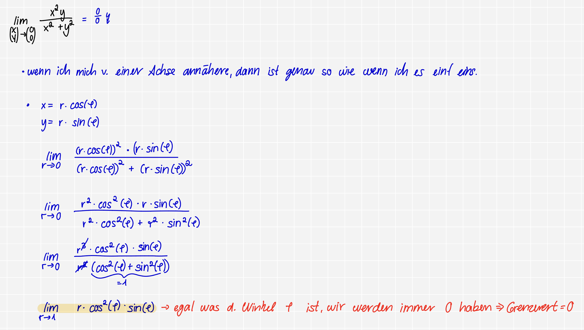

<!-- Style:  -->

<!-- Image -->

<!-- Textgröße -->

<!-- Tabelle -->

<!-- Lückentext -->

1) [Mehrdimensionale Grenzwerte](#Mehrdimensionale_Grenzwerte)

# **Mehrdimensionale Grenzwerte**

## **Grenzwert bestimmen**

### <u>1) Einf. einsetzten</u>
* Versuchen d. Werte einzusetzen $\underrightarrow{\ \ \ \ \textcolor{#7abd2d}{\text{wenn } \frac{0}{0}}\ \ \ \ }$ d. 3 Fälle

### 2) <u>Achsen</u>

**1) Fall: Achsen**: 

Wir setzen quazi $x=0/y=0$ & setzen dann den $y,x$-Wert des $\lim$ ein
  * $y=0, x \to \dots$
  * $x=0, y \to \dots$

**2) Fall: Ursprungsgeraden**: 

<b>D. ist keine fertige Lösung, d. zeigt nur, dass wir kein Grenzwert haben. D.h., wenn hier alle Ergebnisse gleich sind, dann muss ich dennoch die anderen Beweise rechnen (Sandwitch-Lemma, Polarkoordinaten)</b>

* $y = mx \ \lor x = my$

**3) Fall: Kurven**: 
* wenn **Zähler Pot./Nenner Pot.** sehr unterschliedl.

* $y = x^2 \ \lor x = y^2$

### 2) <u>Abschätzen</u>

<u>Polarkoordinaten</u>

* nur f. **($\mathbf{\lim \to 0,0}$)**

* Wir ersetzten $x$ & $y$
  * $x = r \cdot \cos(\varphi)$
  * $y = r \cdot \sin(\varphi)$
    * d. bedeutet einf. nur, dass $r \to 0$, wobei $\varphi$ variabel bleibt
* <u>Nutzen</u>: $\cos^2(\varphi) + \sin^2(\varphi) = 1$
* WICHTIG !!! D. Ergebnis am Ende darf $\color{red}\lnot$ mehr vom Winkel abhängen

<u><b>Sandwich-Lemma</b></u>

* $|\sin(\dots)| \leq 1$ & $|\cos(\dots)| \leq 1$.
* Nenner verkleinern macht den Bruch größer: Da $x^2 \geq 0$ ist, gilt z.B. $x^2 + y^2 \geq y^2$.
* Teilbrüche sind kleiner oder gleich $1$: $\frac{x^2}{x^2+y^2} \leq 1$.

  <button popovertarget="mehrdimensionale Grenzwerte" style="border:none; background:none; color:blue; text-decoration:underline; cursor:pointer;">
    Aufgaben
  </button> 

  <strong>
  <u>Übung 8</u>
  

  Nr. 3a)
  
  Nr. 3b)
  
  Nr. 3c)
  

