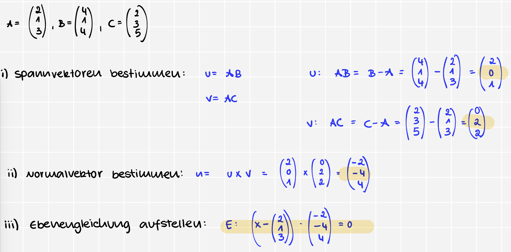

<h1>Normalenformen</h1>

<h2> Was ist eine Normalform ?</h2>

* `allgemeine Form` = $ax^2 + 2bxy + cy^2 + dx + ey + f = 0$
* Durch __Drehung d. Koordinate__ wird  d. __Term xy eliminiert__ $\underrightarrow{\ \ \ \ \textcolor{#83b7ea}{\text{Normalform sieht dann so aus}}\ \ \ \ }$ $\lambda_1 u^2 + \lambda_2 v^2 + g = 0$
    * $\lambda_1$ & $\lambda_2$ = Eigenwerte d. Matrix $\underrightarrow{\ \ \ \ \textcolor{#83b7ea}{\text{repräsentiert}}\ \ \ \ }$  quadratischen Teil d. Gleichung

    
Wie Normalform bestimmen ?

* <u>__3 Schritte__</u>
    1) Matrix aufstellen

        $\begin{pmatrix} a & b \\ b & c \end{pmatrix}$
        
    1) Eigenwerte bestimmen
    1) Einsetzten in d. Normalform

<table>
  <thead>
    <tr>
      <th>&lambda;1</th>
      <th>&lambda;2</th>
      <th>h</th>
      <th>Typ</th>
      <th>Beispiel</th>
    </tr>
  </thead>
  <tbody>
    <tr>
      <td>+</td>
      <td>+</td>
      <td>+</td>
      <td>leere Menge</td>
      <td>u² + v² + 1 = 0</td>
    </tr>
    <tr>
      <td>+</td>
      <td>+</td>
      <td>0</td>
      <td>Punkt</td>
      <td>u² + v² = 0</td>
    </tr>
    <tr>
      <td>+</td>
      <td>+</td>
      <td>-</td>
      <td>Ellipse</td>
      <td>u² + v² = 1</td>
    </tr>
    <tr>
      <td>+</td>
      <td>0</td>
      <td>+</td>
      <td>leere Menge</td>
      <td>u² + 1 = 0</td>
    </tr>
    <tr>
      <td>+</td>
      <td>0</td>
      <td>0</td>
      <td>Gerade (Doppelgerade)</td>
      <td>u² = 0</td>
    </tr>
    <tr>
      <td>+</td>
      <td>0</td>
      <td>-</td>
      <td>zwei parallele Geraden</td>
      <td>u² - 1 = 0</td>
    </tr>
    <tr>
      <td>+</td>
      <td>-</td>
      <td>+</td>
      <td>Hyperbel</td>
      <td>u² - v² = -1</td>
    </tr>
    <tr>
      <td>+</td>
      <td>-</td>
      <td>0</td>
      <td>zwei sich schneidende Geraden</td>
      <td>u² - v² = 0</td>
    </tr>
    <tr>
      <td>+</td>
      <td>-</td>
      <td>-</td>
      <td>Hyperbel</td>
      <td>u² - v² = 1</td>
    </tr>
  </tbody>
</table>

<u><b>Bezeichne die einzelnen Bestandteile: $\begin{pmatrix} 1 \\ 0 \\ 2 \end{pmatrix} + s \cdot \begin{pmatrix} 2 \\ 1 \\ 0 \end{pmatrix} + t \cdot \begin{pmatrix} 0 \\ 1 \\ 3 \end{pmatrix}$</b></u>

* $\begin{pmatrix} 1 \\ 0 \\ 2 \end{pmatrix}$ = `Stützvektor`

* $\begin{pmatrix} 2 \\ 1 \\ 0 \end{pmatrix}$ & $\begin{pmatrix} 0 \\ 1 \\ 3 \end{pmatrix}$ = `Spannvektoren`

<u><b>Was muss ich verw., wenn ich zeigen möchte, ob 2 Vektoren orthogonal zu einander sind ?</b></u>

* `Skalarprodukt`
  * $<a,b> = 0$

<u><b>Wie lautet d. Formel zur Berechnung v. Winkeln ?</b></u>

* $\frac{<a,b>}{|a| \cdot |b|}$

<u><b>Mit was kann ich 2 Vektoren fussieren ?</b></u>

* `Vektorprodukt`
  * $|a \times b| = \begin{pmatrix} a_1 \\ a_2 \\ a_3 \end{pmatrix} \times \begin{pmatrix} b_1 \\ b_2 \\ b_3 \end{pmatrix}$

<u><b>Was ist der Normalvektor ?</b></u>

* `Vektorprodukt`
  * $|a \times b| = \begin{pmatrix} a_1 \\ a_2 \\ a_3 \end{pmatrix} \times \begin{pmatrix} b_1 \\ b_2 \\ b_3 \end{pmatrix}$

<u><b>Wie bestimmt man die Normalform von Ebenen ?</b></u>

* $E: (\vec{x} - \vec{c}) \cdot (\vec{a} \times \vec{b}) = 0$
* $[x - \text{Stütztvektor}] \cdot \text{Normalvektor} = 0$

  

  
<u><b>Was bedeutet es, wenn das Ergebnis $E \ne 0$ ist?</b></u>

  * Punkt liegt $\lnot$ auf d. Ebene
  

<u><b>Gegeben ist $A = \begin{pmatrix} 2 \\ 1 \\ 3 \end{pmatrix}, \quad B = \begin{pmatrix} 4 \\ 1 \\ 4 \end{pmatrix}, \quad C = \begin{pmatrix} 2 \\ 3 \\ 5 \end{pmatrix}$. Wie bestimmt man die Spannvektor ?
</b></u>

* u = AB = B-A
* v = AC = C-A

<u><b>Gegeben ist $A = \begin{pmatrix} 2 \\ 1 \\ 3 \end{pmatrix}, \quad B = \begin{pmatrix} 4 \\ 1 \\ 4 \end{pmatrix}, \quad C = \begin{pmatrix} 2 \\ 3 \\ 5 \end{pmatrix}$. Bestimme d. Ebenengleichung ?
</b></u>

<u><b>Wie berechne ich die parametrische Form von Ebenen ?</b></u>

$\boxed{x_1 + x_2 + x_3 = 4}$
1) Punkte finden
   * $A(4, 0, 0)$ (für $x_1=4, x_2=0, x_3=0$)
   * $B(0, 4, 0)$ (für $x_1=0, x_2=4, x_3=0$)
   * $C(0, 0, 4)$ (für $x_1=0, x_2=0, x_3=4$)
2) Vektoren bilden
  * Richtungsvektoren berechnen:
    * $u = AB = B - A= \begin{pmatrix} 0-4 \\ 4-0 \\ 0-0 \end{pmatrix} = \begin{pmatrix} -4 \\ 4 \\ 0 \end{pmatrix}$

    * $v = AC = C - A= \begin{pmatrix} 0-4 \\ 0-0 \\ 4-0 \end{pmatrix} = \begin{pmatrix} -4 \\ 0 \\ 4 \end{pmatrix}$
1) Parameterform:
   * $\vec{x} = \begin{pmatrix} 4 \\ 0 \\ 0 \end{pmatrix} + r \cdot \begin{pmatrix} -4 \\ 4 \\ 0 \end{pmatrix} + s \cdot \begin{pmatrix} -4 \\ 0 \\ 4 \end{pmatrix} \quad (r, s \in \mathbb{R})$

# Schnittpunkte

<u><b>Wie berechnet man den Schnittpunkt 2er Ebenen ?</b></u>

1) Gleichsetzen mit Addition oder Subtraktion
1) Nach Var. umstellen
  * wenn Gleichungen $\lt$ Variabeln => ein Var. frei wählbar
1) Parameterform aufschreiben

<u><b>Wie berechnet man den Schnittpunkt von einer Gerade und einer Ebene ?</b></u>

> wenn es geschirben ist als $(1,2,3) + \lambda(1,2,3)$, dann ist es eigentl.: $\begin{pmatrix} 1 \\ 2 \\ 3 \end{pmatrix} + \lambda \cdot \begin{pmatrix} 1 \\ 2 \\ 3 \end{pmatrix}$
1) Gerade in Einzelteile zerlegen
1) Einzelteile in Ebene einsetzen
1) N. \lambda umstellen
1) In Formel eins.: $\boxed{a + \lambda \cdot b}$

# Paralellogram

<u><b>Wie berechnet man den Inhalt eines Parallelograms ?</b></u>

* ist $a$ & $b$ __linearunabhängig__ ?
$$\boxed{A = ||a \times b||}$$

<u><b>Wie berechnet man das Volumen eines Parallelograms ?</b></u>

* $$\boxed{|(a \times b) * c|}$$

