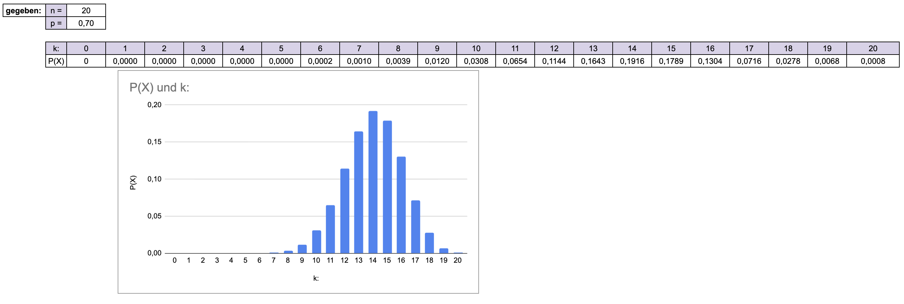

<h1>Mathe Lernblatt</h1>

<h2>Themensammlung</h2>

* Bernoulli-Formel
* Prozentrechnung/Bruchrechnung
* Bedingte/ Unbedingte Wahrscheinlichkeit
* Binomialverteilung
* 4-Fälderrafel
* Baumdiagramm

<h2>Bernoulli-Formel</h2>

$$P(X = \textcolor{red}{k}) = \binom{\textcolor{blue}{n}}{\textcolor{red}{k}} \cdot \textcolor{purple}{p}^{\textcolor{red}{k}} \cdot (1-\textcolor{purple}{p})^{\textcolor{blue}{n}-{\textcolor{red}{k}}}$$

* $\textcolor{blue}{n}$ : Anzahl d. Versuche
* $\textcolor{red}{k}$ : Anzahl d. Treffer (Wie viele Erfolge ?)
* $\textcolor{purple}{p}$ : Wie hoch ist d. Wahrscheinlichkeit auf einen Erfolg
* $(1-p)$: Das ist quazi $(100 \% - \text{mein Erfolg})$ $\to$ automatisch d. Rest
* $\binom{n}{k}$: Wie viele Möglichkeiten gibt es 

<h2>Wie berechnet man den Binomialkoeffizienten ?</h2>

* Aussehen:
  * $\binom{n}{k}$

* Berechnung:
  *  $\frac{n!}{k! \cdot (n-k)!}$

* Wichtig:
  * kürzen

<h2>Vierfeldtafel</h2>

<section class="info">
    

        <table style="width: 100%; border-collapse: collapse; background-color: white; color: black; text-align: center; border: 2px solid #333;">
            <tr style="background-color: rgb(153, 153, 199); color: white;">
                <th style="border: 1px solid #333; padding: 12px;"></th>
                <th style="border: 1px solid #333; padding: 12px;">$B$</th>
                <th style="border: 1px solid #333; padding: 12px;">$\bar{B}$ (Nicht $B$)</th>
                <th style="border: 1px solid #333; padding: 12px;">Summe</th>
            </tr>
            <tr>
                <th style="border: 1px solid #333; padding: 12px; background-color: rgb(219, 219, 237);">$A$</th>
                <td style="border: 1px solid #333; padding: 12px;">$P(A \cap B)$</td>
                <td style="border: 1px solid #333; padding: 12px;">$P(A \cap \bar{B})$</td>
                <td style="border: 1px solid #333; padding: 12px; font-weight: bold; background-color: #eee;">$P(A)$</td>
            </tr>
            <tr>
                <th style="border: 1px solid #333; padding: 12px; background-color: rgb(219, 219, 237);">$\bar{A}$ (Nicht $A$)</th>
                <td style="border: 1px solid #333; padding: 12px;">$P(\bar{A} \cap B)$</td>
                <td style="border: 1px solid #333; padding: 12px;">$P(\bar{A} \cap \bar{B})$</td>
                <td style="border: 1px solid #333; padding: 12px; font-weight: bold; background-color: #eee;">$P(\bar{A})$</td>
            </tr>
            <tr style="font-weight: bold;">
                <th style="border: 1px solid #333; padding: 12px; background-color: rgb(153, 153, 199); color: white;">Summe</th>
                <td style="border: 1px solid #333; padding: 12px; background-color: #eee;">$P(B)$</td>
                <td style="border: 1px solid #333; padding: 12px; background-color: #eee;">$P(\bar{B})$</td>
                <td style="border: 1px solid #333; padding: 12px; background-color: rgb(219, 219, 237);">$1$ (oder $100\%$)</td>
            </tr>
        </table>
    

</section>

